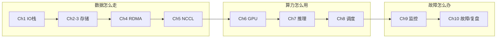

## 本书写给谁

这本书写给**有 Linux 运维 / 存储 / 网络背景、正准备转型 AI Infra（GPU 集群方向）的工程师**。你大概有 5-8 年的 SRE / HPC / 大规模存储经验，熟悉 Ceph、Slurm、K8s，但还没深入 GPU 集群和 AI 训练推理。

读完这本书，你应该能：从 IO 栈、存储、网络、GPU、推理、调度、监控到故障，完整地讲清一个 AI 集群的每个环节，并用数据（而非直觉）定位瓶颈、做选型、讲好一个故障故事。

## 怎么用这本书

- **每章开头有"本章学习目标"**：读完先对照它，学完用章末的自检清单逐条确认学会了没有；
- **示范例题要跟着算一遍**：每道例题都给了完整推导和验证代码，自己动手复算一遍最有效；
- **引导练习先自己想**：每道引导练习有"提示 1 → 提示 2 → 完整解答"三层，先看到提示 1 自己试，卡住再看下一层；
- **独立习题做完再翻答案**：独立习题的题干在章内，参考答案和验证过程统一在 `98-参考答案.md`，先自己做再对照；
- **不认识的词与记号查术语表**：`术语表.md` 有术语和符号两个对照表，全书的约定都在里面；
- **最后一章是综合检验**：`99-表现性任务.md` 给了 3 个迁移性任务（新集群排查 / 存储选型 / 面试叙事），做完能检验你能否把知识用到新场景。

## 全书主线

这本书有一条主线：**数据怎么走 → 算力怎么用 → 故障怎么办**。前 5 章建立"数据通路"（存储、网络、集合通信），第 6-8 章讲"算力使用"（GPU、推理、调度），第 9-10 章收束到"可靠运行"（监控、故障、复盘）。

*图 0-1：全书主线*

主线背后的三个贯穿问题（核心问题 Q1-Q3，会在多章反复回来）：
- **Q1**：集群变慢时，瓶颈在计算、网络、存储还是调度？怎么用数据定位？
- **Q2**：训练与推理的存储需求为什么不同？一套系统能否兼顾？
- **Q3**：集群的"稳定"来自硬件、软件还是流程？三者的贡献如何衡量？

## 目录

- [第 1 章 Linux 内核 IO 栈与 VFS](/posts/ai-infra-01-linux-io-vfs/) — 建立"数据从磁盘到进程"的底层心智
- [第 2 章 分布式存储：Ceph 核心](/posts/ai-infra-02-ceph/) — CRUSH/PG/BlueStore 与副本/EC 数学
- [第 3 章 存储选型：JuiceFS/3FS/Lustre 对比](/posts/ai-infra-03-storage-choice/) — 用框架选型而非背参数
- [第 4 章 RDMA 与无损网络](/posts/ai-infra-04-rdma/) — IB/RoCE/PFC/ECN/DCQCN
- [第 5 章 NCCL 与集合通信](/posts/ai-infra-05-nccl/) — Ring AllReduce 数学与 hang 排查
- [第 6 章 GPU 硬件与 CUDA/DCGM](/posts/ai-infra-06-gpu-cuda-dcgm/) — 利用率之谜与 Xid 故障
- [第 7 章 推理框架：vLLM 与 PagedAttention](/posts/ai-infra-07-vllm-pagedattention/) — KV cache 与连续批处理
- [第 8 章 调度与多租户：Slurm/Volcano/Kueue](/posts/ai-infra-08-scheduler/) — Gang/Fair-share/Preemption
- [第 9 章 可观测性与告警](/posts/ai-infra-09-observability/) — Prometheus/PromQL/告警设计
- [第 10 章 故障演练与 STAR 叙事](/posts/ai-infra-10-chaos-star/) — 混沌工程/复盘/面试故事
- [第 11 章 综合实战：一次完整的集群故障排查演练](/posts/ai-infra-11-troubleshooting/) — 分层假设法把全书串成排障流程
- [第 12 章 面试冲刺：高频题与答题框架](/posts/ai-infra-12-interview/) — 三段式答题 + 对比框架 + mini 讲解
- [第 13 章 自动化运维与版本管理](/posts/ai-infra-13-automation/) — 健康巡检 + 驱动/CUDA/NCCL 版本对齐

附：[术语与符号表](/posts/ai-infra-glossary/)
