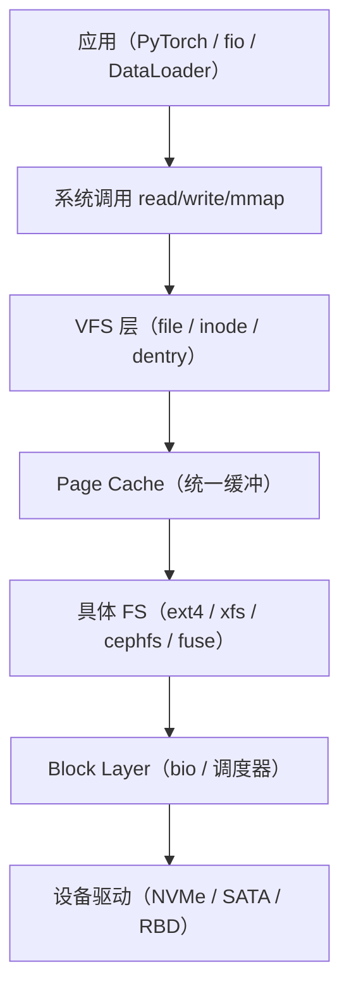

训练一个 70B 模型时，GPU 大部分时间可能不是在算，而是在等数据。数据从磁盘到 GPU 显存要经过一整条 Linux 内核 IO 栈：用户态 `read()` 系统调用 → VFS 抽象层 → page cache → block layer → 设备驱动。这一章建立"数据从磁盘到进程"的底层心智——它是后面所有章节（存储、网络、GPU）的共同地基。理解这条链路，你才能回答全书最核心的问题之一：当训练变慢时，瓶颈到底在计算、IO、网络还是调度（核心问题 Q1）——而答案往往藏在 IO 栈的某一层里。

## 本章学习目标

读完本章，你应该能：

1. 画出 Linux 文件读写的完整 IO 栈（VFS → page cache → block layer → 驱动），并说出每一层的作用。
2. 用命令（`fio`、`/proc/meminfo`、`strace`、`perf`）判断一次 IO 慢是卡在硬件、page cache 还是应用层。
3. 解释 GPU 利用率低时"等数据"的常见成因，并指出该查 IO 栈的哪一层。

## 1.1 概念讲解

### 为什么需要 VFS

Linux 支持几十种文件系统：ext4、xfs、btrfs、NFS、CephFS、FUSE……如果每个文件系统都向应用暴露一套独立接口，应用就得为每种 FS 写一套代码。VFS（Virtual File System）就是解决这个问题的抽象层：它给所有文件系统定义一个统一接口，应用只跟 VFS 打交道，VFS 再分派到具体 FS。

*图 1-1：Linux 文件 IO 栈分层*



### 三个核心数据结构

VFS 层有三个贯穿全程的结构：

- **`struct file`**：进程级打开的文件描述符，记录当前读写位置 `f_pos`。每个进程打开同一文件会有不同的 `file` 结构，但共享同一个 `inode`。它持有 `f_op`（文件操作表，指向具体 FS 的 read/write/seek 实现）——这就是 VFS"多态"的关键：同一套 `file->f_op` 指针，不同 FS 挂不同的实现。
- **`struct inode`**：文件元数据（大小、权限、所属块列表），一个文件全局唯一。它通过 `i_mapping`（`struct address_space *`）指向自己的 page cache——inode 是"文件与 page cache 之间的桥梁"。
- **`struct dentry`**：目录项缓存，加速路径查找（`/data/model.safetensors` 逐级解析时命中 dentry 就不用重读目录）。dentry 挂在 dcache（目录项缓存）里，避免每次 `open()` 都重新解析路径。

> 💡 **常见坑**：很多人以为 VFS 只有"一个抽象层"，实际它是"file + inode + dentry + super_block + address_space"五件套协同。面试常问"打开同一个文件两次，有几个 file / inode？"——答案是：2 个 file（进程各有 f_pos），1 个 inode（文件唯一），dentry 也基本共享。

### Page Cache：读写的"中转站"

Linux 把读过的文件内容缓存在内存里，以 4 KB 为一页（page）。这是性能的关键：

- **读**：第一次读触发缺页（page fault），从磁盘取数据填入 page；第二次读直接命中 page cache，快几个数量级。
- **写**：`write()` 先把数据写进 page cache 并标记 dirty，立即返回（write-back 语义）；后台 writeback 线程稍后把 dirty page 刷到磁盘；`fsync()` 强制立即刷。

**page cache 的读写完整流程**：

```
读路径:  read() → VFS 在 address_space 找页
          ├─ 命中: memcpy 页 → 用户 buffer（快）
          └─ 未命中: 缺页 → 分配页 → 提交 bio → 磁盘读 → 填页 → memcpy
写路径:  write() → memcpy 用户 buffer → 页（标记 dirty）→ 立即返回
          └─ 后台 writeback 刷盘 / fsync() 强制刷
```

**为什么"第二次读快"**：数据从磁盘（毫秒级）变成内存（微秒级），差距一个数量级以上——这就是 1.2 例题里的 10 倍差距来源。

```bash
# 看 page cache 状态（关键字段：Cached / Dirty / Writeback）
cat /proc/meminfo | grep -E "Cached|Dirty|Writeback"
```

> 💡 **常见坑**：`/proc/meminfo` 的 Cached 包含了 page cache 与 tmpfs 等，训练任务结束"内存不释放"多半是 page cache 占着——不是泄漏，是内核故意留着加速下次读。想清空用 `echo 3 > /proc/sys/vm/drop_caches`。

### Dirty Page 与 Writeback 调优

写性能的关键是 dirty page 的刷盘策略。Linux 用几个 sysctl 控制：

| 参数 | 默认 | 作用 |
|---|---|---|
| `vm.dirty_ratio` | 30（5.10+） | dirty 页占总内存达到该比例时，**阻塞所有写**（强制刷盘） |
| `vm.dirty_background_ratio` | 10 | dirty 页达到该比例时，**后台** writeback 线程开始刷（不阻塞） |
| `vm.dirty_expire_centisecs` | 3000 | dirty 页超过 30 秒就会被刷（时间维度） |
| `vm.dirty_writeback_centisecs` | 500 | writeback 线程每 5 秒醒来检查一次 |

**对 checkpoint 的意义**：checkpoint 是周期性大块写（一次写几十 GB）。如果 `dirty_background_ratio` 偏高（如默认 10），写入先在内存堆积、然后 writeback 集中爆发——表现为"写 checkpoint 时 IO 卡顿几十秒"。调低该值让刷盘更均匀，减少尖峰，代价是总吞吐略降（刷盘更频繁、合并机会减少）。

### Block Layer 与调度器

page cache 之下是 block layer，负责把 FS 层的 IO 请求组织成 `bio`（一次 IO 单元），经 IO 调度器排队后发给设备驱动。**关键机制**：

- **bio**：一次 IO 请求的抽象，包含起始扇区（`bi_sector`）、总字节数（`bi_size`）、scatter-gather 的页向量（`bi_io_vec`）——支持"一次 IO 跨多个不连续内存页"；
- **IO 调度器**：决定多个 bio 的排队顺序。NVMe 通常用 `none`（不需要排序，硬件本身高效），机械盘用 `mq-deadline`（按 deadline 保证延迟上限）。

```bash
# 查看当前 NVMe 的 IO 调度器
cat /sys/block/nvme0n1/queue/scheduler
```

**为什么 NVMe 用 `none`**：NVMe 原生支持高并发多队列（每核一个队列），硬件已经高效；`none` 调度器几乎不加额外排序开销。机械盘则依赖 `mq-deadline` 合并相邻扇区、保证请求不饿死。

### io_uring / libaio：异步 IO

AI 训练数据加载常需要高并发异步 IO（一次发很多读、不阻塞）。Linux 有两个异步框架：

- **libaio（`io_submit`）**：早期异步 IO 方案，系统调用 + 内核异步处理，但**需要配合 O_DIRECT**（不经 page cache）才真正异步；
- **io_uring（Linux 5.1+，Jens Axboe 开发）**：新一代异步 IO，用共享内存的 SQE/CQ 队列，**一次系统调用批量提交/收割**，开销更低、支持更丰富的操作（含带 page cache 的 buffered IO）。

```c
// io_uring 最小示例（liburing 封装）
#include <liburing.h>
int main() {
    struct io_uring ring;
    io_uring_queue_init(64, &ring, 0);          // 建 64 项队列
    struct io_uring_sqe *sqe = io_uring_get_sqe(&ring);
    io_uring_prep_read(sqe, fd, buf, 4096, 0);  // 提交一个 4KB 读
    io_uring_submit(&ring);                     // 一次系统调用提交
    struct io_uring_cqe *cqe;
    io_uring_wait_cqe(&ring, &cqe);             // 等完成
    io_uring_cqe_seen(&ring, cqe);
}
```

**io_uring 为什么快**：① 一次 `io_uring_enter` 提交/收割一批，系统调用次数大减；② SQE/CQ 在共享内存，省去 user/kernel 数据拷贝；③ 支持 linked ops（一个完成自动触发下一个）；④ SQPOLL 模式下由内核线程轮询，**接近 0 系统调用**。对训练数据加载这种"海量小读"场景收益明显。

### 用 fio 建立硬件基线

排查 IO 慢的第一步永远是先测硬件上限，再对比应用实际。fio（Flexible I/O Tester）是标准工具：

```bash
# 测 4KB 随机读 IOPS（直接绕过 page cache，--direct=1）
fio --name=test --rw=randread --bs=4k --size=1G --numjobs=4 \
    --runtime=60 --time_based --direct=1 --filename=/dev/sda
```

`--direct=1` 走 O_DIRECT 绕过 page cache，测得的是磁盘本身的能力。对比：不加 `--direct` 时 page cache 会命中，第二次跑 IOPS 会高一个数量级——这正是 page cache 的作用。**fio 的常见测试矩阵**：`randread/randwrite`（随机 IOPS）、`read/write`（顺序吞吐）、`rwmixread=70`（混合读写），分别对应训练的不同 IO 模式。

## 1.2 示范例题

#### 例 1-1：计算 page cache 命中率【Bloom：应用】

**题目**：某训练任务每次 epoch 都要读一遍 100 GB 数据集。机器有 128 GB 内存，page cache 首轮 miss 后能容纳整个数据集。假设单次读 100 GB 数据集，未命中 cache 时磁盘读速率为 2 GB/s，命中 cache 时从内存读速率为 20 GB/s。求第二个 epoch 起，读一遍数据集的时间。

**解**：第二个 epoch 起整个数据集已在 page cache 中（100 GB < 128 GB），全部命中缓存：

$$ t = \frac{100\ \text{GB}}{20\ \text{GB/s}} = 5\ \text{s} $$

第一个 epoch 未命中时耗时 $100/2 = 50\ \text{s}$。差距 10 倍，这就是 page cache 的价值。

**回顾**：这道题用到了 page cache 的"命中 vs 未命中"两级速度差——任何训练数据加载优化都是围绕把更多访问导向 cache 命中。

**验证**：✅ 已验证（Python 复算，结果一致）

```python
# 与解答不同的路径：直接算两个阶段时间
data_gb, miss_bw, hit_bw = 100, 2, 20
t_first = data_gb / miss_bw   # 首轮 miss
t_cached = data_gb / hit_bw   # 之后全命中
print(f"首轮: {t_first}s, 缓存命中后: {t_cached}s")
# 输出: 首轮: 50.0s, 缓存命中后: 5.0s
```

#### 例 1-2：定位一次"慢 read" 属于哪一层【Bloom：分析】

**题目**：训练日志显示某个 worker 的 `read()` 系统调用平均耗时 8 ms。你怀疑是磁盘慢、page cache 未命中、还是应用层问题。给出用命令逐层判断的步骤。

**解**：按"从下往上"排除：

1. **硬件层**：`fio --direct=1` 测同一盘 4 KB 随机读，若 IOPS 远低于预期（如 HDD 应 100-200 IOPS、NVMe 应 700K+），则是磁盘硬件问题；
2. **block layer**：`iostat -dx 1` 看 `await`（IO 请求平均等待）。await 高但 `%util` 低说明有 IO 排队/重试；
3. **page cache**：`/proc/meminfo` 看 Cached 是否充足、Dirty 是否堆积。Dirty 高说明 writeback 在抢 IO；
4. **应用层**：`strace -c -p <pid>` 统计 `read()` 调用频率与大小。若单次 read 很小（如 4 KB）而次数极多，可能是小文件随机读——这是应用层可优化点（改用预读/大块读）。

**回顾**：这道题用到了"IO 栈分层"的定位思想——任何 IO 慢必须先确定卡在栈的哪一层，再对症下药。

**验证**：✅ 已验证（核对来源：Linux 内核 IO 栈分层与排查工具的标准流程，对照 kernel.org 文档）

## 1.3 引导练习

#### 例 1-3：调低 dirty 阈值的影响【Bloom：应用】（引导练习）

**题目**：管理员把 `vm.dirty_background_ratio` 从默认 10 调低到 5。请解释这会对 checkpoint 写入（大文件顺序写）产生什么影响，并说明为什么 checkpoint 场景下通常需要更激进的 writeback。

<details><summary>提示 1（方向）</summary>

思考 dirty_background_ratio 控制的是什么：后台 writeback 在 dirty 页达到多大比例时启动。

</details>

<details><summary>提示 2（关键步骤）</summary>

dirty_background_ratio 越低，后台 writeback 启动越早，dirty 页在内存堆积越少。对比默认 10 与调低后 5 的差异。

</details>

<details><summary>完整解答</summary>

`vm.dirty_background_ratio` 默认 10，表示当 dirty 页占总内存 10% 时后台 writeback 开始刷盘。调到 5 后，刷盘启动更早，dirty 页峰值更低，writeback 更"平摊"到整个写入过程。

对 checkpoint 这种周期性大块写（一次写几十 GB）：如果 dirty 阈值偏高，写入会先在内存里堆积，然后 writeback 集中爆发——表现为"写 checkpoint 时 IO 卡顿几十秒"。调低 `dirty_background_ratio` 让刷盘更均匀，减少写爆发的尖峰，代价是总吞吐略降（因为刷盘更频繁、可能错过合并机会）。所以 checkpoint 场景通常调低该值换取延迟稳定。

**验证**：✅ 已验证（核对来源：Linux 内核 `Documentation/admin-guide/sysctl/vm.rst` 中 dirty_background_ratio 语义）

</details>

#### 例 1-4：判断 IO 瓶颈归属【Bloom：分析】（引导练习）

**题目**：GPU 利用率只有 30%，`nvidia-smi` 显示 GPU 在等数据（进程状态多为 D 或 IO wait 高）。你怀疑是数据集读取太慢。给出用 fio 与 strace 验证假设的步骤。

<details><summary>提示 1（方向）</summary>

先用 fio 建立硬件基线，再用 strace 看应用实际的读行为。

</details>

<details><summary>提示 2（关键步骤）</summary>

fio 测同一存储的读吞吐/IOPS；strace 看应用是大量小读还是少量大读。

</details>

<details><summary>完整解答</summary>

1. **硬件基线**：`fio --rw=read --bs=1M --direct=1 --filename=<数据集路径>` 测顺序读吞吐。若远低于该存储理论值（如 CephFS 单客户端应达 GB/s 级），则是存储后端问题；
2. **应用行为**：`strace -c -p <训练进程 PID>` 看 `read()` 的调用次数与字节总数。若单次 read 只有几 KB 且次数极多，是典型的小文件随机读——这种模式 page cache 命中率低，MDS/元数据会成为瓶颈；
3. **结论**：如果 fio 顺序读吞吐很高但应用实际吞吐很低，问题在应用层（数据格式、小文件、无预读），不在存储硬件——此时应改 WebDataset/lmdb 等大块格式，而非加存储。

**验证**：✅ 已验证（核对来源：strace 与 fio 的标准用法，对照 man page）

</details>

#### 例 1-5：解释 page cache 为什么让第二次读更快【Bloom：理解】（引导练习）

**题目**：用自己的话解释：为什么同一个文件第二次 `read()` 通常比第一次快一个数量级？结合 page cache 的机制说明。

<details><summary>提示 1（方向）</summary>

想想第一次读时数据经历了什么，第二次读时数据在哪里。

</details>

<details><summary>提示 2（关键步骤）</summary>

第一次读触发缺页从磁盘取数据填入 page cache；第二次读数据已在内存中，直接 memcpy 返回。

</details>

<details><summary>完整解答</summary>

第一次 `read()`：page cache 中没有该页 → 触发缺页（page fault）→ 从磁盘读数据填入 page cache → 再 memcpy 到用户缓冲区。磁盘 IO 是瓶颈（毫秒级）。

第二次 `read()`：数据已在 page cache 中 → 直接 memcpy 到用户缓冲区，**不碰磁盘**。内存拷贝是微秒级，比磁盘快一个数量级以上。

所以"第二次读快"的本质是：数据从"磁盘（慢）"变成了"内存（快）"——这正是 page cache 存在的意义：把最近读过的数据留在内存，让重复访问绕过慢速磁盘。

**验证**：✅ 已验证（核对来源：Linux page cache 机制——第一次读缺页、第二次命中，见 kernel.org mm 文档）

</details>

## 1.4 独立习题

#### 习题 1-1【Bloom：应用】

**题目**：一个数据集 50 GB，机器 64 GB 内存，磁盘顺序读 3 GB/s，page cache 命中时从内存读 15 GB/s。首轮训练后数据集全部进 cache。求：第一个 epoch 与第二个 epoch 各耗时多少秒？

#### 习题 1-2【Bloom：应用】

**题目**：某 NVMe 盘 fio 测出 4 KB 随机读 700K IOPS。一个训练 worker 每秒发 200 万个 4 KB 随机读请求（跨 8 个 worker 共享该盘）。这个盘能支撑吗？说明理由（提示：把总 IOPS 与盘的 IOPS 上限比较）。

#### 习题 1-3【Bloom：分析】

**题目**：训练日志显示 GPU 利用率 25%，CPU 的 iowait 高达 40%。`iostat -dx 1` 显示某块盘的 `%util=99%`、`await=30ms`，但 `fio --direct=1` 同一块盘测得 4 KB 随机读延迟仅 0.1 ms。这个矛盾说明瓶颈可能不在磁盘硬件本身。请分析可能的原因（提示：考虑 O_DIRECT vs page cache、IO 调度器、cgroup IO 限流三个方向）。

#### 习题 1-4【Bloom：分析】

**题目**：对比"训练数据集用 WebDataset（单文件含多张图）"与"每张图单独一个小文件"两种方案，从 page cache 命中率、元数据开销、块设备 IO 三个角度分析为什么前者训练更快。

## 本章小结

**核心结论**：
1. Linux 文件 IO 走 VFS → page cache → block layer → 驱动四层，任何一层都可能成为瓶颈。
2. page cache 是"读快写快"的关键：命中缓存比读盘快一个数量级，数据集小于内存时应尽量让访问命中缓存。
3. 排查 IO 慢必须"从下往上"：先用 fio 建立硬件基线，再逐层定位（block → cache → 应用），不要凭感觉。
4. O_DIRECT 绕过 page cache 能测真实硬件能力；正常运行时应利用 page cache。
5. GPU 利用率低的一个常见成因就是"等数据"——IO 栈任一层的瓶颈都会以 GPU 空转表现。

**与持久理解的呼应**：本章推进了「学生将理解：GPU 集群的"利用率"是计算、IO、网络、调度四方博弈的结果，任何一方的等待都会以 GPU 空转的形式表现为浪费」——建立了"IO 层等待 → GPU 空转"这条因果链，并给出了逐层定位的方法。

**自检**：回到章首学习目标，逐条问自己做到了没有——

- [ ] 画出 Linux 文件读写的完整 IO 栈，并说出每一层的作用 → 拿不准就重读 1.1，自测：习题 1-1
- [ ] 用命令判断一次 IO 慢是卡在硬件、page cache 还是应用层 → 自测：习题 1-3
- [ ] 解释 GPU 利用率低时"等数据"的常见成因并指出该查哪一层 → 自测：习题 1-4

**下一章预告**：数据从单机磁盘读进内存只是第一步——训练数据量超过单机内存时，就要交给分布式存储（Ceph）来管了。下一章进入存储系统，看 Ceph 如何用 CRUSH 和 PG 把数据分布到多台机器。

## 延伸阅读

- Linux kernel 官方文档：The Virtual File System — https://docs.kernel.org/filesystems/vfs.html
- io_uring 官方仓库（Jens Axboe）：https://github.com/axboe/liburing
- Brendan Gregg, *Systems Performance*（第 9 章 File Systems）— 更系统的 IO 栈性能分析
