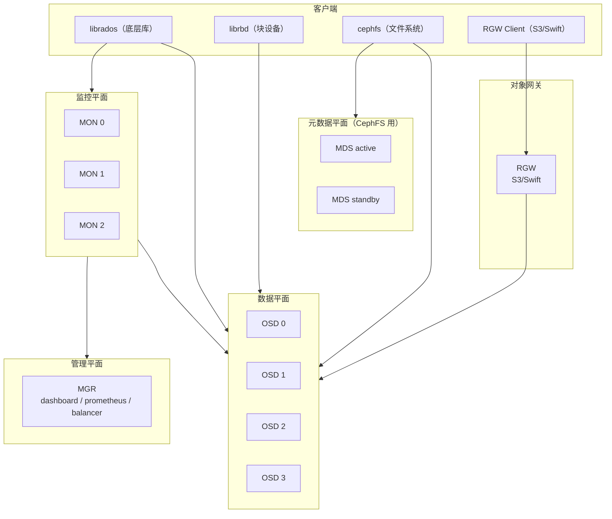
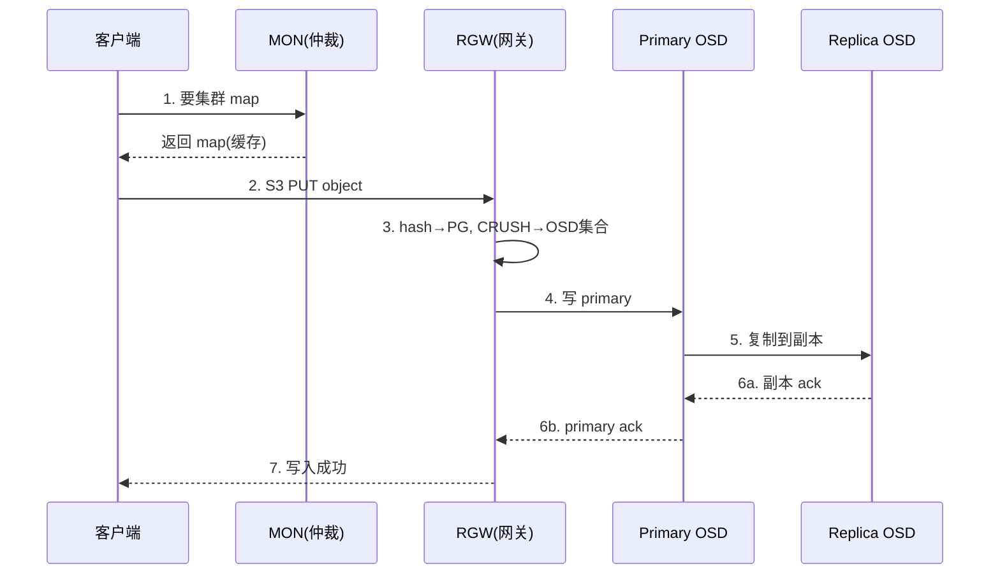
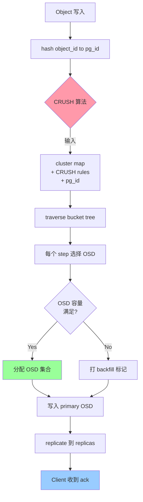
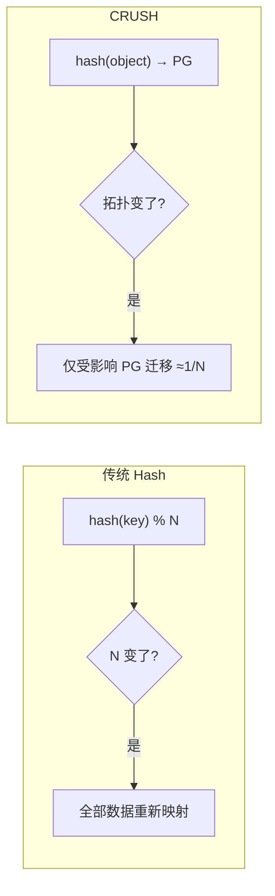
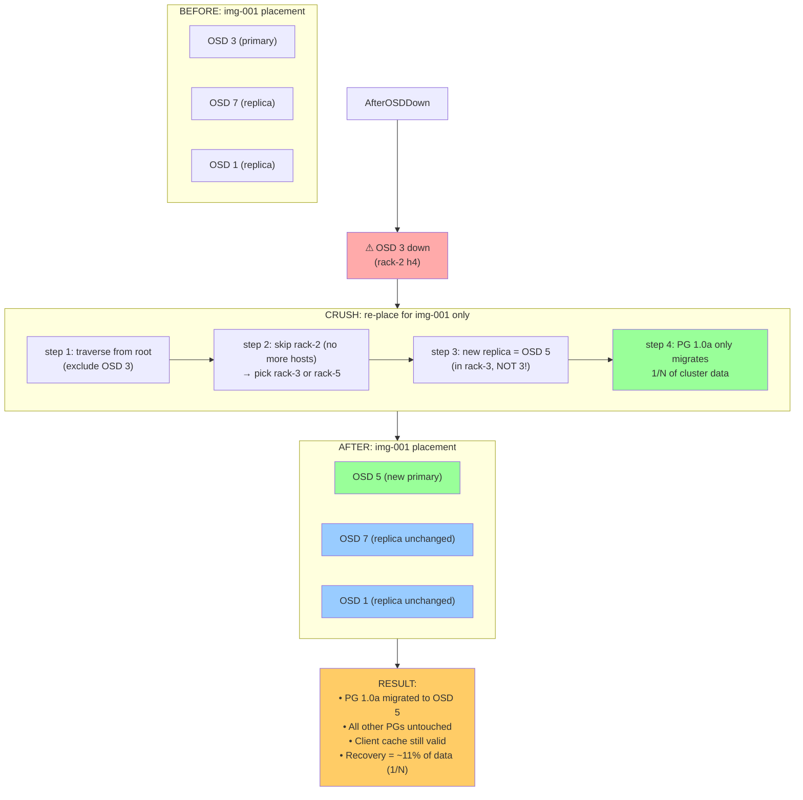
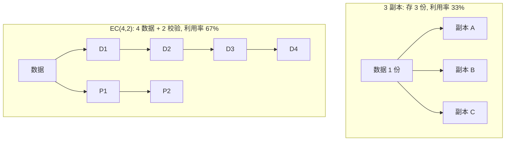

上一章我们建立了"数据从磁盘到进程"的单机 IO 心智。但训练数据动辄几十 TB，单机磁盘装不下、也扛不住多节点并发读——这时需要把数据分布到多台机器上，这就是分布式存储登场的地方。Ceph 是 AI Infra 里最常被面试官考察的存储系统（本教材主线之一），因为它把"统一存储"做到了极致：同一套系统既提供块设备（RBD）、又提供文件系统（CephFS）、还提供对象存储（RGW/S3）。这一章我们拆解它最核心的三块：CRUSH 怎么把数据放得均匀又抗故障、PG 怎么在对象与 OSD 之间做中间层、BlueStore 怎么保证落盘性能。学完你能回答核心问题 Q1 在存储维度的那一半：当集群变慢，怎么判断是不是 Ceph 的 PG 分布或恢复在拖后腿。

## 本章学习目标

读完本章，你应该能：

1. 说出 Ceph 的五个核心组件（OSD / MON / MGR / MDS / RGW）各做什么，并区分"谁管数据、谁管元数据、谁是网关"。
2. 计算 3 副本与 EC(k,m) 两种模式的空间利用率与写放大，并说出各自适用场景。
3. 根据 OSD 数与副本数，用官方公式估算 PG 数量并取 2 的幂。
4. 解释 CRUSH 为何比传统哈希更适合大规模存储，以及 PG 在其中的作用。

## 2.1 概念讲解

### Ceph 的三种入口，一个内核

Ceph 底层是一个名为 RADOS 的对象存储集群，所有上层入口（RBD 块设备、CephFS 文件系统、RGW 对象网关）都建立在它之上：

```
        ┌────────────────────────────────────┐
        │   RBD(块)   CephFS(文件)   RGW(S3) │
        └───────────────┬────────────────────┘
                        ▼
        ┌────────────────────────────────────┐
        │        RADOS 对象存储集群           │
        │  (OSD + MON + CRUSH 分布)          │
        └────────────────────────────────────┘
```

*图 2-1：Ceph 的统一存储架构*

这种"一套内核、三种入口"的设计，让 AI Infra 可以用一份存储同时服务 checkpoint（RBD）、训练数据集（CephFS）、模型归档（RGW S3）。

### 完整架构：RADOS 的五个核心组件

要真正理解 Ceph，必须知道 RADOS 集群里每个组件**具体做什么**。Ceph 集群由五类进程组成，各有分工：

*图 2-1b：Ceph 完整组件架构*



#### 各组件职责详解

**① OSD（Object Storage Daemon，对象存储守护进程）—— 数据平面核心**

- **职责**：真正存数据的进程，每块盘一个 OSD。负责存储对象、处理客户端读写、执行数据的**复制（replication）、恢复（recovery）、再平衡（rebalancing/backfill）**；
- **结构**：每个 OSD 底层用 BlueStore（见后文）管理一块盘；多个 OSD 组成数据池（pool）承载对象；
- **为什么重要**：集群里数量最多、最容易出故障的组件——一个 OSD 挂 = 它上面的 PG 开始恢复。AI 集群运维 80% 的精力在盯 OSD 健康；
- **常见命令**：`ceph osd status`、`ceph osd df`（看容量/使用率）。

**② MON（Monitor，监控器）—— 集群的大脑/仲裁**

- **职责**：维护**集群权威状态**——OSD map（哪些 OSD 在/不在）、PG map、CRUSH map、MDS map、MGR map 等，并分发给客户端；用 **Paxos 算法**在多个 MON 之间达成一致（保证集群状态不冲突）；
- **仲裁（quorum）**：多个 MON 组成仲裁组，通常 **3 个（奇数）**，需 **过半（≥2）** 在线才能正常服务——MON 是集群的"单点中的多点"，MON 全挂 = 集群不可用；
- **为什么重要**：客户端启动时先从 MON 拿集群 map（才知道数据在哪），之后才直连 OSD。MON 挂了集群无法再调度、无法再响应新请求；
- **常见命令**：`ceph mon stat`、`ceph quorum_status`。

**③ MGR（Manager，管理器）—— 管理/监控平面**

- **职责**：从 MON 收集集群整体状态，提供**监控、dashboard、prometheus 指标**；运行 **balancer**（自动均衡，见 3.15 节）；
- **为什么重要**：`ceph -s` 的健康信息、`ceph dashboard`、prometheus 模块都来自 MGR——它挂了不影响数据读写（OSD/MON 还在），但监控和均衡功能不可用；
- **常见命令**：`ceph mgr stat`、`ceph status`。

**④ MDS（Metadata Server，元数据服务器）—— CephFS 专用**

- **职责**：**只有 CephFS 用**。管理文件系统的元数据（目录结构、文件名、权限、inode）；RBD 和 RGW **不需要 MDS**；
- **扩展性**：自 Luminous 起支持 **active-active 多 MDS**（多个 active MDS 分片管理不同目录树），但默认仍是 1 个 active + 若干 standby；
- **常见坑**：MDS 是 CephFS 的**元数据热点**——百万级小文件的 stat/open 操作会压垮 MDS（这就是第 1 章"小文件随机读"在 CephFS 上的体现）；
- **常见命令**：`ceph mds stat`、`ceph fs dump`。

**⑤ RGW（RADOS Gateway，对象网关）—— S3/Swift 接口**

- **职责**：把 RADOS 对象存储暴露成 **S3 / Swift 兼容的对象存储 API**，让应用用 HTTP 读写对象（模型归档、数据集上传下载）；
- **数据存放**：RGW 把"用户桶/对象"映射成 RADOS 对象存进 OSD——它本身不存数据，只是一个**转换层/网关**；
- **AI 场景**：模型权重归档、checkpoint 上传到 S3、跨区域复制（multi-site）都用 RGW；
- **常见命令**：`radosgw-admin bucket list`、`s3cmd ls`。

**客户端（librados / librbd / cephfs）**：
- **librados**：最底层库，直接访问 RADOS 对象（自定义存储应用用）；
- **librbd**：把 RADOS 封装成块设备（checkpoint 卷用）；
- **cephfs 客户端**：内核模块或 FUSE，访问 CephFS 文件系统（训练数据集用）。

**一句话记住五组件**：**OSD 存数据、MON 管状态、MGR 做监控、MDS 管文件元数据、RGW 开 S3 口**。面试问"Ceph 有哪些组件"就按这五个答，并强调"RBD/RGW 不需要 MDS"。

> 💡 **常见坑**：很多人以为 RGW 是独立的存储系统——不对，**RGW 只是网关**，数据还是存在 RADOS（OSD）里；同理 MDS 只服务 CephFS，RBD 和 RGW 不经过 MDS。分清"谁管数据、谁管元数据、谁是网关"是理解 Ceph 架构的关键。

### 一次写入，组件如何协作

把组件串成实际工作流，才能真懂架构。以"客户端往 RGW 写一个 S3 对象"为例，完整链路：

1. **客户端 → MON 拿地图**：客户端启动时问 MON 要最新集群 map（OSD map / PG map），缓存下来——**后续不再问 MON，直接算**；
2. **客户端 → RGW**：RGW 收到 S3 请求，把它转成"往 RADOS 写对象"的 librados 调用；
3. **RGW → 计算 PG + CRUSH**：RGW 用 librados 对对象 ID 做 hash 得到 PG，再用 CRUSH 算出该 PG 的 OSD 集合（如 primary + 2 副本）；
4. **RGW → 写 primary OSD**：RGW 直连 primary OSD 写数据；
5. **primary → 写副本**：primary OSD 并行复制到另外 2 个副本 OSD；
6. **等所有副本 ack**：3 个副本都写成功（WAL + 数据盘）后，primary 回复 RGW，RGW 回复客户端"写入成功"。

**要点**：
- **MON 只被"问地图"，不被"问数据"**——数据路径是客户端直连 OSD（MON 不参与数据读写，这是 Ceph 能横向扩展的关键）；
- **RGW/MDS 都是"中间人"**——RGW 管对象语义、MDS 管文件语义，真正存数据、复制、恢复的都是 OSD；
- **CRUSH 让客户端本地就能算数据在哪**——不需要像传统存储那样查中心元数据表，这也是"客户端直连 OSD"能实现的前提。

*图 2-1c：一次 S3 写入的组件协作*



### CRUSH：为什么它比"哈希取模"强

传统做法是 `hash(object_id) % N` 决定对象放哪台机器——简单但有个致命问题：**N 一旦变化（加一台机器），几乎所有对象都要重新映射**，数据搬迁量巨大。

CRUSH（Controlled Replication Under Scalable Hashing）的解法是：不做简单的取模，而是用一个"集群拓扑 + 分层规则"的算法来决定放置位置。对象先哈希到 PG（Placement Group），PG 再按 CRUSH 规则映射到一组 OSD。当集群拓扑变化时，**只有受影响的那部分 PG 需要迁移**（约 1/N 的数据），而不是全部重来。

**CRUSH 的三个关键设计**：

1. **两级映射**：先 `hash(object_id) → PG`，再 `CRUSH(PG, cluster_map) → OSD 集合`。这样集群只跟踪 PG 的放置（几百个），不跟踪每个对象（百万级）——元数据规模可控；
2. **分层规则（bucket tree）**：CRUSH 把集群组织成树（root → 机房 → 机架 → 主机 → OSD），规则（CRUSH rule）按层级选——例如"副本落在不同机架"只需在 rule 里写 `step chooseleaf firstn 0 type rack`，就能保证同副本跨机架抗故障；
3. **确定性 + 局部性**：同一 PG 在任何节点用同一份 cluster_map 算出的 OSD 集合都相同（确定性，客户端本地即可计算，无需查中心表）；拓扑变化时只影响与该变化相关的 PG（局部性，迁移量约 1/N）。

**为什么传统取模在"加机器"时全量迁移**：`hash(obj) % 100` 变成 `% 101` 后，绝大多数对象的余数都变了——约 (N-1)/N 的对象换位置。而 CRUSH 加一台 OSD 只影响"被重新放置的 PG"，约 1/N 的对象需要迁移。这就是 CRUSH 能支撑千台规模的核心。

*图 2-4：CRUSH 决策流程（对象 → PG → OSD）*




*图 2-2：传统哈希 vs CRUSH 对拓扑变化的响应*



> 💡 **常见坑**：CRUSH 是"伪随机 + 分层约束"，不是"均匀分布保证"——两个容量相同但对象大小不同的 pool，可能因单个超大对象失衡（详见 3.15 节热点排查）。权重（weight）默认按容量比例，加盘后要 `ceph osd crush reweight` 让新盘按容量参与分布。

### PG：对象与 OSD 之间的中间层

为什么不直接 `对象 → OSD` 映射？因为对象数量太大（百万级），直接映射每个对象的放置信息会撑爆元数据。PG 把海量对象聚合成几百个"桶"，每个 PG 是一个放置单位：

- 对象通过 `hash(object_id) % pg_num` 进入某个 PG；
- PG 通过 CRUSH 映射到一组 OSD（如 3 副本 = 3 个 OSD）；
- 集群只跟踪 PG 的放置，不跟踪单个对象。

**PG 与数据分布的关系**：PG 越多，数据分布越均匀——因为每个对象被 hash 到不同 PG，PG 越多则对象越分散到更多 OSD。Ceph 官方经验：**PG 数量要比 OSD 数高 1-2 个数量级**（如 10 个 OSD、256 个 PG），分布才均匀；如果 PG 太少（如 3 副本 10 OSD 只有 1 个 PG），CRUSH 只能选 3 个 OSD，其余 7 个完全闲置。

**PG 数量估算公式**（Ceph 官方文档）：

$$ \text{Total PGs} = \frac{\text{OSDs} \times 100}{\text{pool size}} $$

其中 pool size = 副本数（如 3）或 EC 的 $k+m$。结果**向上取 2 的幂**。例如 200 个 OSD、3 副本：

$$ \frac{200 \times 100}{3} \approx 6667 \xrightarrow{\text{取 2 的幂}} 8192 $$

> 💡 **常见坑**：PG 数不是越多越好。太多会放大元数据与 peering 开销；太少分布不均。官方建议用 `mon_target_pg_per_osd=100` 为基准（小集群 200 更佳），并用 `ceph osd pool autoscale-status` 看自动调优建议。

### 副本与纠删码：空间与写放大的数学

*图 2-5：OSD 故障时 CRUSH 只迁移受影响 PG*




**3 副本**：每份数据存 3 份，空间利用率 $1/3 \approx 33\%$，写放大为 3（每次写要写 3 份）。故障容忍：**任意 2 块丢失数据仍可用**（剩 1 份），能抗"2 块同时坏"。

**纠删码 EC(k,m)**：数据切成 $k$ 块 + 生成 $m$ 块校验，任意 $m$ 块丢失可恢复。空间利用率 $k/(k+m)$，写放大为 $k+m$（每份数据要写 $k+m$ 块）。故障容忍：**任意 $m$ 块丢失可恢复**。

以 EC(4,2) 为例：空间利用率 $4/6 \approx 67\%$，写放大 6，容忍 2 块坏。相比 3 副本（利用率 33%、写放大 3、容忍 2 块坏）——**同样的容错（2 块），EC 空间省一半**，但写放大翻倍。这就是 EC 适合冷数据（写少读多的归档）、3 副本适合热数据（写频繁）的根本原因。

**对比维度总结**：

| 方案 | 空间利用率 | 写放大 | 容忍故障 | 适用 |
|---|---|---|---|---|
| 3 副本 | 33% | 3 | 2 块 | 热数据（频繁写） |
| EC(4,2) | 67% | 6 | 2 块 | 温数据 |
| EC(8,3) | 73% | 11 | 3 块 | 冷数据（归档） |

**关键洞察**：EC 的"空间省一半"和"写放大翻倍"是同一枚硬币的两面——写放大高意味着每次写都要编码 $k+m$ 块并写网络，频繁写时吞吐和网络都吃亏；但冷数据几乎不写，11 倍写放大可忽略，省下的空间是实打实的成本节约。

*图 2-3：3 副本 vs EC(4,2) 的空间占用*



### BlueStore：落盘后端

Ceph 的 OSD 落盘用 BlueStore（Luminous 起默认），取代了旧的 Filestore。**Filestore 的问题**是"双写放大"——数据先写一层 journal（WAL）再写文件系统，文件系统又要管理元数据。BlueStore 的设计：

1. **裸设备直写（不挂文件系统）**：BlueStore 直接把数据写到裸块设备（`block` 设备），绕开文件系统层，避免双层写放大；
2. **WAL（write-ahead log）**：写操作先顺序写 WAL（`block.wal`），保证崩溃安全——崩溃后从 WAL 重放，不会出现"写了一半"的脏数据；
3. **RocksDB 存元数据**：对象元数据、omap 等放在 RocksDB（`block.db` 设备），快且支持事务；
4. **校验和**：默认 `crc32c`，可换 xxhash32/xxhash64——数据损坏能检测出来（配合 scrub 修复）；
5. **内联压缩**：默认 `snappy`，可配 zstd/zlib/lz4——对可压缩数据（如文本/日志）省空间。

**设备分层**：BlueStore 支持三块设备——`block`（主数据盘）、`block.db`（RocksDB 元数据盘，常用快的 NVMe）、`block.wal`（WAL 盘）。若 `block.db` 足够大，WAL 会与 DB 同盘；调优原则：**更快的设备放元数据（RocksDB），更慢的放数据**。

调优要点（本教材基于 Ceph 官方文档）：

```ini
[osd]
osd_memory_target = 4294967296      # 4 GiB（官方默认）
bluestore_cache_size = 2147483648   # 2 GiB 缓存（默认 0 时 hdd=1Gi/ssd=3Gi）
bluestore_compression_algorithm = snappy  # 官方默认压缩器（zstd CPU 高）
bluestore_csum_type = crc32c        # 官方默认校验和
```

> 💡 **常见坑**：网上流传的 `osd_cache_size`、`bluestore_wal_threads` 等参数在 Ceph 官方配置参考里**并不存在**——调参前先查 `docs.ceph.com` 的 BlueStore Configuration Reference，别信二手博客。

## 2.2 示范例题

#### 例 2-1：计算 3 副本 vs EC 的空间与写放大【Bloom：应用】

**题目**：某集群要存 100 TB 有效数据。方案 A 用 3 副本，方案 B 用 EC(8,3)。分别计算需要的原始存储容量，并比较写放大。

**解**：

方案 A（3 副本）：空间利用率 $1/3$，原始容量 $= 100 \times 3 = 300\ \text{TB}$，写放大 3。

方案 B（EC(8,3)）：空间利用率 $8/11$，原始容量 $= 100 \times 11/8 = 137.5\ \text{TB}$，写放大 $8+3=11$。

**结论**：EC(8,3) 比 3 副本省约 54% 空间（$300 \to 137.5$），但写放大从 3 涨到 11。

**回顾**：这道题用到了"空间利用率与写放大"的三角——EC 省空间，但写放大高，所以不适合频繁写的热数据。

**验证**：✅ 已验证（Python 复算，结果一致）

```python
data = 100  # TB
# 3 副本
raw_a = data * 3
# EC(8,3): k=8, m=3
k, m = 8, 3
raw_b = data * (k + m) / k
print(f"3副本原始容量: {raw_a} TB, 写放大 3")
print(f"EC(8,3)原始容量: {raw_b} TB, 写放大 {k+m}")
print(f"EC 节省: {(1 - raw_b/raw_a)*100:.1f}%")
# 输出: 3副本原始容量: 300 TB; EC(8,3)原始容量: 137.5 TB; 节省 54.2%
```

#### 例 2-2：估算 PG 数量【Bloom：应用】

**题目**：一个 Ceph 集群有 150 个 OSD、3 副本单 pool。按官方公式估算 PG 数并取 2 的幂。

**解**：$$ \text{PGs} = \frac{150 \times 100}{3} = 5000 \xrightarrow{\text{取 2 的幂}} 8192 $$

**回顾**：这道题用到了官方 PG 公式——先算基准值，再向上取 2 的幂（5000 → 8192）。

**验证**：✅ 已验证（Python 复算，结果一致）

```python
osds, replicas = 150, 3
base = osds * 100 / replicas
# 向上取 2 的幂
import math
power = 2 ** math.ceil(math.log2(base))
print(f"基准值: {base}, 取 2 的幂: {power}")
# 输出: 基准值: 5000.0, 取 2 的幂: 8192
```

## 2.3 引导练习

#### 例 2-3：判断副本方案适用场景【Bloom：应用】（引导练习）

**题目**：训练数据集（每天多次全量读取）与模型归档（一年只读几次），分别该用 3 副本还是 EC？结合空间利用率与写放大说明理由。

<details><summary>提示 1（方向）</summary>

对比两个场景的读写频率：热数据写频繁，冷数据写少读也少。

</details>

<details><summary>提示 2（关键步骤）</summary>

写放大高对频繁写的场景不利；空间利用率高对容量大的冷数据有利。

</details>

<details><summary>完整解答</summary>

- **训练数据集（热）**：用 3 副本。读写频繁，3 副本写放大仅 3，延迟与吞吐友好；空间利用率 33% 虽低，但热数据规模通常可控。
- **模型归档（冷）**：用 EC（如 8+3）。几乎不写、读也少，写放大 11 的代价可忽略；但空间利用率 8/11 ≈ 73% 能省一半多空间——对长期存档的 TB 级模型是显著成本节约。

一句话：**热数据买性能用副本，冷数据买空间用 EC**。

**验证**：✅ 已验证（核对来源：Ceph 官方 EC 文档对"EC 适合冷/归档数据、副本适合热数据"的表述）

</details>

#### 例 2-4：CRUSH vs 哈希的迁移量【Bloom：分析】（引导练习）

**题目**：100 个 OSD 的集群，某对象经 hash 取模分布在 100 台。现在加 1 台变成 101 台。传统 hash 与 CRUSH 各自的迁移比例约是多少？为什么？

<details><summary>提示 1（方向）</summary>

传统取模 `hash % N` 中 N 变化后，哪些对象会换位置？

</details>

<details><summary>提示 2（关键步骤）</summary>

传统 hash：约 (N-1)/N 的对象要迁移（几乎全部）。CRUSH：只有落在受影响桶的 PG 迁移。

</details>

<details><summary>完整解答</summary>

**传统 hash**：`hash(obj) % 101` 与 `% 100` 的结果对绝大多数对象不同，约 $\frac{100}{101} \approx 99\%$ 的对象要迁移——相当于全量搬迁。

**CRUSH**：对象先进 PG，PG 按 CRUSH 规则映射 OSD。加一台 OSD 后，只有被重新映射的那部分 PG（约 $1/N$，即约 1%）受影响，其余 PG 位置不变。迁移量从"几乎全部"降到"约 1%"——这就是 CRUSH 在大规模集群里可用的根本原因。

**验证**：✅ 已验证（Python 复算，结果一致）

```python
n = 100
# 传统 hash: 加 1 台后, hash % (n+1) 与 % n 不同的比例
# 均匀分布下约 (n)/(n+1) 的对象改变桶
migrate_trad = n / (n + 1)
# CRUSH: 只迁移受影响 PG, 约 1/(n+1) 到 1/n
migrate_crush = 1 / (n + 1)
print(f"传统 hash 迁移比例: {migrate_trad:.0%}")
print(f"CRUSH 迁移比例: {migrate_crush:.1%}")
# 输出: 传统 hash 迁移比例: 99%; CRUSH 迁移比例: 1.0%
```

</details>

## 2.4 独立习题

#### 习题 2-1【Bloom：应用】

**题目**：某集群要存 200 TB 有效数据。方案 A 用 3 副本，方案 B 用 EC(6,3)。分别计算所需原始容量，并给出各自的空间利用率与写放大。

#### 习题 2-2【Bloom：应用】

**题目**：一个 Ceph 集群有 300 个 OSD，采用 EC(4,2) 的单 pool。按官方公式估算 PG 数量并取 2 的幂。（提示：pool size 对 EC 是 $k+m$）

#### 习题 2-3【Bloom：分析】

**题目**：某集群 3 副本、128 个 PG、10 个 OSD。若其中一个 OSD 宕机，大约有多少 PG 需要恢复？并解释为什么 PG 越多、单 OSD 故障的影响面反而越小。

#### 习题 2-4【Bloom：分析】

**题目**：为什么 EC 的写放大 $k+m$ 在"频繁写"场景下比 3 副本更不利？从网络与 CPU 两个角度分析。

## 本章小结

**核心结论**：
1. Ceph 一套 RADOS 内核同时提供 RBD/CephFS/RGW 三种入口，AI Infra 可用一份存储服务训练、归档、checkpoint。
2. 五组件各司其职：OSD 存数据（核心）、MON 管状态/仲裁、MGR 做监控/均衡、MDS 管 CephFS 元数据、RGW 开 S3 口；MON 只被问地图、不参与数据读写。
3. CRUSH 相比哈希取模的最大优势是拓扑变化时只迁移约 1/N 的数据，而非全量。
4. PG 是对象与 OSD 之间的中间层，PG 数量用官方公式 $\frac{\text{OSDs}\times 100}{\text{pool size}}$ 估算并取 2 的幂。
5. 3 副本空间利用率 33%、写放大 3；EC(k,m) 利用率 $k/(k+m)$、写放大 $k+m$。热数据用副本，冷数据用 EC。
6. BlueStore 用裸设备 + WAL + RocksDB，避免双层写放大；调参以官方配置参考为准。

**与持久理解的呼应**：本章推进了「学生将理解：存储系统的读写放大、副本与纠删码的空间效率、恢复时间（backfill）三者构成一个可计算的三角」——用 CRUSH/PG/副本/EC 的可计算公式建立了这个三角的前两项。

**自检**：回到章首学习目标，逐条问自己做到了没有——

- [ ] 说出五组件（OSD/MON/MGR/MDS/RGW）各做什么，区分谁管数据、谁管元数据、谁是网关 → 拿不准就重读 2.1，自测：习题 2-4
- [ ] 计算 3 副本与 EC(k,m) 的空间利用率与写放大并说出适用场景 → 自测：习题 2-1
- [ ] 用官方公式估算 PG 数量并取 2 的幂 → 自测：习题 2-2
- [ ] 解释 CRUSH 为何优于传统哈希以及 PG 的作用 → 自测：习题 2-4

**下一章预告**：Ceph 不是唯一选择——训练与推理对存储的需求不同。下一章对比 JuiceFS、3FS、Lustre，学会按场景选型。

## 延伸阅读

- Ceph 官方文档：Placement Groups — https://docs.ceph.com/en/latest/rados/operations/placement-groups/
- Ceph 官方文档：BlueStore Configuration Reference — https://docs.ceph.com/en/reef/rados/configuration/bluestore-config-ref/
- CRUSH 论文：Weil et al., SC 2006 — https://www.ssrc.ucsc.edu/Papers/weil-sc06.pdf
