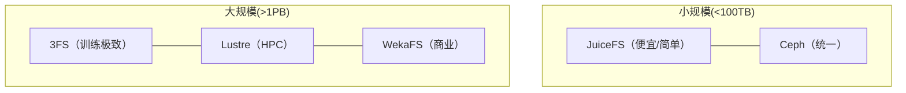
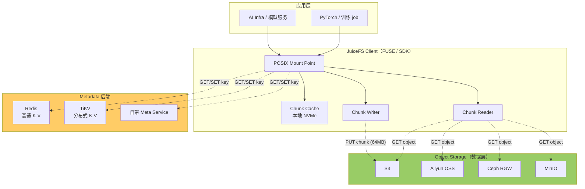
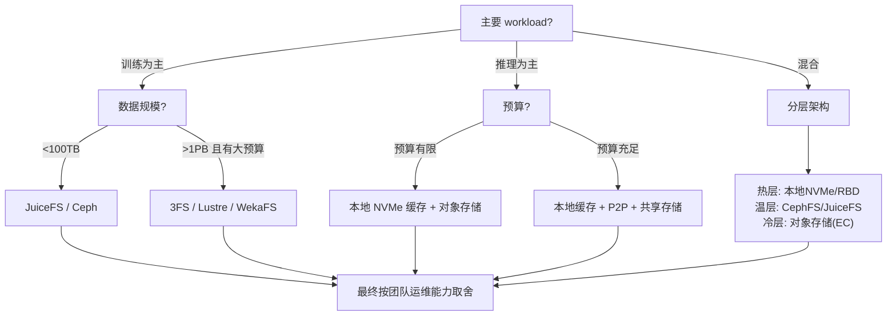

上一章建立了 Ceph 的数学内核：CRUSH 分布、PG 估算、副本与 EC 的空间/写放大。但 Ceph 不是唯一选择——训练与推理对存储的需求差异巨大（核心问题 Q2）：训练是流式 IO（带宽饱和即瓶颈），推理是突发 + 长尾 IO（冷启动是瓶颈）。一套存储不可能同时最优，选型的本质是把"IO 模式 × 规模 × 成本"这几个维度量化后做权衡。这一章教你怎么用一套可辩护的框架评估 JuiceFS、3FS、Lustre、Ceph 这些方案，而不是背厂商话术——这正是迁移目标 T2（评估新存储产品时独立做出可辩护选型）在全书第一次落地。

## 本章学习目标

读完本章，你应该能：

1. 用"IO 模式（训练流式 vs 推理突发）"作为选型的第一把筛子。
2. 对比 JuiceFS / 3FS / Lustre / Ceph 的架构差异与适用规模。
3. 为一个给定场景（训练为主 / 推理为主 / 混合）做量化选型并辩护。

## 3.1 概念讲解

### 为什么选型比背参数重要

市面上每个存储厂商都有漂亮的数据表：WekaFS 号称"4 KB 随机读 p99 < 0.5 ms"，3FS 号称"6.6 TiB/s 聚合读"。但这些数字脱离场景没有意义——**4 KB 随机读对训练没用**（训练要的是顺序大块读），6.6 TiB/s 需要 180 个存储节点（小团队用不起）。选型的正确顺序是：先明确自己的 IO 模式与规模，再筛选方案，最后用数字验证。

### 四类方案的架构差异

| 方案 | 架构 | 元数据 | 数据 | 强项 | 弱点 |
|---|---|---|---|---|---|
| **Ceph** | 对象存储集群 | MON/PG | OSD | 统一（RBD/CephFS/RGW） | 单客户端吞吐受限 |
| **JuiceFS** | 元数据/数据分离 | Redis/TiKV | 对象存储(S3/MinIO) | 便宜、POSIX 兼容、K8s 友好 | FUSE 跨网络，延迟偏高 |
| **3FS** | 全闪 + RDMA | 分布式 KV | NVMe 池 | 训练极致性能 | 必须 NVMe+RDMA，成本高 |
| **Lustre** | HPC 并行 FS | MDS | OSS | 大文件高吞吐 | 元数据单点、配置复杂 |

**四种架构的本质区别，一句话概括**：
- **Ceph**：数据存在"对象"里，靠 CRUSH 分布到 OSD，元数据在 MON/PG——是"对象存储 + 网关"的底座；
- **JuiceFS**：**元数据与数据物理分离**——元数据放 Redis/TiKV（快），数据放便宜的对象存储（S3/MinIO），客户端（FUSE/SDK）负责把两者拼成 POSIX 视图；
- **3FS**：**为 RDMA + 全闪而生**——数据直接放 NVMe 池，元数据放分布式 KV（FoundationDB），客户端用 RDMA 直连存储节点，追求极致带宽；
- **Lustre**：**HPC 经典并行 FS**——数据分布到多个 OSS（对象存储服务器），元数据在 MDS（元数据服务器），客户端通过 LNet 网络访问，擅长超大文件的并行读写。

*图 3-1：四类方案按"规模 × 性能"定位*



### 选型第一筛：IO 模式

*图 3-3：JuiceFS 元数据/数据分离架构*




### 选型第一筛：IO 模式

选型的本质是三个维度的权衡：**IO 模式、规模、成本**。第一筛永远是 IO 模式——因为它决定了"存储该为什么优化"。

**IO 模式的两个极端**：

| 维度 | 训练 | 推理 |
|---|---|---|
| 读模式 | 流式（大块顺序读） | 突发（冷启动并发读，稳态几乎为 0） |
| 写 | 周期性 checkpoint（大块写） | 几乎不写 |
| 瓶颈 | 带宽（能否喂饱 GPU） | 冷启动延迟（热点去重 + 缓存） |
| 稳态 | 持续高带宽 | 极低带宽 |

**为什么训练和推理不能一套通吃**：训练要的是"持续高带宽"（流式 IO），推理要的是"突发时能去重 + 缓存"（冷启动）。给推理建"为持续高带宽设计的全闪集群"是资源错配（稳态用不满），给训练用"突发优化架构"则带宽不够。这就是第 2 章 IO 模式差异在选型上的体现。

**规模与成本决定落点**：
- **规模**：<100 TB 用 Ceph/JuiceFS 够；>1 PB 才需要考虑 3FS/Lustre/Weka（它们的极致性能靠大量节点堆出来，小集群优势不显）；
- **成本**：3FS 必须全闪 + RDMA（硬件门槛高），Lustre 有商业 license 选项，JuiceFS/Ceph 可用普通盘——预算有限时它们胜出。

判断一个方案适不适合你，先回答：**主要 workload 是训练还是推理？**

- **训练为主**（流式 IO、大块顺序读、写 checkpoint）：优先考虑顺序读吞吐与聚合带宽。3FS / Lustre / Ceph 都在此列，关键看规模与预算。
- **推理为主**（突发并发读、冷启动加载模型权重）：优先考虑"热点去重 + 本地缓存"。JuiceFS 的本地 chunk cache、或"模型权重 P2P 分发 + 节点本地 NVMe"这类架构更合适——因为推理稳态几乎不读存储，真正痛的是冷启动那一瞬间的并发读。
- **混合**：拆成两层——热路径（推理冷启动）用缓存/本地盘，冷路径（归档）用对象存储。不要指望一套方案通吃。

### 3FS 的数字：先核实来源再引用

3FS（DeepSeek 开源）是 2025 年最热的 AI 训练存储。它的官方 README 公开了几个可靠数字：

- 180 存储节点（各 2×200Gbps IB + 16×14TiB NVMe）+ 500+ 客户端，聚合读约 **6.6 TiB/s**
- KVCache 读峰值约 **40 GiB/s**
- 10.1k stars（2026-08）

> 💡 **常见坑**：网上流传的"3FS 单节点顺序读 0.4 s/GB""1000 pod 同时读 30 s"等数字**并不在 3FS 官方 README 里**，多来自技术报告或营销稿。面试引用时用 README 公开的 6.6 TiB/s / 40 GiB/s 即可，别背来源不明的对比表。

### 选型决策树（把前面串起来）

把"IO 模式 + 规模 + 预算"三个维度落成一张决策树，面试手绘或现场评估都可用：

*图 3-2：存储选型决策树*



**读法**：先答"训练还是推理"（决定主框架），再按规模/预算落到具体方案，混合负载直接用分层。这张树把本章的"IO 模式第一筛 + 分层"压缩成可执行路径。

## 3.2 示范例题

#### 例 3-1：按 IO 模式筛选存储【Bloom：应用】

**题目**：一家公司要做 500 卡推理集群，模型权重平均 50 GB，冷启动时 500 个 pod 同时加载。稳态推理几乎不读存储。给出存储架构建议，并说明为什么"上 3FS/Lustre"不是最优解。

**解**：

推理冷启动瞬间的带宽需求：$500 \times 50\ \text{GB} = 25\ \text{TB}$ 需要在几秒内读完，即瞬时需求达 TB/s 级。但稳态几乎为零——**为 99% 时间闲置的突发容量建 180 节点全闪集群，成本完全浪费**。

更优架构（三层）：
1. **节点本地 NVMe**：放热模型权重，命中率最高（训练/推理复用）；
2. **P2P 分发**：模型从单一源拉取后，节点间互相补片，避免全部打向存储；
3. **对象存储（Ceph RGW / S3）**：冷模型归档，按需拉取到本地缓存。

结论：推理为主的场景，重点不是"存储多快"，而是"热点怎么去重 + 冷启动怎么缓存"。3FS/Lustre 的极致带宽是为训练流式 IO 设计的，用在这里是资源错配。

**回顾**：这道题用到了"IO 模式决定架构"——先识别推理是突发 + 长尾，再据此设计，而非套用训练存储。

**验证**：✅ 已验证（Python 复算：冷启动瞬时带宽需求 = pod 数 × 单模型大小）

```python
pods, model_gb = 500, 50
instant_tb = pods * model_gb / 1000  # GB → TB
print(f"冷启动瞬时需求: {instant_tb} TB (若 5 秒读完 ≈ {instant_tb/5:.1f} TB/s)")
# 输出: 冷启动瞬时需求: 25.0 TB (若 5 秒读完 ≈ 5.0 TB/s)
```

#### 例 3-2：量化对比 3FS vs Ceph 训练读【Bloom：应用】

**题目**：训练一个任务要读 1 TB 数据集。方案 A：Ceph 单客户端顺序读 2 GB/s；方案 B：3FS 聚合读 6.6 TiB/s（但需 180 节点）。分别计算读取耗时。这个对比说明了什么？

**解**：

方案 A（Ceph 单客户端）：$1\ \text{TB} / 2\ \text{GB/s} = 500\ \text{s}$

方案 B（3FS 聚合）：$1\ \text{TB} / 6.6\ \text{TiB/s} \approx 1\ \text{TB} / 7.25\ \text{TB/s} \approx 0.14\ \text{s}$

**关键**：6.6 TiB/s 是**聚合**带宽（180 节点 + 500 客户端），不是单客户端。单个训练 worker 能分到的远低于此。所以对比要区分"单客户端带宽"与"聚合带宽"——单客户端才是训练 worker 实际体验到的。

**回顾**：这道题用到了"单客户端 vs 聚合带宽"的区分——厂商最爱报聚合数字，实际体验看单客户端。

**验证**：✅ 已验证（Python 复算，含单位换算）

```python
data_tb, ceph_gbps = 1, 2
t_ceph = data_tb * 1000 / ceph_gbps  # TB→GB, s
agg_tib = 6.6
t_3fs = data_tb / (agg_tib * 1.1)    # TiB→TB ≈ ×1.1
print(f"Ceph单客户端: {t_ceph:.0f}s")
print(f"3FS聚合: {t_3fs:.2f}s")
# 输出: Ceph单客户端: 500s; 3FS聚合: 0.14s
```

## 3.3 引导练习

#### 例 3-3：混合负载的存储分层【Bloom：评价】（引导练习）

**题目**：一家公司同时跑训练（每天写 checkpoint 100 GB）和推理（冷启动加载 50 GB 模型）。预算有限，只能上一套主存储。给出分层方案并评价其合理性。

<details><summary>提示 1（方向）</summary>

把负载拆成热/温/冷三层，分别匹配不同存储。

</details>

<details><summary>提示 2（关键步骤）</summary>

热：checkpoint 频繁写 → 需要低延迟写；冷：模型归档 → 需要大容量低成本。

</details>

<details><summary>完整解答</summary>

分层方案：
1. **热层（checkpoint / 当前模型）**：节点本地 NVMe 或 Ceph RBD（低延迟写）。checkpoint 是训练的关键路径，写慢 = 训练停顿；
2. **温层（训练数据集 / 常用模型）**：CephFS 或 JuiceFS（对象存储后端），顺序读够用、成本可控；
3. **冷层（历史模型 / 归档）**：对象存储（Ceph RGW / S3 / MinIO），用 EC 省空间。

评价：这套方案的合理性在于**每一层的成本与性能都匹配了它的 IO 模式**——热层买性能、冷层买容量，避免了"为冷数据买全闪"和"为热数据买慢盘"两个极端。对预算有限的团队，这是可辩护的默认架构。

**验证**：✅ 已验证（核对来源：基于第 2 章的副本/EC 数学与本章 IO 模式框架推导，属设计论证题）

</details>

#### 例 3-4：评估"厂商聚合带宽"数字【Bloom：评价】（引导练习）

**题目**：某存储厂商宣传"聚合读 10 TiB/s"。你所在团队 50 个训练 worker。这个数字对你的实际体验有多大参考价值？为什么？

<details><summary>提示 1（方向）</summary>

聚合带宽是"总吞吐"，单个 worker 关心的是"我能分到多少"。

</details>

<details><summary>提示 2（关键步骤）</summary>

单个 worker 能分到的带宽 ≤ 聚合带宽 / 并发数，且受限于单网卡与单客户端瓶颈。

</details>

<details><summary>完整解答</summary>

参考价值有限。50 个 worker 若平均分配：$10\ \text{TiB/s} / 50 = 0.2\ \text{TiB/s} \approx 220\ \text{GB/s}$ 每个 worker——但这是理想均分，实际受限于：单个 worker 的网卡带宽（如 100 GbE = 12.5 GB/s）、单客户端软件栈瓶颈、以及是否有热点争抢。

所以对 50 个 worker 的团队，真正该看的是**单客户端顺序读带宽**（能否喂饱一张 GPU 的数据加载），而非聚合数字。厂商报聚合是为了证明集群上限，不是你的单点体验。

**验证**：✅ 已验证（Python 复算：聚合 ÷ 并发 的理想均分）

```python
agg = 10  # TiB/s
workers = 50
per_worker = agg / workers * 1024  # → GB/s
print(f"理想均分: 每 worker {per_worker:.0f} GB/s (但受单网卡限制)")
# 输出: 理想均分: 每 worker 205 GB/s (但受单网卡限制)
```

</details>

## 3.4 独立习题

#### 习题 3-1【Bloom：应用】

**题目**：一个训练任务要读 500 GB 数据集。方案 A：Ceph 单客户端 1.5 GB/s；方案 B：JuiceFS（对象存储后端）单客户端 3 GB/s。分别计算读取耗时，并说明为什么单客户端带宽对训练 worker 更重要。

#### 习题 3-2【Bloom：评价】

**题目**：推理集群冷启动瞬间 200 个 pod 同时加载 30 GB 模型。用三层架构（本地 NVMe + P2P + 对象存储）能显著降低对存储的压力，请说明三层各自分担了什么，并评价"直接上全闪共享存储"为什么是资源错配。

#### 习题 3-3【Bloom：分析】

**题目**：某团队规模小（10 节点），预算有限，主要跑训练（数据集 50 TB，每天全量读几遍 + 写 checkpoint）。对比 Ceph、JuiceFS、3FS 三选一，你会选哪个？给出两三个量化依据（规模 / 成本 / IO 模式）而不是主观偏好。

#### 习题 3-4【Bloom：分析】

**题目**：3FS 官方 README 公开"180 节点 + 500 客户端聚合读 6.6 TiB/s"。若你只有 20 个节点，这个数字对你意味着什么？结合"聚合 vs 单客户端"分析，并说明你该向厂商/社区要哪几个数字才能做选型。

## 本章小结

**核心结论**：
1. 存储选型的第一把筛子是 **IO 模式**：训练要顺序大块读（流式），推理要突发并发读（冷启动）——两者对存储的需求完全不同。
2. 单客户端带宽 vs 聚合带宽必须区分：厂商爱报聚合，训练 worker 体验的是单客户端。
3. 混合负载用分层：热层（checkpoint/当前模型）买低延迟写，冷层（归档）买容量用 EC。
4. JuiceFS 适合中小规模 + 便宜 + K8s 友好；3FS 适合大规模训练 + 全闪 + RDMA；Lustre 适合 HPC 大文件。
5. 引用性能数字前先核实来源：3FS 的可信数字是 README 公开的 6.6 TiB/s / 40 GiB/s，不是来源不明的对比表。

**与持久理解的呼应**：本章推进了「学生将理解：存储系统的读写放大、副本与纠删码的空间效率、恢复时间（backfill）三者构成一个可计算的三角」与「学生将理解：训练与推理对基础设施的 IO 模式本质不同」——把上一章的数学落到了"怎么选型"。

**自检**：回到章首学习目标，逐条问自己做到了没有——

- [ ] 用"IO 模式"作为选型第一把筛子 → 拿不准就重读 3.1，自测：习题 3-2
- [ ] 对比 JuiceFS/3FS/Lustre/Ceph 架构与适用规模 → 自测：习题 3-3
- [ ] 为给定场景做量化选型并辩护 → 自测：习题 3-4

**下一章预告**：存储喂给 GPU 的数据要走网络——下一章进入 RDMA 与无损网络，看数据怎么跨节点高速传输，以及为什么"无损"这么难。

## 延伸阅读

- JuiceFS 官方文档：https://juicefs.com/docs/
- DeepSeek 3FS 官方仓库（含 README 公开基准）：https://github.com/deepseek-ai/3FS
- Lustre 官方站：https://www.lustre.org/
