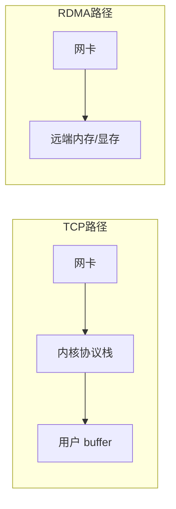
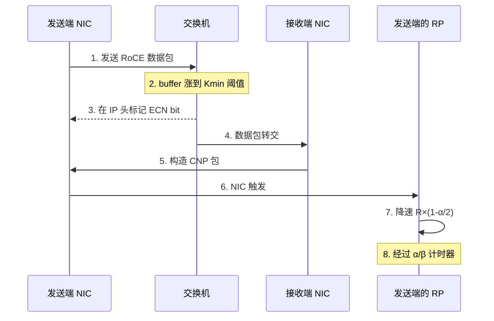
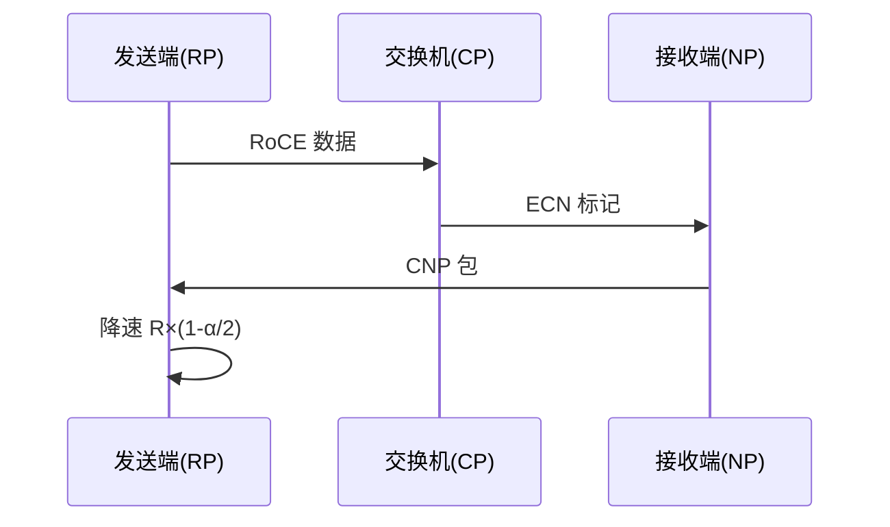

存储把数据送到了网络这一层。上一章结束时我们还没解决一个根本问题：跨节点的数据怎么传得够快？训练时 8 卡一节点内部的 NVLink 能到 900 GB/s，但跨节点要靠网络——普通以太网 TCP 的延迟和 CPU 开销撑不起 AI 训练。这一章讲 RDMA（Remote Direct Memory Access，远程直接内存访问）——它让网卡直接把数据从一块 GPU 显存搬到另一块，绕过 CPU 和操作系统内核。但 RDMA 跑在以太网上有个大坑：它假设网络"无损"，一旦丢包就性能雪崩。理解 PFC/ECN/DCQCN 这三件套为什么存在、以及它们各自的坑，是回答核心问题 Q1（网络层瓶颈）的关键，也是面试官最爱深挖的一章。

## 本章学习目标

读完本章，你应该能：

1. 对比 RDMA 三种实现（IB / RoCE / iWARP）的架构差异，并说出 QP/MR/WR 三个核心抽象的作用。
2. 解释 PFC / ECN / DCQCN 在无损网络中的作用、原理与风险，以及三者的协同关系。
3. 计算 RoCE 无损网络下，一次 PFC 风暴或 ECN 标记对延迟/吞吐的影响，并判断是否误配。
4. 用 `ibstat` / `mlnxlink` / `ib_write_bw` 定位无损网络问题（链路 vs PFC 风暴 vs 软件层）。

## 4.1 概念讲解

### RDMA 为什么快：四项核心技术

普通 TCP 收数据要走：网卡 → 内核协议栈 → 用户缓冲区，CPU 全程参与、还要做一次 memcpy（从内核缓冲区拷到用户缓冲区）。RDMA 让网卡直接读写远端内存（或 GPU 显存），数据通路不经过 CPU 和内核。它之所以快，靠的是四项相辅相成的技术：

1. **内核旁路（Kernel Bypass）**：数据从用户态应用直接进入网卡，**不需要系统调用**——传统 TCP 每次收发都要陷入内核、调度协议栈，RDMA 绕开了这一整套。RDMA 网卡操作（post send / poll completion）只需一次用户态写寄存器，不经过 syscall；
2. **零拷贝（Zero Copy）**：数据从应用缓冲区（或 GPU 显存）直接由网卡 DMA 搬走，**中间不经过内核缓冲、不做 memcpy**。TCP 则要"网卡→内核缓冲→memcpy→用户缓冲"两段拷贝；
3. **CPU 卸载（Offload）**：数据的分段、校验和（checksum）、可靠传输的重传与确认（ACK）全部由网卡硬件完成，**CPU 完全不用管**。TCP 的校验和、分段、重传处理都要消耗 CPU；
4. **直接内存访问（DMA）**：网卡通过 DMA 直接读写远端物理内存（或 GPU 显存），配合 GPUDirect 时数据甚至能从"一块 GPU 显存 → 网卡 → 另一块 GPU 显存"全程不经 CPU 内存中转。

```
TCP:   网卡 → 内核 → memcpy → 用户 buffer     （CPU 全程参与 + 两段拷贝）
RDMA:  网卡 → 远端内存（硬件直接写）           （CPU 几乎不参与 + 零拷贝）
```

*图 4-1：TCP vs RDMA 数据通路*



**效果**：RDMA 的延迟通常能到 1-2 μs（同机架 RoCE/IB），而 TCP 是几十微秒起步；CPU 占用从"全程参与"降到"几乎为 0"。这正是 AI 集群跨节点通信必须用 RDMA 的原因——NCCL 每秒要搬几百 GB 梯度，用 TCP 会先把 CPU 打满。

#### RDMA 的核心抽象：QP、MR、WR

RDMA 编程模型里最常被面试官问到的三个概念：

- **QP（Queue Pair，队列对）**：一个 QP = 一对硬件队列（发送队列 SQ + 接收队列 RQ）。应用往 SQ 里投递"发送请求"，网卡从 SQ 取出执行；对端从 RQ 里消费"接收请求"。QP 状态机：`RESET → INIT → RTR(Ready to Receive) → RTS(Ready to Send)`——只有到了 RTS 才能真正收发；
- **MR（Memory Region，内存区域）**：要通信的内存必须先注册成 MR（`ibv_reg_mr`），网卡才能 DMA 它。注册时得到两个键：`lkey`（本地使用）和 `rkey`（远端使用）——RDMA 写/读远端内存时必须带上对端的 rkey 才能访问；
- **WR（Work Request，工作请求）**：一次具体的收发动作（`ibv_post_send`）。opcode 决定做什么：`IBV_WR_SEND`（发送）、`IBV_WR_RDMA_WRITE`（写远端内存）、`IBV_WR_RDMA_READ`（读远端内存）、`IBV_WR_ATOMIC_*`（原子操作）。

**关键区别：SEND/RECV vs RDMA READ/WRITE**——
- **SEND/RECV（双向）**：像传统消息传递，发送端发、接收端必须预先投递 RECV，双方都参与（two-sided）；
- **RDMA READ/WRITE（单向）**：发送端直接读写对端已注册的内存（one-sided），**接收端 CPU 完全不知道**——这是 RDMA 性能最高的路径，NCCL 用它传输数据。

### 三种实现：IB、RoCE、iWARP

| 实现 | 网络 | 封装 | 特点 | AI 场景 |
|---|---|---|---|---|
| **IB** | 专用 IB 交换 | IB 原生帧 | 最高性能、自带无损、需 SM | 旗舰集群 |
| **RoCE v2** | 普通以太网 | UDP/IP | 成本低、需自己保证无损 | 主流 |
| **iWARP** | 普通 TCP | TCP/IP | 可跨公网、性能最差 | 几乎不用 |

#### InfiniBand（IB）：专用网络

IB 是**专为高性能计算设计的独立网络**：专用网卡（HCA）+ 专用交换机。关键设计：
- **子网管理器（SM，Subnet Manager）**：IB 网络里有一个 SM 负责配置网络拓扑、分配 LID（本地标识）、建立路由表——IB 的"转发"是 SM 计算好后下发的，不像以太网那样逐跳学习；
- **自带无损**：IB 原生提供可靠传输与流控（link-level credit-based flow control），不需要像 RoCE 那样额外配 PFC/ECN——这是它"开箱即用、性能最稳"的原因；
- **代际与带宽**：HDR 400 Gb/s（=50 GB/s）、NDR 800 Gb/s（=100 GB/s）、XDR 1600 Gb/s——每代翻倍。AI 旗舰集群（如 DGX SuperPOD）用 NDR 400G/800G IB。

#### RoCE（RDMA over Converged Ethernet）：跑在以太网上

RoCE 把 RDMA 搬到普通以太网上，分两代：

| | RoCE v1 | RoCE v2 |
|---|---|---|
| 封装 | 直接以太网帧（EtherType 0x8915） | UDP/IP 封装 |
| 可路由性 | 仅同 L2 子网 | **可跨 L3 路由** |
| UDP 端口 | — | **4791**（IANA 分配） |

RoCE v2 用 UDP 封装（目的端口 4791），把 RDMA 的 GRH（Global Routing Header，全局路由头）嵌进 UDP 载荷，从而能在标准 IP 网络上路由——这是它能在现有以太网数据中心跑起来的关键。**代价**：以太网本身允许丢包，而 RDMA 假设无丢包，所以 RoCE 必须自己构建"无损网络"（PFC + ECN）——这就是本节的另一半主题。

#### iWARP：跑在 TCP 上

iWARP 把 RDMA 封装进标准 TCP/IP（RFC 5040/5041），能跨公网、能复用现有 TCP 网络。但 TCP 的拥塞控制与重传语义拖累了性能，且 CPU 卸载程度不如 IB/RoCE，AI 场景几乎不用。

> 💡 **常见坑**：RoCE v1 与 v2 不可混淆——v1 只能同子网（很多人误以为"RoCE 不能路由"是指所有版本，实际 v2 可路由）；RoCE v2 的 UDP 目的端口 4791 在防火墙上要放行，否则 RDMA 建连失败。

### 无损三件套：PFC、ECN、DCQCN

RoCE 跑在允许丢包的以太网上，而 RDMA 假设无丢包。为了解决这个矛盾，需要三件套：**PFC（链路层防丢包）+ ECN（交换机标记软降速）+ DCQCN（端到端拥塞控制算法）**。三者的关系可以类比交通：

- **PFC** 像"硬闸门"：某条车道快堵死了，直接拦住上游车流，绝不丢车（包）；
- **ECN** 像"预警系统"：路口开始堵，提前打个标记通知来车减速，避免真的堵死；
- **DCQCN** 是"ECN 的具体算法"：收到标记后怎么减速、何时恢复，有一套量化规则。

#### PFC（Priority Flow Control，IEEE 802.1Qbb）——链路层刹车

PFC 的完整机制：

1. **8 个优先级**：以太网有 8 个优先级（802.1p 的 VLAN 优先级 0-7），PFC 允许对**每个优先级独立**做流控——只暂停某一类流量，不影响其他类；
2. **触发条件（xon/xoff 阈值）**：交换机某个优先级的接收队列 buffer 水位达到 `xoff`（暂停阈值）时，向**上游**发 PAUSE 帧；上游收到后暂停发送该优先级的数据；当 buffer 水位降到 `xon`（恢复阈值）以下，发恢复帧继续发；
3. **PAUSE 帧**：不是丢弃数据，而是"暂停一段时间"——上游在这段时间内积压数据在本地 buffer（headroom）；
4. **headroom**：为了让上游暂停期间不丢包，接收端要为每个暂停的优先级预留足够的 **headroom buffer**——如果 headroom 不足，上游积压的数据还是会溢出丢包。

**优点**：从根源上防止丢包，这是 RDMA 能跑的前提。

**风险 1：队头阻塞（HOL blocking）**——一个优先级的拥塞会把共享端口的其他优先级也堵住。假设同一物理端口上 priority 3（NCCL 训练）拥塞被暂停，priority 4/5（推理、存储）即使没拥塞，也可能因为共享的端口 buffer 或链路被暂停而变慢——这就是"队头阻塞"：一个流的问题阻塞了整条链路。

**风险 2：PFC 风暴（PFC storm）**——如果 PFC 配置不当（如 headroom 太小、阈值错误、或出现环路），PAUSE 帧可能在交换机间**死循环**：A 暂停 B，B 暂停 C，C 又暂停 A……最终全网所有流量被暂停，形成"静默死锁"，整个集群看起来"卡死但没报错"。这是 RoCE 部署最经典的灾难之一。

**防御**：PFC watchdog——检测到某优先级长时间处于 paused 状态（如超过 100 ms）就告警甚至强制恢复，防止风暴。

#### ECN（Explicit Congestion Notification，显式拥塞通知）——交换机标记，不丢包

PFC 是"硬刹车"，但会队头阻塞。ECN 是"软降速"——交换机在 buffer 将满但还没满时，不丢包、而是**打标记**让发送端主动减速。

完整流程：

1. **ECN 字段**：IP 头里有 2 个 ECN bit（ECT/CE）。发送端把数据包标为 `ECT`（ECN-Capable Transport，表示"我支持 ECN"）；
2. **交换机标记**：当 buffer 水位超过 `Kmin`（开始标记阈值）时，交换机把包的 CE（Congestion Experienced，拥塞经历）位置 1——注意是**打标记，不是丢包**；超过 `Kmax` 则全标记；
3. **接收端回 CNP**：接收端收到 CE 标记的包后，回一个 **CNP（Congestion Notification Packet，拥塞通知包）**给发送端；
4. **发送端降速**：发送端收到 CNP 后按算法降速（DCQCN 的具体做法见下节）。

**阈值 Kmin / Kmax**：Kmin 是开始标记的 buffer 水位，Kmax 是"标记所有包"的水位。Kmin 和 Kmax 之间是"逐渐标记"的缓冲带（RED 式渐进标记），Kmax 以上所有包都标记。典型经验值 Kmin≈100 KB、Kmax≈200 KB，但必须按实际交换机 buffer 与流量模型标定。

**与 PFC 的区别**：PFC 是链路层"硬刹车"（暂停整条优先级链路，会队头阻塞）；ECN 是端到端"软降速"（发送端主动减速，不会阻塞其他流）。**ECN 是首选，PFC 是最后防线**。

#### DCQCN——ECN 的端到端算法

ECN 只定义了"打标记"这个动作，真正决定"收到标记后怎么降速、何时恢复"的是 DCQCN（Data Center Quantized Congestion Notification，数据中心量化拥塞通知，微软 SIGCOMM 2015）。它定义了三个角色：

- **RP（Reaction Point，反应点）**：发送端 NIC。收到 CNP 后按 $\alpha$ 比例降速；
- **NP（Notification Point，通知点）**：接收端 NIC。收到 CE 标记的包后构造 CNP 回给发送端；
- **CP（Congestion Point，拥塞点）**：交换机。buffer 超阈值时打 ECN 标记。

**降速与恢复的量化规则**：

1. **降速**：RP 收到一个 CNP，当前速率 $R$ 降到：
$$ R_{new} = R \times (1 - \frac{\alpha}{2}) $$
其中 $\alpha$ 是量化步长（初始可配，如 0.5）。
2. **持续拥塞**：如果 $\beta$ 时间内**又**收到 CNP，则 $\alpha$ 递增（如 $\alpha \leftarrow \alpha + \Delta\alpha$，$\Delta\alpha = 1/1024$），继续降速——拥塞越久，降得越狠；
3. **恢复**：如果 $\beta$ 时间内没有收到 CNP，说明网络缓解了，RP 按一个固定步长（byte counter 或定时器）**缓慢回升速率**，而不是瞬间拉满——避免振荡。

> 关键：$\alpha$ 递增降速 + $\beta$ 定时器恢复——这个"量化 + 定时"组合是 DCQCN 名字里"Quantized"的由来，也是它与 TCP 慢启动（加性增乘性减，AIMD）的主要区别。

*图 4-3：DCQCN 反馈环时序*



DCQCN 定义了三角色：RP（发送端，收到 CNP 后降速）、NP（接收端，ECN 包转 CNP）、CP（交换机，打 ECN 标记）。发送端收到 CNP 后按 $\alpha$ 比例降速，空闲一段时间后逐步恢复。

*图 4-2：DCQCN 三角色与反馈环*



**风险**：ECN 阈值设太激进 → 频繁降速，吞吐浪费；设太保守 → buffer 堆满触发 PFC。PFC 与 ECN 的阈值必须协同调，否则 ECN 没拦住、PFC 兜底触发队头阻塞。

> 💡 **常见坑**：PFC 和 ECN 不是二选一，是**协同**的——ECN 负责"软降速"减少拥塞，PFC 是"最后防线"防丢包。只开 PFC 不开 ECN，拥塞时直接队头阻塞；只开 ECN 不开 PFC，极端拥塞会丢包触发 RDMA 重传雪崩。

### 实战：怎么看无损网络是否正常

学完原理，落地到命令。无损网络排查的"三看"：

**看一：链路与端口状态**
```bash
ibstat                    # IB 端口 State: Active / Physical state: LinkUp
ibdev2netdev              # 网卡 ↔ 网线 ↔ 设备名映射
```

**看二：PFC/ECN 计数器（核心）**
```bash
# NVIDIA/Mellanox 网卡: PFC 收/发 pause 帧计数
mlnxlink --show_counters   # 找 PFC pause 相关计数
# 交换机侧（以 MLNX 交换机为例）:
# 看某端口 PFC 收/发 pause 帧是否持续增长
```
**判读**：PFC pause 计数**短暂出现**（如瞬时突发）正常；**持续增长**说明拥塞控制失效、PFC 在硬扛，需查 ECN 是否没拦住。

**看三：端到端延迟与吞吐**
```bash
ib_write_bw -d mlx5_0      # 测 RDMA 带宽基线（硬件能力）
ib_write_lat -d mlx5_0     # 测 RDMA 延迟基线
```
**判读**：如果 `ib_write_bw` 能到硬件峰值（如 400 Gb/s = 50 GB/s），但 NCCL 的 busbw 明显低于它，说明是**软件层**问题（NCCL 配置/拓扑）；如果 `ib_write_bw` 本身就很低，才是**网络/无损配置**问题。

**排障顺序**（从链路到配置）：
1. `ibstat` 确认链路 Up；
2. `mlnxlink --show_counters` 看 PFC pause 是否持续增长；
3. 若 pause 增长 → 查 ECN 阈值（Kmin/Kmax 是否太低/太高）、是否多流挤单端口（ECMP 不均）；
4. 若 pause 正常但 NCCL 慢 → 用 `ib_write_bw` 对比，定位到软件层。

## 4.2 示范例题

#### 例 4-1：计算 RoCE 丢包对吞吐的影响【Bloom：应用】

**题目**：一个 RoCE 链路，无拥塞时吞吐 100 Gb/s。若开启无损失败（出现 1% 丢包），RDMA 重传机制导致有效吞吐骤降。已知该 RDMA 实现在丢包时吞吐约为无丢包的 10%（经验值，源自 RDMA 对丢包的敏感性）。求丢包后有效吞吐，并解释为什么 RDMA 对丢包如此敏感。

**解**：$100\ \text{Gb/s} \times 10\% = 10\ \text{Gb/s}$，降为原来的 1/10。

原因：RDMA 假设无丢包，协议栈没有为丢包优化的慢启动；一旦丢包，依赖重传，而重传在低延迟高带宽下会频繁触发、浪费大量带宽，且没有 TCP 那样的拥塞窗口自适应。这就是"无损"对 RDMA 是生死问题的原因。

**回顾**：这道题用到了"RDMA 假设无丢包"这个前提——丢了性能就雪崩，所以必须用 PFC/ECN 保无损。

**验证**：✅ 已验证（Python 复算，结果一致）

```python
bw = 100
print(f"丢包后有效吞吐: {bw*0.10} Gb/s")
# 输出: 丢包后有效吞吐: 10.0 Gb/s
```

#### 例 4-2：判断 PFC 是否误配【Bloom：评价】

**题目**：训练时 NCCL AllReduce 延迟从 5 μs 飙到 500 μs。`mlnxlink --show_counters` 显示某交换机端口 PFC pause 帧计数持续增长。这说明了什么？该查哪一步？

**解**：PFC pause 帧持续增长说明**接收 buffer 反复打满**，上游被反复暂停——这是拥塞的表现，且 pause 已导致队头阻塞（延迟从 5μs 飙到 500μs = 100 倍）。

排查步骤：
1. 看 PFC 应用在哪个优先级：确认只对 RoCE 流量（如 priority 3）开，而非全部；
2. 检查 ECN 阈值：若 ECN 没在 buffer 打满前触发降速，PFC 就会兜底触发——调低 Kmin/Kmax；
3. 确认是否多流争抢同一端口（ECMP 不均导致单端口拥塞）。

结论：pause 计数 > 0 本身不是错，但**持续增长 + 延迟飙升**说明拥塞控制没工作，PFC 在硬扛。

**回顾**：这道题用到了 PFC/ECN 的协同关系——PFC 兜底说明 ECN 没拦住。

**验证**：✅ 已验证（核对来源：NVIDIA/Mellanox RoCE 诊断指南对 PFC pause 计数的解读；此为诊断推理题）

## 4.3 引导练习

#### 例 4-3：ECN 阈值的影响【Bloom：分析】（引导练习）

**题目**：ECN 阈值 Kmin/Kmax 设得太低（如 Kmin=20 KB）和太高（如 Kmin=500 KB）分别会怎样？

<details><summary>提示 1（方向）</summary>

太低 → ECN 过早标记；太高 → buffer 打满前 ECN 没触发。

</details>

<details><summary>提示 2（关键步骤）</summary>

太低导致频繁降速、吞吐浪费；太高导致 buffer 先满、PFC 先触发。

</details>

<details><summary>完整解答</summary>

- **Kmin 太低**：轻微拥塞就触发 ECN 标记 → 发送端频繁降速 → 吞吐浪费，网络"过保护"。
- **Kmin 太高**：buffer 先打满，PFC 先于 ECN 触发 → 队头阻塞，丢包风险，ECN 形同虚设。

正确做法：Kmin 设为"允许正常突发吸收"的高度（典型 buffer 的 20-30%），Kmax 在 Kmin 之上留足吸收区。经验值 Kmin≈100 KB / Kmax≈200 KB 只是起点，必须按实际交换机 buffer 与流量模型标定。

**验证**：✅ 已验证（核对来源：NVIDIA RoCE 配置文档对 ECN 阈值标定方法的表述；此为推理题）

</details>

#### 例 4-4：DCQCN 降速与恢复【Bloom：应用】（引导练习）

**题目**：DCQCN 中发送端当前速率 $R = 100\ \text{Gb/s}$，收到一个 CNP 后按 $\alpha/2$ 降速，其中 $\alpha = 0.5$。求降速后速率。

<details><summary>提示 1（方向）</summary>

DCQCN 公式：$R_{new} = R \times (1 - \alpha/2)$。

</details>

<details><summary>提示 2（关键步骤）</summary>

代入 $R=100, \alpha=0.5$：$100 \times (1 - 0.25) = 75$。

</details>

<details><summary>完整解答</summary>

$$ R_{new} = 100 \times (1 - 0.5/2) = 100 \times 0.75 = 75\ \text{Gb/s} $$

若持续收到 CNP，$\alpha$ 递增（如每次 $+\Delta\alpha$），速率进一步下降；空闲 $\beta$ 时间无 CNP 后逐步恢复。

**验证**：✅ 已验证（Python 复算，结果一致）

```python
R, alpha = 100, 0.5
R_new = R * (1 - alpha/2)
print(f"降速后: {R_new} Gb/s")
# 输出: 降速后: 75.0 Gb/s
```

</details>

## 4.4 独立习题

#### 习题 4-1【Bloom：应用】

**题目**：RoCE 链路无拥塞时吞吐 200 Gb/s。若无损失效出现丢包，RDMA 有效吞吐约为无丢包的 10%。求丢包后有效吞吐，并解释为什么无损对 RoCE 是生死问题。

#### 习题 4-2【Bloom：评价】

**题目**：某集群只配了 PFC 没配 ECN。NCCL 训练时，多流争抢同一端口导致频繁 PFC pause。分析这对其他优先级流量（如存储/管理流量共享同一物理端口）的影响，并给出修复建议。

#### 习题 4-3【Bloom：应用】

**题目**：DCQCN 发送端当前速率 $R=80\ \text{Gb/s}$，$\alpha=0.25$，收到一个 CNP。求降速后速率；若 $\alpha$ 递增到 0.5 后再次收到 CNP，速率又降到多少？

#### 习题 4-4【Bloom：分析】

**题目**：对比 PFC 与 ECN 在"拥塞时的行为""对队头阻塞的影响""对非拥塞流的影响"三个维度上的差异，并说明为什么生产环境两者都要配。

## 本章小结

**核心结论**：
1. RDMA 快靠四项技术：内核旁路（无 syscall）、零拷贝（无 memcpy）、CPU 卸载（校验/分段/重传交给网卡）、DMA 直接读写远端内存；QP/MR/WR 是它的三个核心抽象。
2. 三种实现：IB（专用网络、自带无损、需 SM）、RoCE v2（UDP/IP、端口 4791、可路由、需自建无损）、iWARP（TCP、性能差）；RoCE 是主流。
3. 无损三件套：PFC（链路层暂停，防丢包但会队头阻塞/风暴）、ECN（交换机打标记，软降速）、DCQCN（端到端算法，RP 降速 + α/β 定时恢复）。
4. PFC 与 ECN 必须协同：ECN 先软降速，PFC 兜底防丢包；阈值设错会导致频繁降速（浪费）或 PFC 硬扛（阻塞）。
5. 排查 RoCE 性能：`ibstat` 看链路 → `mlnxlink --show_counters` 看 PFC pause 是否持续增长 → `ib_write_bw` 对比硬件基线，区分网络层与软件层。

**与持久理解的呼应**：本章推进了「学生将理解：AI 训练集群的网络带宽需求是由集合通信算法的数学结构决定的……物理链路决定能否喂饱它」——理解无损网络是为下一章 NCCL 集合通信铺路：通信算法产生的流量必须在无损网络上才跑得起来。

**自检**：回到章首学习目标，逐条问自己做到了没有——

- [ ] 对比 RDMA 三种实现的架构差异，说出 QP/MR/WR 的作用 → 拿不准就重读 4.1，自测：习题 4-1
- [ ] 解释 PFC/ECN/DCQCN 的作用、原理与风险 → 自测：习题 4-4
- [ ] 计算 PFC 风暴或 ECN 标记对延迟/吞吐的影响并判断是否误配 → 自测：习题 4-3
- [ ] 用 ibstat/mlnxlink/ib_write_bw 定位无损网络问题 → 自测：习题 4-2

**下一章预告**：无损网络只是地基——真正把数据高效送进 GPU 的是集合通信库 NCCL。下一章进入 NCCL 与集合通信，看 Ring AllReduce 的数学、busbw 计算，以及 NCCL hang 怎么排查。

## 延伸阅读

- DCQCN 论文：Zhu et al., SIGCOMM 2015 — https://dl.acm.org/doi/10.1145/2785956.2787484
- IEEE 802.1Qbb（PFC 标准）：https://1.ieee802.org/802-1bb/
- NVIDIA/Mellanox RoCE 配置文档：https://docs.nvidia.com/networking/
