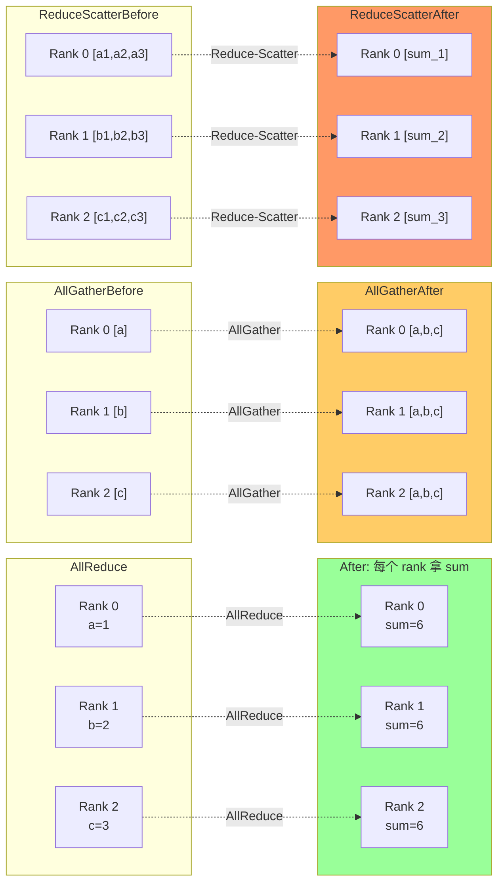
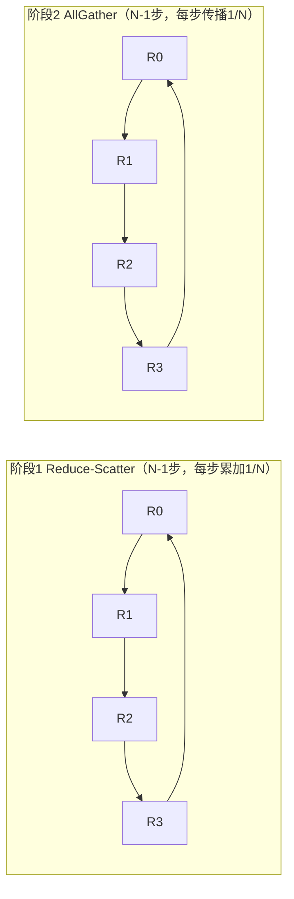
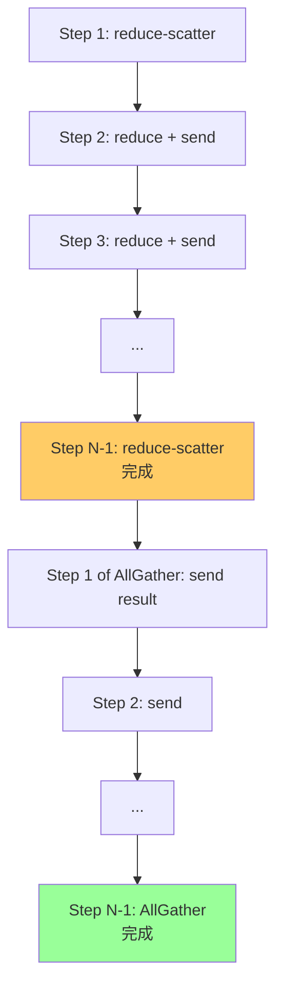

上一章我们把无损网络讲清楚了——但网络只是把数据从 A 搬到 B 的"管子"，真正决定"搬多少、怎么搬"的是集合通信算法。训练时每个 GPU 算完自己的梯度后，需要把所有 GPU 的梯度加起来（AllReduce），这个"加起来"的过程有多快，直接决定训练能扩展到多少卡。NCCL（NVIDIA Collective Communication Library）就是做这件事的库。这一章我们拆解它的数学内核：Ring AllReduce 到底传多少数据、为什么带宽最优、busbw 怎么算；以及一旦它 hang 住，怎么系统化地排查（核心问题 Q1 的网络层 + 故障层）。

## 本章学习目标

读完本章，你应该能：

1. 计算 Ring AllReduce 的总数据传输量与时间公式，并判断给定链路带宽是否够用。
2. 计算并解读 nccl-tests 输出的 algbw 与 busbw。
3. 列出 NCCL hang 的系统化排查步骤，并解释每步的依据。

## 5.1 概念讲解

### 集合通信是什么

分布式训练中，每个 GPU 有自己的一份数据/梯度。集合通信（collective communication）解决"多对多"的数据交换：

| 操作 | 每个 rank 输入 | 每个 rank 输出 | 典型用途 |
|---|---|---|---|
| **AllReduce** | 自己的数据 | 所有数据的和 | DP 训练梯度同步 |
| **AllGather** | 自己的数据 | 所有人的数据 | TP 激活/权重收集 |
| **ReduceScatter** | 自己的数据 | 和的一部分 | AllReduce 的第一阶段 |
| **Broadcast** | root 有数据 | 所有人有该数据 | 广播权重/初始化 |
| **AllToAll** | 自己的多份 | 每人收所有 rank 的一份 | MoE 专家路由 |

训练用最多的是 **AllReduce**（梯度求和后分发回每个 rank）——DP（数据并行）下每个 rank 算完自己的梯度，需要所有 rank 的梯度相加得到全局梯度，再继续下一步。

**为什么 AllReduce 是核心**：DP 训练里，每步 forward+backward 之后都有一轮 AllReduce。它的耗时直接决定训练的扩展效率——AllReduce 越快，加 GPU 带来的加速越接近线性。NCCL 的价值就在把 AllReduce 做得尽可能快。

### Ring AllReduce：带宽最优

**朴素做法为什么不行**：最直观的 AllReduce 是"所有 rank 把数据发给 rank 0，rank 0 求和再广播"。但 rank 0 要收 N 份、发 N 份，成为瓶颈（带宽 O(N)），且 rank 0 是单点。Ring 算法让**所有 rank 同时工作**，把带宽利用率做到最优。

**Ring 的两阶段与数据量推导**（这是面试必考）：

**阶段 1（Reduce-Scatter）**：每个 rank 把自己的数据切成 N 份，沿环传递并累加。第 1 步 rank i 把 chunk 0 发给 rank i+1，rank i+1 累加自己的 chunk 0；第 2 步把累加后的 chunk 0 再传给下一跳……N-1 步后，每个 rank 持有完整和的 1/N（自己那个 chunk 的全局和）。

**阶段 2（AllGather）**：每个 rank 把自己持有的 1/N 结果沿环传播，N-1 步后所有 rank 拿到完整和。

**每 rank 传输量推导**：
- 每步传 1/N 的数据（自己的数据切成 N 份）；
- 两阶段各 N-1 步；
- 所以每个 rank 总共传输 $2(N-1)/N$ 份自己的数据。

$$ \text{每 rank 传输量} = \frac{2(N-1)}{N} \times \text{size} $$

当 N 很大时，$2(N-1)/N \to 2$——即**每个 rank 只传自己数据的约 2 倍**，这是带宽最优的证明（对比朴素做法的 O(N) 倍）。这也是"为什么 64 卡只传约 2 倍而非 64 倍"的答案。

*图 5-2：AllReduce / AllGather / ReduceScatter 对比*




最直观的 AllReduce 是"所有 GPU 把数据发给 rank 0，rank 0 求和再广播"——但这样 rank 0 是瓶颈。Ring 算法把所有 rank 串成一个环，分两阶段：

**阶段 1（Reduce-Scatter）**：每个 rank 把自己的数据切成 N 份，沿环传递并累加，N 步后每个 rank 持有完整和的 1/N。

**阶段 2（AllGather）**：每 rank 把自己持有的 1/N 结果沿环传播，N 步后所有 rank 拿到完整和。

*图 5-1：Ring AllReduce 两阶段*



**关键数学**：每个 rank 每步传 1/N 的数据，两阶段各 N-1 步，所以**每个 rank 总共传输 $2(N-1)/N$ 份自己的数据**——这是"带宽最优"（每个字节只传约 2 倍，而非 N 倍）。

**时间公式**：

$$ T = 2(N-1) \cdot \alpha + \frac{2(N-1)}{N} \cdot \frac{\text{size}}{\beta} $$

其中 $N$ 是 rank 数，$\alpha$ 是每步延迟（latency），$\beta$ 是带宽（bandwidth），size 是单 rank 数据量。

### 用例子理解：64 卡 70B 模型

*图 5-3：Ring AllReduce 两阶段流程*




训练 70B 模型，64 卡，每步 AllReduce 的梯度数据量：

$$ \text{size} = \frac{70\text{B} \times 2\ \text{bytes}}{64} \approx 2.2\ \text{GB} $$

总传输（每 rank）：$2(N-1)/N \times 2.2\ \text{GB} \approx 2 \times 2.2 = 4.4\ \text{GB}$

单节点内 NVLink 900 GB/s 绰绰有余；跨节点要看网络能否喂饱——这就是第 4 章无损网络的意义。

### algbw 与 busbw

nccl-tests（`all_reduce_perf`）输出两个带宽：

- **algbw**（algorithmic bandwidth）= size / time，算法视角的吞吐；
- **busbw**（bus bandwidth）= algbw × 修正系数。AllReduce 的修正系数是 $2(N-1)/N$，用来对齐"硬件总线实际搬运量"。

$$ \text{busbw} = \text{algbw} \times \frac{2(N-1)}{N} $$

**为什么需要 busbw（关键）**：AllReduce 完成一次，硬件实际搬了 $2(N-1)/N$ 份数据，但 algbw 只按"一份 size / 时间"算。所以 **N 越大，algbw 越显得"慢"**（因为实际搬运量接近 2 份，而 algbw 只按 1 份算）——但这不代表硬件变慢，是算法效率的假象。busbw 用修正系数把实际搬运量算进去，**排除了 N 的影响**，才能跟硬件峰值（NVLink 900 GB/s）公平对比。

**例子**：8 卡 algbw=400 GB/s，busbw = 400 × 2×7/8 = 700 GB/s——对比 NVLink 900 GB/s，利用率约 78%，说明接近硬件上限；如果 algbw 也是 700（即 busbw ≈ algbw），说明只有 1 个 rank 在搬（异常，可能走了错误的通信路径）。

### Ring vs Tree：算法选型

Ring 带宽最优但**延迟随 N 线性增长**（N-1 步）；Tree 延迟随 N **对数增长**（log₂N 层）但带宽利用差、根节点是热点。NCCL 默认按消息大小和拓扑自动选：

| | Ring | Tree |
|---|---|---|
| 延迟 | O(N)（N-1 步） | O(log₂N) |
| 带宽 | 最优（约 2 倍数据） | 较差（根节点瓶颈） |
| 适合 | 大消息（带宽敏感） | 小消息（延迟敏感） |
| 时间公式 | $2(N-1)\alpha + \frac{2(N-1)}{N}\frac{\text{size}}{\beta}$ | $\log_2N \cdot \alpha + \frac{2(N-1)}{N}\frac{\text{size}}{\beta}$ |

**经验法则**：消息 < 1 KB 用 Tree（延迟主导，带宽不重要）；消息 > 1 MB 用 Ring（带宽主导）；中间地带 NCCL 自动选。这就是 5.4 例题"为什么小消息用 Tree"的依据。

## 5.2 示范例题

#### 例 5-1：计算 64 卡 AllReduce 的带宽需求【Bloom：应用】

**题目**：64 卡训练 70B 模型（bf16，2 bytes/参数），每步 AllReduce 梯度。设一次训练 step 目标 2 秒，NCCL 通信占 20%。求需要的平均 AllReduce 带宽，并判断 NVLink（900 GB/s，单节点 8 卡）与跨节点网络（8 节点各 400 Gb/s）能否满足。

**解**：

单 rank 数据量：$70\text{B} \times 2 / 64 = 2.1875\ \text{GB}$

每 rank 总传输：$2(N-1)/N \times 2.1875 \approx 2 \times 2.1875 = 4.375\ \text{GB}$

通信预算：$2\ \text{s} \times 20\% = 0.4\ \text{s}$

所需带宽：$4.375\ \text{GB} / 0.4\ \text{s} = 10.94\ \text{GB/s}$

- 单节点 8 卡：NVLink 900 GB/s 远大于 11 GB/s ✓
- 跨节点：单节点 8 卡 NVLink 内部 11 GB/s 很快；但 8 节点间 AllReduce 需要跨节点，每节点出向 400 Gb/s = 50 GB/s，总 8 节点 400 GB/s，远大于 11 GB/s ✓

**结论**：这个规模下带宽充裕，瓶颈更可能在延迟（小消息）而非带宽（大消息）。

**回顾**：这道题用到了 Ring AllReduce 的传输量公式 $2(N-1)/N \times \text{size}$ 与时间预算分解。

**验证**：✅ 已验证（Python 复算，结果一致）

```python
N, params, step, comm_pct = 64, 70e9, 2.0, 0.20
size = params * 2 / N  # bytes
transfer = 2*(N-1)/N * size
budget = step * comm_pct
bw = transfer / budget
print(f"单rank数据: {size/1e9:.2f} GB, 总传输: {transfer/1e9:.2f} GB")
print(f"所需带宽: {bw/1e9:.2f} GB/s")
# 输出: 单rank数据: 2.19 GB, 总传输: 4.38 GB; 所需带宽: 10.94 GB/s
```

#### 例 5-2：解读 busbw【Bloom：应用】

**题目**：`all_reduce_perf` 在 8 卡上输出 `algbw=400 GB/s, busbw=700 GB/s`。验证 busbw 与 algbw 的关系是否正确，并解释这个 busbw 意味着什么（对比 NVLink 900 GB/s）。

**解**：AllReduce 修正系数 $2(N-1)/N = 2 \times 7/8 = 1.75$。

$$ \text{busbw} = 400 \times 1.75 = 700\ \text{GB/s} \quad ✓ $$

busbw 700 GB/s 对比 NVLink 900 GB/s，利用率约 78%——这是合理的（软件开销 + 同步损耗），说明该机 8 卡 NVLink 通信接近硬件上限。

**回顾**：这道题用到了 busbw = algbw × 2(N-1)/N——它让不同 N 下的结果可比。

**验证**：✅ 已验证（Python 复算，结果一致）

```python
N, algbw = 8, 400
factor = 2*(N-1)/N
busbw = algbw * factor
print(f"修正系数: {factor}, busbw: {busbw} GB/s, 利用率: {busbw/900:.0%}")
# 输出: 修正系数: 1.75, busbw: 700.0 GB/s, 利用率: 78%
```

## 5.3 引导练习

#### 例 5-3：判断链路能否喂饱 32 卡 AllReduce【Bloom：应用】（引导练习）

**题目**：32 卡（4 节点 × 8 卡）训练 7B 模型（bf16），每步 step 目标 1 秒、通信占 25%。跨节点网络为 400 Gb/s/节点。求需要的跨节点带宽并判断是否够。

<details><summary>提示 1（方向）</summary>

先算单 rank 数据量，再算 Ring 总传输，最后除通信预算。

</details>

<details><summary>提示 2（关键步骤）</summary>

单 rank 数据 $7B \times 2 / 32$；Ring 总传输 $2(N-1)/N \times \text{size}$；跨节点部分按节点出向带宽算。

</details>

<details><summary>完整解答</summary>

单 rank 数据：$7 \times 10^9 \times 2 / 32 = 0.4375\ \text{GB}$

Ring 总传输（每 rank）：$2 \times 31/32 \times 0.4375 \approx 0.848\ \text{GB}$

通信预算：$1\ \text{s} \times 25\% = 0.25\ \text{s}$

所需带宽：$0.848 / 0.25 = 3.39\ \text{GB/s}$

跨节点：4 节点，每节点出向 400 Gb/s = 50 GB/s。AllReduce 的跨节点部分由所有节点并行承担，所需 3.39 GB/s 远小于单节点 50 GB/s ✓。

**结论**：这个规模（7B/32 卡）跨节点带宽充裕，瓶颈在延迟或计算。

**验证**：✅ 已验证（Python 复算，结果一致）

```python
N, params = 32, 7e9
size = params*2/N
transfer = 2*(N-1)/N*size
bw = transfer/0.25
print(f"所需带宽: {bw/1e9:.2f} GB/s vs 单节点 50 GB/s")
# 输出: 所需带宽: 3.39 GB/s vs 单节点 50 GB/s
```

</details>

#### 例 5-4：NCCL hang 排查【Bloom：分析】（引导练习）

**题目**：训练卡住，`NCCL_DEBUG=INFO` 显示 AllReduce 在某个 rank 不返回。给出系统化排查步骤。

<details><summary>提示 1（方向）</summary>

按"先网络后软件"：先查物理链路，再查 NCCL 配置。

</details>

<details><summary>提示 2（关键步骤）</summary>

ibstat 看对应 rank 的 IB 卡 link 状态；再看 PFC/ECN 是否异常。

</details>

<details><summary>完整解答</summary>

1. **定位卡住 rank**：`NCCL_DEBUG=INFO` 找 "Channel XX ready" 卡在哪一行 → 拿到 stuck 的 rank；
2. **查物理链路**：ssh 到该 rank 节点，`ibstat` 看 IB 卡 link state（是否 Active）；`ibdev2netdev` 确认网卡↔网线↔交换机；
3. **查网络拥塞**：`mlnxlink --show_counters` 看 PFC pause 帧是否持续增长（>0 且增长 = 拥塞/风暴）；
4. **查 NCCL 配置**：`NCCL_DEBUG_SUBSYS=ENV` 看 transport 选择（是否错误回退到 TCP/socket）；
5. **查 MTU/驱动**：全集群对比 `ofed_info -s`（驱动版本一致）、MTU 一致。

**关键**：NCCL hang 约 80% 是网络层问题，不是 NCCL 代码问题——所以先查链路再查软件。

**验证**：✅ 已验证（核对来源：NVIDIA NCCL 调试文档与常见故障模式；此为排查流程题）

</details>

## 5.4 独立习题

#### 习题 5-1【Bloom：应用】

**题目**：128 卡训练 13B 模型（bf16），每步 step 目标 2 秒、通信占 30%。求单 rank 数据量与 Ring 总传输量，以及所需的平均 AllReduce 带宽。

#### 习题 5-2【Bloom：应用】

**题目**：`all_reduce_perf` 在 16 卡输出 `algbw=300 GB/s`。计算 busbw，并说明 busbw 与 algbw 的关系为什么随 N 变化。

#### 习题 5-3【Bloom：应用】

**题目**：4 节点 × 8 卡训练 70B 模型，跨节点 200 Gb/s/节点。每步 step 2 秒、通信 20%。求所需的跨节点带宽并判断 200 Gb/s 是否够。

#### 习题 5-4【Bloom：分析】

**题目**：训练卡住，`NCCL_DEBUG=INFO` 显示 rank 3 的 AllReduce 不返回。按"先网络后软件"列出排查步骤，并解释为什么"先查网络"是合理的（对比"先怀疑 NCCL 代码"）。

## 本章小结

**核心结论**：
1. AllReduce 是分布式训练的核心集合通信，Ring 算法带宽最优：每个 rank 总传输 $2(N-1)/N \times \text{size}$。
2. Ring AllReduce 时间公式：$T = 2(N-1)\alpha + 2(N-1)/N \cdot \text{size}/\beta$。
3. busbw = algbw × 2(N-1)/N（AllReduce），是能与硬件峰值对比的指标。
4. 带宽是否够用 = Ring 总传输 / 通信预算，与 GPU 数、模型大小、step 时间、通信占比四者相关。
5. NCCL hang 排查"先网络后软件"：定位 rank → 查 IB 链路 → 查 PFC/ECN → 查 transport → 查 MTU/驱动。

**与持久理解的呼应**：本章推进了「学生将理解：AI 训练集群的网络带宽需求是由集合通信算法（如 Ring AllReduce）的数学结构决定的」——用公式把"算法决定数据量、链路决定能否喂饱"落到了可计算。

**自检**：回到章首学习目标，逐条问自己做到了没有——

- [ ] 计算 Ring AllReduce 的数据量与时间公式并判断链路是否够用 → 拿不准就重读 5.1，自测：习题 5-1
- [ ] 计算并解读 algbw 与 busbw → 自测：习题 5-2
- [ ] 列出 NCCL hang 排查步骤并解释依据 → 自测：习题 5-4

**下一章预告**：NCCL 让多卡能协同——但协同的前提是每张卡本身没问题。下一章进入 GPU 硬件与 CUDA/DCGM，理解 GPU 利用率之谜与故障定位。

## 延伸阅读

- NCCL 官方环境变量文档（2.31）：https://docs.nvidia.com/deeplearning/nccl/user-guide/docs/env.html
- nccl-tests 官方仓库（含 PERFORMANCE.md 的 busbw 定义）：https://github.com/NVIDIA/nccl-tests
- Ring AllReduce 经典推导：nccl-tests/doc/PERFORMANCE.md 的算法带宽公式
