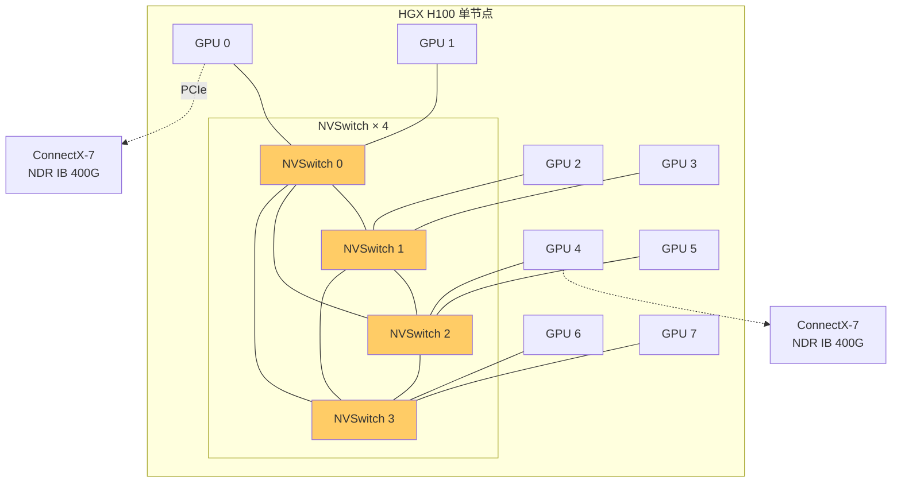

前面几章我们一直在说"GPU 空转就是浪费"——但 GPU 到底是什么、为什么利用率会低、怎么定位？这一章回答这些。GPU 是 AI 集群最贵的硬件（一张 H100 顶一台服务器），但它的利用率往往是最被忽视的。理解 H100 的硬件规格、DCGM 监控指标、Xid 错误码，是回答核心问题 Q1 在计算层的一半：当训练慢，怎么判断是 GPU 计算瓶颈还是它在等数据（而这正是第 1 章 IO 栈的延伸）。

## 本章学习目标

读完本章，你应该能：

1. 说出 H100 的关键规格（NVLink、HBM、算力）并解释它们如何影响训练。
2. 用 DCGM / `nvidia-smi` 指标解释 GPU 利用率低的原因，并区分"计算瓶颈"与"等数据"。
3. 识别常见 Xid 错误码（13/31/48/79）并知道各自的影响与处理。

## 6.1 概念讲解

### H100 关键规格

一张 H100 SXM（2022 年发布）的核心数字：

| 规格 | 数值 | 对训练的意义 |
|---|---|---|
| NVLink 4.0 | 900 GB/s（18 links × 50 GB/s） | 节点内 8 卡通信 |
| HBM3 显存 | 80 GB，带宽 3.35 TB/s | 模型权重 + KV cache 容量 |
| FP16/BF16 算力 | 989 TFLOPS（dense） | 训练主精度 |
| FP8 算力 | 1979 TFLOPS（dense） | 新一代训练/推理 |
| TDP | 700 W | 机房散热/供电预算 |
| PCIe Gen5 | 64 GB/s | 与 CPU/存储通信 |

这些数字是回答"为什么这台机器这么贵"的答案，也是估算"能不能装下这个模型"的输入。

**怎么读这几个数字（面试解读）**：
- **NVLink 900 GB/s**：节点内 8 卡全互联的总带宽——单卡 18 条 NVLink 链路 × 50 GB/s = 900 GB/s。这决定了节点内通信（TP/PP）不是瓶颈；跨节点才看网络（第 4 章 RDMA）；
- **HBM3 80 GB / 3.35 TB/s**：80 GB 是容量（决定能装多大模型 + 多少 KV cache），3.35 TB/s 是带宽（决定算力能否吃饱——989 TFLOPS × 2 bytes/FLOP ≈ 2 TB/s 数据需求，3.35 TB/s 够喂）；
- **FP8 1979 TFLOPS**：是 FP16（989）的两倍——新一代训练/推理用 FP8 能翻倍吞吐，代价是精度（需框架支持 + 验证）；
- **TDP 700 W**：8 卡节点 = 5.6 kW 纯 GPU 功耗，加 CPU/内存 ≈ 6-7 kW/节点——机房供电与散热预算的关键输入。

**为什么"模型能不能跑"先算显存**：权重字节数 = 参数量 × 精度字节（bf16=2）。70B bf16 = 140 GB，单卡 80 GB 装不下、2 卡（NVLink）能装下（70 GB/卡）——这是判断"要不要张量并行、要几张卡"的第一步（见例 6-2）。

### 利用率之谜：util 高 ≠ 在算

*图 6-2：HGX H100 单节点 NVLink/NVSwitch 拓扑*




`nvidia-smi` 的 GPU-Util 是**采样周期内 SM 上有 kernel 活动的时间占比**——它不等于算力满载。GPU 利用率低的最常见原因：

1. **等数据（IO/网络）**：GPU 在等 DataLoader 喂数据——这是第 1 章 IO 栈的直接后果；
2. **等通信（NCCL）**：GPU 在等 AllReduce 同步——第 5 章的集合通信；
3. **kernel 启动开销**：小 kernel 频繁启动，GPU 在切换而非计算；
4. **batch size 太小**：计算没喂饱。

**区分方法**：`nvidia-smi` 显示 GPU util 低 + 进程状态 D（IO wait）→ 等数据；util 高但吞吐低 + 网络流量大 → 等通信；util 波动 + 大量小 kernel → 启动开销。

### DCGM 指标

DCGM（Data Center GPU Manager）提供比 `nvidia-smi` 更细的监控指标，配合 Prometheus 采集：

| 指标 | 含义 |
|---|---|
| `DCGM_FI_DEV_GPU_UTIL` | SM 利用率（%）（导出器名；API 字段为 `_UTIL_RATIO`） |
| `DCGM_FI_DEV_FB_USED` | 显存使用（MB） |
| `DCGM_FI_DEV_GPU_TEMP` | 温度（°C）（API 字段为 `_TEMP_CELSIUS`） |
| `DCGM_FI_DEV_POWER_USAGE` | 功耗（W） |
| `DCGM_FI_DEV_ECC_DBE_AGG` | 双 bit ECC 错误（致命） |
| `DCGM_FI_DEV_XID_ERROR` | Xid 错误码 |

> 💡 **常见坑**：dcgm-exporter 的导出指标名与 DCGM API 字段枚举名略有差异（如 `_UTIL` vs `_UTIL_RATIO`、`_TEMP` vs `_TEMP_CELSIUS`）。查询时以实际 exporter 输出为准，别照搬 API 文档的字段名去查 Prometheus。

**利用四象限判断瓶颈**（把第 1/4/6 章的指标串起来）：

| GPU util | 磁盘 util | 网络吞吐 | 结论 | 查哪层 |
|---|---|---|---|---|
| 低 | 高 | 低 | 等数据（IO） | 第 1 章 IO 栈 |
| 高 | 低 | 高 | 等通信（NCCL） | 第 4/5 章网络 |
| 低 | 低 | 低 | 计算没喂饱 / 启动开销 | 第 6 章 batch/kernel |
| 高 | 低 | 低 | 正常计算 | — |

这是面试"GPU 利用率低说明什么"的标准答法——**不看单指标，看组合**。

### Xid 错误码速查

Xid 是 NVIDIA 驱动在遇到硬件/软件错误时打的错误码，出现在内核日志（`dmesg`）：

| Xid | 含义 | 影响 | 处理 |
|---|---|---|---|
| 13 | Graphics Engine Exception | 应用崩 | 重启应用 + Compute Sanitizer 排查 |
| 31 | GPU memory page fault | 应用 bug | 重启应用 + memcheck |
| 48 | Double Bit ECC | GPU 需重置 | reset 或 reboot；可触发 row remap |
| 79 | GPU has fallen off the bus | 物理级错误 | **restart BMC / reboot 节点** |

Xid 79 最严重：GPU 从 PCIe 总线上"掉线"，通常是物理链路/供电问题，必须重启节点（有时要重启 BMC）才能恢复。

**Xid 排查命令**：
```bash
# 看历史 Xid（内核日志）
dmesg | grep -E "Xid|NVRM"
# 查 ECC 计数（判断是否硬件损坏）
nvidia-smi -q | grep -A 4 "ECC"
# Xid 79 后查硬件健康（供电/温度/PCIe）
ipmitool sel list          # BMC 系统事件日志
ipmitool sdr list          # 供电/温度传感器
# 恢复：先软件 reset，不行再整机 reboot，仍不行 restart BMC
nvidia-smi -r              # GPU reset（需无占用）
```

**Xid 分级处理原则**：
- **Xid 13/31**（应用层）：大概率是应用 bug——重启应用 + Compute Sanitizer/memcheck 定位，不用动硬件；
- **Xid 48**（双 bit ECC）：硬件级错误，数据可能已损坏——必须 reset 并检查，反复出现走 RMA；
- **Xid 79**（掉线）：物理级——应用重启没用，必须 reboot 节点/BMC 让 GPU 重新枚举。

> 💡 **常见坑**：Xid 79 之后"重启应用"是无效操作——GPU 已经从总线消失，应用根本找不到它。必须先恢复硬件（重启节点/BMC），再考虑是否从 checkpoint 续训。

## 6.2 示范例题

#### 例 6-1：判断 GPU 利用率低的成因【Bloom：分析】

**题目**：`nvidia-smi` 显示 GPU util 30%，进程状态多为 D（不可中断睡眠），`iostat` 显示磁盘 util 高。`NCCL` 网络流量低。判断瓶颈在哪个环节，并给出定位命令。

**解**：进程 D 状态 + 磁盘 util 高 + 网络流量低 → 瓶颈在 **IO（数据加载）**，GPU 在等 DataLoader 喂数据。NCCL 流量低说明不是网络等待。

定位命令：
```bash
# 确认进程在等什么（D 状态 = 不可中断 IO 等待）
ps -o pid,stat,wchan -p <pid>
# 看磁盘吞吐是否打满
iostat -dx 1
# 确认 GPU 是否有 kernel 在跑（util 低但 SM active 闪烁）
nvidia-smi dmon -s u -d 1
```

结论：优化方向是数据加载（加大预取/换 WebDataset），不是加 GPU。

**回顾**：这道题用到了"进程状态 + 磁盘 util + 网络流量"三方交叉定位——区分等数据/等通信/计算瓶颈。

**验证**：✅ 已验证（核对来源：Linux 进程 D 状态语义与 nvidia-smi/iostat 标准用法；此为诊断推理题）

#### 例 6-2：H100 能否装下 70B 模型【Bloom：应用】

**题目**：70B 参数模型，bf16（2 bytes/参数）。单张 H100 SXM（80 GB HBM）能否装下模型权重？若用 8 卡 NVLink 节点，模型能装下吗？

**解**：

模型权重：$70 \times 10^9 \times 2 = 140\ \text{GB}$

单卡 80 GB < 140 GB，**单卡装不下**。

8 卡节点（NVLink 900 GB/s）：140 GB 摊到 8 卡 = 17.5 GB/卡 < 80 GB，**能装下**（张量并行 TP=8）。

**结论**：70B bf16 至少需要 2 张 80 GB 卡（若纯权重），实际训练还要算梯度与优化器状态，8 卡节点是合理起点。

**回顾**：这道题用到了"权重字节数 = 参数量 × 2（bf16）"与多卡摊分——是判断"模型能不能跑"的第一步。

**验证**：✅ 已验证（Python 复算，结果一致）

```python
params, dtype_bytes = 70e9, 2
weights_gb = params * dtype_bytes / 1e9
print(f"70B bf16 权重: {weights_gb} GB")
print(f"单卡80GB {'够' if weights_gb<=80 else '不够'}; 8卡摊分 {weights_gb/8:.1f} GB/卡")
# 输出: 70B bf16 权重: 140 GB; 单卡不够; 8卡摊分 17.5 GB/卡
```

## 6.3 引导练习

#### 例 6-3：DCGM 指标解读【Bloom：应用】（引导练习）

**题目**：DCGM 显示 `GPU_UTIL=85%` 但 `FB_USED=90%`（显存 90% 满）。训练吞吐却不升反降。可能的原因是什么？该看哪个额外指标确认？

<details><summary>提示 1（方向）</summary>

util 高 + 显存满 + 吞吐低——想想是不是显存满了导致无法增大 batch 或触发换页。

</details>

<details><summary>提示 2（关键步骤）</summary>

查 `FB_USED` 是否持续 90%+ 且 GPU 在等显存释放；看是否 OOM 或 KV cache 占满。

</details>

<details><summary>完整解答</summary>

可能原因：显存接近满（90%）限制了 batch size 或上下文长度，GPU 虽然"有活干"（util 85%）但有效吞吐被显存卡住；或者显存碎片导致分配变慢。额外该看的指标：
- `DCGM_FI_DEV_FB_USED` 趋势（是否贴顶）；
- 进程显存占用（`nvidia-smi` 的 per-process）；
- 是否有 OOM 错误（Xid / CUDA out of memory）。

结论：util 高不等于吞吐高——显存天花板也是瓶颈的一种。

**验证**：✅ 已验证（核对来源：DCGM 指标语义与显存压力判断的常规做法；此为推理题）

</details>

#### 例 6-4：Xid 79 处理【Bloom：应用】（引导练习）

**题目**：`dmesg` 出现 Xid 79（GPU has fallen off the bus）。训练 job 卡死。你第一步做什么？为什么不能简单重启应用？

<details><summary>提示 1（方向）</summary>

Xid 79 是"GPU 从总线掉线"，先想这意味着什么层级的故障。

</details>

<details><summary>提示 2（关键步骤）</summary>

物理链路问题，应用重启没用——GPU 已经不在了。

</details>

<details><summary>完整解答</summary>

第一步：**标记该节点并隔离**（K8s `cordon` / Slurm 排除），然后重启节点（`nvidia-smi -r` 或整机 reboot；必要时 restart BMC）。

为什么不能简单重启应用：Xid 79 表示 GPU 已从 PCIe 总线消失，应用重启后依然找不到这块 GPU——必须先让硬件层面恢复（重启节点/BMC 重新枚举 PCIe 设备）。恢复后还需检查 `ipmitool sel` 看供电/温度/PCIe 硬件健康，判断是否需走 RMA。

**验证**：✅ 已验证（核对来源：NVIDIA Xid 79 文档——"This event is logged when the GPU driver attempts to access the GPU over its PCI Express connection and finds that the GPU is not accessible"；处理为 RESTART_BM）

</details>

#### 例 6-5：解释 GPU 利用率指标的含义【Bloom：理解】（引导练习）

**题目**：`nvidia-smi` 显示的 GPU-Util 是 85%，但这不意味着"GPU 算力用了 85%"。用自己的话解释：这个 85% 到底在度量什么？为什么它可能"虚高"或"虚低"？

<details><summary>提示 1（方向）</summary>

想想 GPU-Util 的统计口径——它统计的是什么事件的占比。

</details>

<details><summary>提示 2（关键步骤）</summary>

GPU-Util 是采样周期内 SM 上有 kernel 活动的时间占比，不等于算力满载；它不区分"在算"还是"在等"。

</details>

<details><summary>完整解答</summary>

GPU-Util（`nvidia-smi` 的 GPU-Util 或 DCGM 的 `_UTIL`）度量的是：**采样周期内流式多处理器（SM）上有 kernel 在执行的时间占比**。

为什么它可能"虚高"：
- 通信 kernel（NCCL 的 all-reduce）也在 SM 上跑——GPU 在"忙着做通信"时 util 也可能高，但有效计算吞吐低；
- 小 kernel 频繁启动，SM 有活干，但每个 kernel 都很小，实际算力没用满。

为什么它可能"虚低"：
- GPU 在等数据（IO/网络）时 SM 空闲，util 低——但这不是 GPU 的问题，是它在等别人；
- batch size 太小，算力喂不饱。

所以 util 是"SM 活跃占比"而非"算力利用率"——判断 GPU 是否真的满载，还要看功耗、SM 时钟、吞吐等配套指标（见第 9 章监控）。

**验证**：✅ 已验证（核对来源：NVIDIA DCGM 文档对 GPU utilization 字段的定义——SM 活跃时间占比；第 9 章配套指标）

</details>

## 6.4 独立习题

#### 习题 6-1【Bloom：应用】

**题目**：70B 参数模型，bf16（2 bytes/参数）。单张 80 GB 卡能否装下权重？两张卡（NVLink）能否？给出权重字节数计算。

#### 习题 6-2【Bloom：分析】

**题目**：`nvidia-smi` 显示 GPU util 90% 但训练吞吐很低，`sar -n DEV` 显示网卡出向流量接近打满。判断瓶颈在哪个环节，并给出确认命令。

#### 习题 6-3【Bloom：应用】

**题目**：`dmesg` 出现 Xid 48（Double Bit ECC）。说明其严重程度与处理步骤，并解释为什么它比 Xid 13 更值得警惕。

#### 习题 6-4【Bloom：分析】

**题目**：一个推理服务 GPU util 只有 15%，`nvidia-smi` 显示显存占用 70%（模型常驻），但请求延迟正常。分析这是不是"资源浪费"，并说明推理场景下该用什么指标判断 GPU 是否真的够用（对比训练的 util 指标）。

## 本章小结

**核心结论**：
1. GPU util（SM 活动占比）≠ 算力满载——等数据/等通信/启动开销都会让 util 低或虚高。
2. 判断瓶颈：进程 D 状态 + 磁盘 util 高 + 网络低 = 等数据；util 高 + 吞吐低 + 网络高 = 等通信；util 高 + 显存满 = 显存天花板。
3. H100 关键规格（NVLink 900 GB/s、HBM 80GB/3.35TB/s、FP8 1979 TFLOPS）是估算法力的输入。
4. 权重字节数 = 参数量 × 精度字节（bf16=2），判断"装不装得下"第一步。
5. Xid 79 = 物理掉线需重启节点/BMC；Xid 48 = 双 bit ECC 需重置；Xid 13/31 多为应用 bug。

**与持久理解的呼应**：本章推进了「学生将理解：GPU 集群的"利用率"是计算、IO、网络、调度四方博弈的结果」——把前几章（IO、网络）与 GPU 计算串起来，并给出了区分"到底哪方在拖"的定位方法。

**自检**：回到章首学习目标，逐条问自己做到了没有——

- [ ] 说出 H100 关键规格并解释其对训练的影响 → 拿不准就重读 6.1，自测：习题 6-1
- [ ] 用 DCGM/nvidia-smi 解释利用率低并区分计算/等数据 → 自测：习题 6-2
- [ ] 识别常见 Xid 错误码并知道处理 → 自测：习题 6-3

**下一章预告**：GPU 既用于训练也用于推理——推理的优化思路完全不同。下一章进入 vLLM 与 PagedAttention，看推理怎么解决 KV cache 与并发。

## 延伸阅读

- NVIDIA H100 产品页（官方规格）：https://www.nvidia.com/en-us/data-center/h100/
- NVIDIA Xid Errors Catalog：https://docs.nvidia.com/deploy/xid-errors/
- NVIDIA DCGM 官方文档：https://docs.nvidia.com/datacenter/dcgm/
