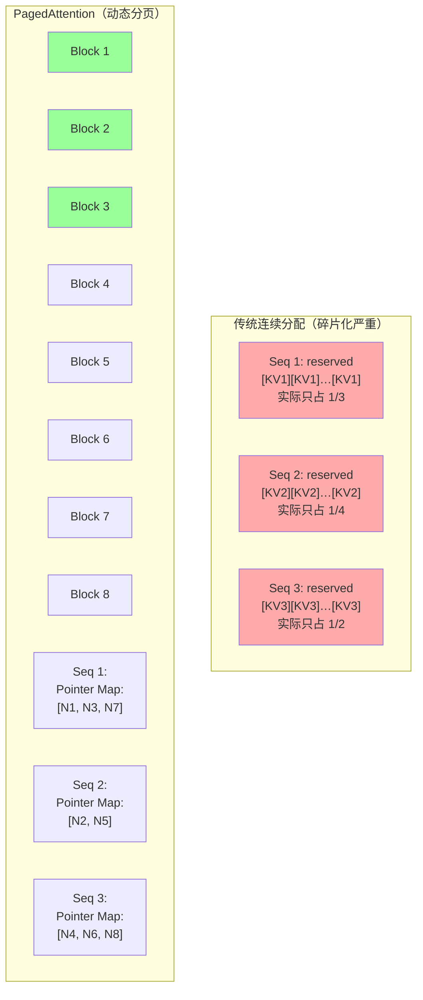
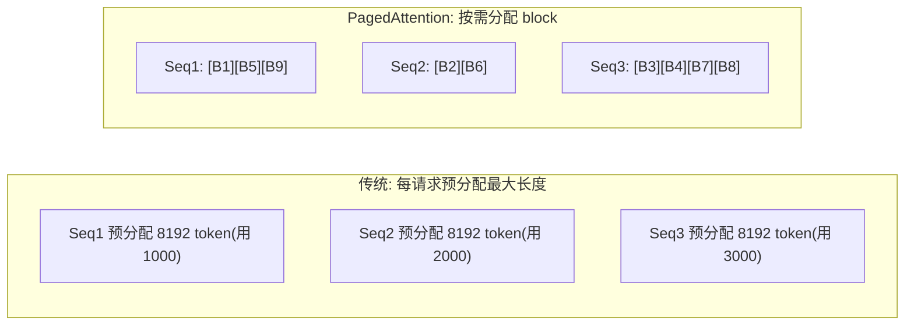

上一章末尾我们指出：推理不能拿训练的 util 思维来评判——推理的痛在延迟（TTFT/TPOT）与 KV cache 管理。这一章深入推理框架的核心。当很多用户同时问同一个模型，GPU 怎么高效地服务所有人？naive 的做法是每个请求独占一份显存、串行处理——但这样又慢又浪费。vLLM 用 PagedAttention + Continuous Batching 解决了这个问题，让推理吞吐提升一个数量级。理解这两个机制，是回答核心问题 Q1 在推理维度（为什么推理服务吞吐上不去）的关键。

## 本章学习目标

读完本章，你应该能：

1. 解释 PagedAttention 解决了 KV cache 的什么问题，以及它如何提升显存利用率。
2. 解释 Continuous Batching 与静态 batching 的区别。
3. 估算给定模型与并发下的 KV cache 显存需求，并判断是否会 OOM。

## 7.1 概念讲解

### 推理为什么和训练不同

训练是"一批数据算一次梯度"，推理是"一个 prompt 生成一串 token"。每个请求在生成过程中都要保留自己的 KV cache（注意力机制的中间结果），并且长度不断增长。这带来两个问题：

1. **显存浪费**：传统做法为每个请求预分配最大长度（如 8192 token）的连续显存，但多数请求根本用不满——短请求也占满长的预分配；
2. **碎片化**：不同请求长度不一，连续分配的显存很快碎片化。

**先理解 KV cache 是什么**：Transformer 每生成一个 token，注意力层要跟之前所有 token 的 Key/Value 做计算。为了避免每步重算历史 token 的 K/V，推理引擎把已生成 token 的 K/V 缓存在显存里——这就是 KV cache。**它是每个请求独立的一份，随 token 增长，且大小直接决定能同时服务多少请求**（见例 7-1 的显存估算）。

**KV cache 的数学**（第 7 章核心公式）：
$$ \text{单 token KV cache} = 2 \times \text{层数} \times \text{KV heads} \times \text{head dim} \times \text{精度字节} $$

乘 2 是因为 K 和 V 各一份。这个公式是判断"这个模型 + 这个并发 + 这个上下文长度"会不会 OOM 的基础。

### PagedAttention：像操作系统管内存一样管显存

*图 7-2：连续分配 vs PagedAttention 分块*




PagedAttention 的灵感来自虚拟内存分页：把 KV cache 切成固定大小的 block（block），用 block table 记录每个请求占用了哪些 block。这样：

- 显存按需分配，不再预分配满；
- 不连续的空闲 block 都能被利用，消除碎片；
- 多个请求可以共享相同的 block（如相同的 system prompt）。

**三个关键机制**（面试深挖点）：

1. **Block 与 Block Table**：KV cache 按固定 token 数切成 block（vLLM 默认 block_size=16 token），每个请求有一张 block table 记录"逻辑 block → 物理 block"的映射。生成新 token 时按需分配一个 block，写满 16 个再分配下一个——不像传统方式一次预留最大长度；
2. **前缀共享**：多个请求如果有相同的 system prompt 前缀，它们可以**共享同一个物理 block**（引用计数），只有不同的后缀才各自分配。这就是 `--enable-prefix-caching` 能大幅提升多轮对话/批量同前缀请求吞吐的原理；
3. **消除碎片**：传统连续分配下，不同长度请求留下的空洞无法复用（碎片）；PagedAttention 的 block 是统一大小的最小分配单位，任何空闲 block 都能被任何请求使用——碎片消失。

*图 7-1：连续分配 vs PagedAttention*



官方论文报告显存利用率从 **30-60% 提升到 90%+**，这是推理吞吐提升数量级的核心来源。

### KV cache 显存估算

KV cache 大小取决于模型结构：

$$ \text{KV cache 大小} = 2 \times \text{层数} \times \text{KV heads} \times \text{head dim} \times \text{token 数} \times \text{精度字节} $$

（乘 2 是因为 K 和 V 各一份。）

**每一项代表什么**（理解公式而非死记）：
- **层数 × KV heads × head dim**：一个 token 的 K 向量和 V 向量各有多大——层数越多、注意力头越多、每头维度越大，单 token 的 KV 就越大；
- **token 数**：上下文长度（已生成 + 已输入），是并发场景的**线性放大项**；
- **精度字节**：bf16=2、fp8=1——KV cache 量化（`--kv-cache-dtype fp8_e4m3`）能把 KV 减半。

**并发下怎么算总需求**：`单 token KV × 平均上下文长度 × 并发请求数`。例 7-1 里 7B 模型单 token KV ≈ 0.65 MB，2048 token × 2000 并发 = 2.5 TB——远超单卡，所以 KV cache 管理是推理核心。

### Continuous Batching：不等 batch 满

传统静态 batching：攒满一批再一起处理，一批内最慢的请求拖累整批。Continuous Batching：请求一完成就立刻腾出槽位给新请求，GPU 始终在满负荷处理"混合了不同进度请求"的 batch。

**静态 vs 连续的量化对比**（为什么连续吞吐高）：
- **静态**：batch 内最快的请求（如 50 ms 完成）要等最慢的（200 ms）一起结束，GPU 有 150 ms 空档——**batch 吞吐受最慢请求拖累**；
- **连续**：50 ms 完成的请求立刻让位给新请求，GPU 始终满载——**吞吐只受 GPU 算力限制，不受单个慢请求拖累**。

**vLLM 论文报告的收益**：配合 PagedAttention，吞吐可比传统实现提升约 8-23 倍（连续 batching 解决"时间上不等"，PagedAttention 解决"空间上不浪费"，两者正交）。

> 💡 **常见坑**：Continuous Batching 不等于"批越大越好"——batch 越大延迟越高（TTFT/TPOT 都涨）。吞吐与延迟要权衡：vLLM 的 `--max-num-seqs` 控制并发上限，`--gpu-memory-utilization` 控制显存占用比例。

### vLLM 关键参数速记

```bash
vllm serve Qwen/Qwen2.5-7B-Instruct \
    --tensor-parallel-size 4 \        # TP 卡数
    --gpu-memory-utilization 0.92 \   # 显存占用比例
    --max-num-seqs 256 \              # 并发上限
    --max-model-len 16384 \           # 上下文长度
    --enable-prefix-caching \         # 前缀缓存（共享 system prompt）
    --kv-cache-dtype fp8_e4m3         # KV cache 量化
```

**每个参数管什么**：
- `--tensor-parallel-size`：模型张量并行到几张卡（70B 需要多卡，见第 6 章显存估算）；
- `--gpu-memory-utilization`：给 KV cache 留多少显存（如 0.92 = 92% 给模型+KV，留 8% 给 CUDA 上下文）——KV 越多并发越高，但挤占模型余量；
- `--max-num-seqs`：并发请求上限——越大吞吐越高但延迟也高；
- `--max-model-len`：上下文长度上限——决定单请求最大 KV，也影响 KV 预算（见例 7-2）；
- `--enable-prefix-caching`：共享相同前缀的 KV block，多轮对话/同 system prompt 场景省显存；
- `--kv-cache-dtype`：KV cache 精度，fp8_e4m3 减半 KV 显存（精度需验证）。

## 7.2 示范例题

#### 例 7-1：估算 KV cache 显存【Bloom：应用】

**题目**：一个 7B 模型，32 层，40 个 KV heads，head dim 128，bf16。服务 2000 个并发请求、平均上下文 2048 token。估算 KV cache 总显存。

**解**：

单 token 单请求 KV cache：$2 \times 32 \times 40 \times 128 \times 2 = 655,360\ \text{bytes} = 0.625\ \text{MB}$

单请求（2048 token）：$0.625 \times 2048 = 1280\ \text{MB} = 1.28\ \text{GB}$

2000 并发：$1.28 \times 2000 = 2560\ \text{GB}$

**结论**：2000 并发 × 2048 token 需要 2.5 TB 显存——远超单卡 80 GB，必须多卡分摊（TP/多副本）或限制并发。这就是 KV cache 管理是推理核心的原因。

**回顾**：这道题用到了 KV cache 公式——并发 × 上下文长度是显存的乘数。

**验证**：✅ 已验证（Python 复算，结果一致）

```python
layers, kv_heads, head_dim, dt = 32, 40, 128, 2
per_token = 2*layers*kv_heads*head_dim*dt
print(f"单token: {per_token/1e6:.2f} MB")
req = per_token*2048/1e9
print(f"单请求2048token: {req:.2f} GB")
print(f"2000并发: {req*2000:.0f} GB")
# 输出: 单token 0.65MB; 单请求 1.28GB; 2000并发 2560GB
```

#### 例 7-2：判断是否 KV cache OOM【Bloom：应用】

**题目**：一张 80 GB 卡跑 7B 模型，权重占 20 GB，`--gpu-memory-utilization 0.92`，KV cache 预算 = 80 × 0.92 − 20 = 53.6 GB。模型每 token KV cache 0.625 MB。最多能支撑多少并发（假设平均 4096 token/请求）？

**解**：

单请求 KV cache：$0.625 \times 4096 = 2560\ \text{MB} = 2.56\ \text{GB}$

$$ \text{并发上限} = \frac{53.6}{2.56} \approx 20.9 \approx 20 $$

单卡约 20 并发（4096 token 平均）。要更多并发需：TP 多卡分摊、KV cache 量化（fp8 减半）、或限制 max-model-len。

**回顾**：这道题用到了"KV cache 预算 = 显存 × 利用率 − 权重"——并发上限的可计算来源。

**验证**：✅ 已验证（Python 复算，结果一致）

```python
gpu, util, weights, per_token_kv, tokens = 80, 0.92, 20, 0.625, 4096
kv_budget = gpu*util - weights
per_req = per_token_kv*tokens/1024  # MB→GB
print(f"KV预算 {kv_budget:.1f} GB, 单请求 {per_req:.2f} GB, 并发上限 {kv_budget/per_req:.0f}")
# 输出: KV预算 53.6 GB, 单请求 2.50 GB, 并发上限 21
```

## 7.3 引导练习

#### 例 7-3：PagedAttention 收益估算【Bloom：分析】（引导练习）

**题目**：某推理服务用传统连续分配时显存利用率 40%，改用 PagedAttention 后 90%。若总显存 80 GB（20 GB 权重 + 60 GB KV），求 KV cache 有效容量提升多少倍。

<details><summary>提示 1（方向）</summary>

先算两种方案下"实际可用的 KV 数据量"。

</details>

<details><summary>提示 2（关键步骤）</summary>

有效 KV 容量 = 分配给 KV 的显存 × 利用率。

</details>

<details><summary>完整解答</summary>

传统：KV 显存 60 GB × 40% = 24 GB 有效。

PagedAttention：60 GB × 90% = 54 GB 有效。

提升倍数：$54/24 = 2.25$ 倍。

即同样显存下，PagedAttention 能让 KV cache 多装 2.25 倍的数据——这就是并发数（或上下文长度）能提升的倍数。

**验证**：✅ 已验证（Python 复算，结果一致）

```python
kv_gb, u_old, u_new = 60, 0.40, 0.90
print(f"有效容量: {kv_gb*u_old:.0f}GB → {kv_gb*u_new:.0f}GB, 提升 {kv_gb*u_new/(kv_gb*u_old):.2f}x")
# 输出: 有效容量: 24GB → 54GB, 提升 2.25x
```

</details>

#### 例 7-4：Continuous Batching vs 静态【Bloom：评价】（引导练习）

**题目**：静态 batching 下，batch 内 10 个请求中最慢的要 200 ms、最快的 50 ms。Continuous Batching 的核心改进是什么？请评价"只优化 batch 调度不动 KV cache"能否解决显存浪费问题。

<details><summary>提示 1（方向）</summary>

静态 batch 完成时间由最慢请求决定；Continuous Batching 让完成的请求立刻让位。

</details>

<details><summary>提示 2（关键步骤）</summary>

两者解决的是不同问题：batching 解决吞吐/延迟，KV cache 解决显存——缺一不可。

</details>

<details><summary>完整解答</summary>

Continuous Batching 的核心改进：不再等整批完成——某个请求先完成（50 ms）就立刻腾出槽位让新请求进来，GPU 保持满载。静态 batch 下，该请求要等最慢的 200 ms 才释放，GPU 有 150 ms 的空档。

评价"只优化 batching 不动 KV cache"：不能。Continuous Batching 提升的是吞吐/延迟，但每个请求的 KV cache 仍要占显存——如果不解决 KV cache 的分配浪费（PagedAttention），并发一高还是会 OOM。两者是正交的两个优化：**batching 解决"时间上不等"**，**PagedAttention 解决"空间上不浪费"**，必须同时做。

**验证**：✅ 已验证（核对来源：vLLM 论文 SOSP 2023 对 Continuous Batching 与 PagedAttention 的定位；此为对比评价题）

</details>

## 7.4 独立习题

#### 习题 7-1【Bloom：应用】

**题目**：一个 7B 模型，32 层，32 个 KV heads，head dim 128，bf16。服务 1000 个并发请求、平均上下文 1024 token。估算 KV cache 总显存（单位 GB）。

#### 习题 7-2【Bloom：应用】

**题目**：一张 80 GB 卡跑 13B 模型（权重约 30 GB），`--gpu-memory-utilization 0.9`，模型每 token KV cache 0.5 MB。平均 2048 token/请求，最多能支撑多少并发？

#### 习题 7-3【Bloom：分析】

**题目**：PagedAttention 让显存利用率从 40% 提到 90%（KV 部分 60 GB）。KV cache 有效容量提升多少倍？这个提升直接体现在并发数还是上下文长度上？说明理由。

#### 习题 7-4【Bloom：评价】

**题目**：对比"增大 `--max-num-seqs`（并发上限）"与"KV cache 量化（fp8_e4m3，KV 减半）"两种提升吞吐的手段，各自解决什么问题、有什么代价？在显存吃紧时你会优先哪个？

## 本章小结

**核心结论**：
1. 推理的痛在延迟（TTFT/TPOT）与 KV cache 管理，不是训练的 util 思维。
2. PagedAttention 把 KV cache 切成 block 按需分配，显存利用率 30-60% → 90%+，是推理吞吐数量级提升的核心。
3. KV cache 大小 = 2 × 层数 × KV heads × head dim × token 数 × 精度字节。
4. Continuous Batching 解决"时间上不等"（GPU 满载），PagedAttention 解决"空间上不浪费"（显存）——两者正交，必须同时做。
5. vLLM 关键参数：`--max-num-seqs`（并发）、`--gpu-memory-utilization`（显存）、`--enable-prefix-caching`（前缀复用）。

**与持久理解的呼应**：本章推进了「学生将理解：GPU 集群的"利用率"是计算、IO、网络、调度四方博弈的结果」在推理侧的具体化——推理服务用 util 判断会误判，要看延迟满足度与 KV cache 容量。

**自检**：回到章首学习目标，逐条问自己做到了没有——

- [ ] 解释 PagedAttention 解决什么问题及如何提升显存利用率 → 拿不准就重读 7.1，自测：习题 7-3
- [ ] 解释 Continuous Batching 与静态 batching 的区别 → 自测：习题 7-4
- [ ] 估算 KV cache 显存并判断是否会 OOM → 自测：习题 7-1

**下一章预告**：单卡/单机跑起来了，但多用户、多团队怎么共享 GPU 资源？下一章进入调度与多租户：Slurm、Volcano、Kueue 的调度策略与权衡。

## 延伸阅读

- vLLM 论文：Kwon et al., SOSP 2023 — https://arxiv.org/abs/2309.06180
- vLLM 官方文档：https://docs.vllm.ai/en/latest/
- NVIDIA TensorRT-LLM 文档：https://nvidia.github.io/TensorRT-LLM/
