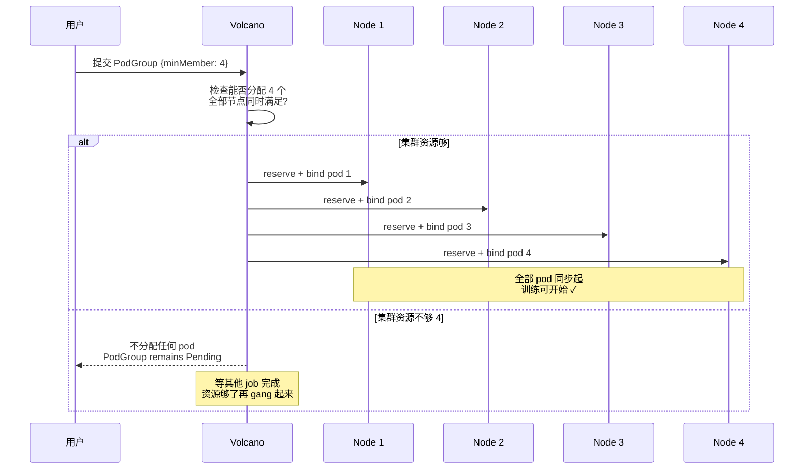
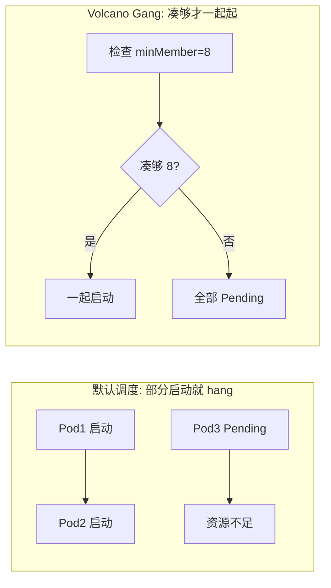

GPU 是最贵的资源，多团队共享时怎么分？这是 AI Infra 的核心问题之一：既要"公平"（每个团队按份额拿到），又要"效率"（GPU 不闲置）。调度系统的任务就是把这两个目标转成可计算的策略。这一章讲三个主流调度器——Slurm（HPC 老牌）、Volcano（K8s 批处理）、Kueue（K8s 队列）——它们的调度模型、抢占策略与适用场景。学完你能回答核心问题 Q3 的一部分：一个"稳定"的集群，调度在公平与效率之间怎么平衡。

## 本章学习目标

读完本章，你应该能：

1. 解释 Slurm、Volcano、Kueue 三种调度模型的本质差异。
2. 对比 Gang scheduling、Fair-share、Preemption 三种策略的权衡。
3. 为一个给定团队结构（多租户、优先级、规模）选择调度方案并辩护。

## 8.1 概念讲解

### 为什么需要专门调度器

K8s 默认调度器适合微服务（每个 pod 独立、随时可调度）。但 AI 训练任务不同：一个多节点训练 job 是"要么全部节点一起跑，要么一个都别跑"（否则部分节点起来、NCCL 等不到同伴就 hang）。这需要 **Gang scheduling**（成组调度）——调度器必须保证一整组资源同时可用才调度。K8s 原生不支持，所以有了 Volcano/Kueue。

**为什么"半启动"比"不启动"更糟**：默认调度器会逐个调度 pod——8 卡 job 提交到只剩 6 卡，6 个 pod 先起来跑，剩下 2 个 Pending。已起的 6 个 rank 通过 NCCL 等第 7、8 个 rank，永远等不到（资源不足），于是**训练 hang 且 6 卡空转**。Gang scheduling 的解法是"凑不齐就一个都不起"——避免了半启动的 hang 与资源浪费（见例 8-2）。

### 三种调度器定位

*图 8-2：Volcano Gang scheduling 时序*




| 调度器 | 模型 | 强项 | 适用 |
|---|---|---|---|
| **Slurm** | 独立调度系统（非 K8s） | HPC 成熟、Gang 原生、多租户 | 传统 HPC + GPU 集群 |
| **Volcano** | K8s 调度器插件（替换默认） | Gang/PodGroup、拓扑感知、国产卡 | K8s + 复杂批处理 |
| **Kueue** | K8s 队列层（不替换调度器） | ClusterQueue/配额、轻量 | K8s + 简单队列/配额 |

**三者本质区别（一句话）**：
- **Slurm**：独立于 K8s 的调度系统——它自己管节点、分配、队列，Gang 是原生的（一次分配全部节点），适合传统 HPC；
- **Volcano**：K8s **内部**的调度器——它替换默认调度器，通过 PodGroup 实现 Gang，适合"需要高级调度能力（Gang/拓扑/国产卡）的 K8s 批处理"；
- **Kueue**：K8s **之前**的队列层——它不碰调度，只在"配额够不够、何时放行"上把关，适合"已有调度器、只想加多租户配额"的场景。

**Volcano vs Kueue 的关键区别**（面试必考）：Volcano 是**调度器本身**（决定 pod 放哪台、怎么凑 Gang），Kueue 是**调度前的门卫**（决定"这个 job 的配额够不够、能不能进入调度"）。一个管"放哪里"，一个管"能不能进"——两者可共存（Volcano 做 Gang，Kueue 做配额）。

### Slurm：HPC 老牌

Slurm 不是 K8s 生态，是独立调度系统：`slurmctld`（主控）+ `slurmd`（每节点）。训练 job 用 `sbatch --gres=gpu:...` 提交，Slurm 负责分配节点。Gang 是原生支持的（一次性分配所有节点）。

```bash
sbatch --nodes=8 --ntasks-per-node=8 --gres=gpu:h100:8 train.sh
```

### Volcano：K8s 批处理调度器

Volcano 是 CNCF Incubating 项目，作为 K8s 调度器插件工作。核心是 **PodGroup** 资源：一组 pod 声明 `minMember`（最小成员数），调度器只有凑够 `minMember` 才一起调度——这就是 Gang scheduling 的 K8s 实现。

```yaml
apiVersion: scheduling.volcano.sh/v1beta1
kind: PodGroup
metadata:
  name: train-pg
spec:
  minMember: 8          # 凑够 8 个才调度
  queue: default
```

### Kueue：K8s 队列层

Kueue 是 kubernetes-sigs 项目（CNCF K8s 子项目），它**不替换调度器**，而是在调度器之前加一层"队列 + 配额"：ClusterQueue 定义资源配额，Workload 申请配额，配额满足才被 admission 放行去调度。

```yaml
apiVersion: kueue.x-k8s.io/v1beta1
kind: ClusterQueue
metadata:
  name: team-a
spec:
  cohort: prod           # 同 cohort 可共享配额
  resourceGroups:
    - coveredResources: [nvidia.com/gpu]
      flavors:
        - name: default
          resources:
            - name: nvidia.com/gpu
              nominalQuota: 8
```

### 三个策略的权衡

| 策略 | 解决什么 | 代价 |
|---|---|---|
| **Gang scheduling** | 多节点训练必须整组起 | 资源碎片（凑不齐就等） |
| **Fair-share** | 多租户公平分配 | 需要历史用量记录 |
| **Preemption** | 高优先级抢低优先级 | 被抢的 job 要能 checkpoint 恢复 |

*图 8-1：Volcano 的 Gang 调度 vs 默认调度*



## 8.2 示范例题

#### 例 8-1：选调度方案【Bloom：评价】

**题目**：一家公司 500 卡集群，多团队共享：训练团队要 8 卡/64 卡的训练 job，推理团队要常驻的推理服务。已在用 K8s。选 Volcano、Kueue 还是组合？说明理由。

**解**：选 **Volcano + Kueue 组合**（或 Volcano 为主 + Kueue 做配额）。

- **训练 job 需要 Gang scheduling**（8 卡必须一次起）→ Volcano 的 PodGroup 是标配；
- **推理服务是常驻**（不需要 Gang，随时可调度）→ 默认调度器即可；
- **多团队配额**（A 团队 40%、B 团队 30%）→ Kueue 的 ClusterQueue/cohort 管理配额。

组合方式：训练 job 用 Volcano schedulerName + 挂 Kueue ClusterQueue 做配额；推理 Deployment 走默认调度器 + Kueue 配额。两个调度器可以共存于一个集群。

**回顾**：这道题用到了"按 workload 类型选调度"——训练要 Gang，推理要常驻，配额要 Kueue，三者不冲突可组合。

**验证**：✅ 已验证（核对来源：Volcano 支持 Gang scheduling（CNCF Incubating）、Kueue 支持 ClusterQueue/cohort 配额（kubernetes-sigs）、两者可共存于 K8s；此为选型评价题）

#### 例 8-2：Gang scheduling 的必要性【Bloom：分析】

**题目**：没有 Gang scheduling 时，8 卡训练 job 提交到只剩 6 张空闲卡的集群。默认 K8s 调度器会怎样？为什么这会导致 NCCL hang？

**解**：

默认调度器会逐个调度 pod：6 个 pod 分配到 6 张卡开始运行，剩下 2 个 pod Pending。但训练 job 是一个整体——已启动的 6 个 rank 通过 NCCL 等待第 7、8 个 rank 就绪，而它们永远等不到（资源不足），于是**训练卡死（hang）**。

这比"不启动"更糟：6 张卡被占住空转，还拖着整个 job 死等。Gang scheduling 的解法是：凑不齐 8 个就**一个都不调度**（全部 Pending），等资源够了再一起起——避免半启动的 hang 与资源浪费。

**回顾**：这道题用到了 Gang scheduling 的本质——"要么全起，要么全等"。

**验证**：✅ 已验证（核对来源：NCCL 要求所有 rank 同时就绪，Volcano PodGroup minMember 机制；此为推理题）

## 8.3 引导练习

#### 例 8-3：Preemption 与 checkpoint【Bloom：评价】（引导练习）

**题目**：高优先级 job 抢占低优先级 job 时，被抢的 job 会怎样？为什么必须配合 checkpoint？

<details><summary>提示 1（方向）</summary>

被抢占 = 进程被杀，之前算的梯度/状态会丢。

</details>

<details><summary>提示 2（关键步骤）</summary>

没有 checkpoint，被抢的 job 要从头重训——抢占的"效率"就被浪费了。

</details>

<details><summary>完整解答</summary>

高优先级 job 抢占时，低优先级 job 的 pod 被驱逐（evict），进程终止。若没有 checkpoint，该 job 之前训练的进度全部丢失，需要从头开始——这违背了抢占"提高资源效率"的初衷。

所以生产环境必须：1) 训练周期性写 checkpoint（如每 30 分钟）；2) 被抢占的 job 配置 requeue/重启并从最近 checkpoint 续跑。抢占的代价（被抢 job 的 checkpoint 窗口内进度）远小于"高优先级 job 一直等"的代价，这是抢占策略可行的前提。

**验证**：✅ 已验证（核对来源：K8s/Volcano/Kueue 抢占与驱逐语义，训练 checkpoint 容错机制；此为权衡评价题）

</details>

#### 例 8-4：Kueue 的配额与 cohort【Bloom：分析】（引导练习）

**题目**：两个团队 ClusterQueue 都设 `nominalQuota: 8 GPU`，且同属 `cohort: prod`。团队 A 用满 8 个、团队 B 只用 2 个。团队 A 还想再起 4 个 GPU 的 job，能否？

<details><summary>提示 1（方向）</summary>

cohort 让同组的 ClusterQueue 可以借用闲置配额。

</details>

<details><summary>提示 2（关键步骤）</summary>

B 只用 2/8，剩 6 个闲置可被 cohort 内借用。

</details>

<details><summary>完整解答</summary>

能。`cohort` 使同组的 ClusterQueue 共享配额池：A 用满自己的 8 个后，可以借用 cohort 内 B 闲置的配额（B 只用了 2/8，剩 6 个）。A 要 4 个 GPU，借 4 个闲置配额即可调度。当 B 自己要用时，配额回收（可能触发驱逐 A 的借用部分，视配置）。

这就是 cohort 的"动态容量共享"：不让闲置配额被浪费，同时各团队名义配额保证基本份额。

**验证**：✅ 已验证（核对来源：Kueue 文档 cohort 语义——"Group queues together to enable dynamic resource sharing……Workloads can automatically borrow unused capacity from peer teams"；此为推理题）

</details>

## 8.4 独立习题

#### 习题 8-1【Bloom：评价】

**题目**：对比 Slurm 与 K8s+Volcano 两种方案给"传统 HPC 用户 + 已有 K8s 团队"的混合集群。各自的取舍是什么？给出你的选型建议。

#### 习题 8-2【Bloom：创造】

**题目**：设计一个三团队（A 40%、B 30%、C 30%）的 GPU 配额方案，要求：A 的优先级最高（可抢占 B/C），B 与 C 平等共享，且闲置配额可互相借用。用 Kueue 的 ClusterQueue/cohort 结构描述你的设计。

#### 习题 8-3【Bloom：评价】

**题目**：8 卡训练 job 提交到只剩 6 张空闲卡。比较"默认调度器逐个起（半 hang）"与"Gang scheduling 全部等"两种行为的资源代价，并解释为什么后者长期更优。

#### 习题 8-4【Bloom：分析】

**题目**：Volcano（替换调度器）与 Kueue（队列层，不替换调度器）在架构上有什么本质区别？为什么说 Kueue 更适合"已有稳定调度器、只想加配额"的场景？

## 本章小结

**核心结论**：
1. AI 训练 job 需要 Gang scheduling（要么全起要么全等），这是 K8s 默认调度器做不到的。
2. Slurm = HPC 独立调度系统（Gang 原生）；Volcano = K8s 批处理调度器插件（PodGroup）；Kueue = K8s 队列层（ClusterQueue/配额，不替换调度器）。
3. 三个策略的权衡：Gang 解决整组起、Fair-share 解决公平、Preemption 解决优先级——各有代价。
4. Preemption 必须配合 checkpoint，否则被抢 job 从头重训，抢占失去意义。
5. Kueue 的 cohort 实现动态容量共享（借用闲置配额），配合 nominalQuota 保证基本份额。

**与持久理解的呼应**：本章推进了「学生将理解：多租户调度的本质是把'公平'与'效率'转成可计算的调度策略（Gang、Fair-share、Preemption），而非行政上的人为分配」——用 Gang/配额/cohort/抢占把调度落成了可配置的策略。

**自检**：回到章首学习目标，逐条问自己做到了没有——

- [ ] 解释三种调度模型的本质差异 → 拿不准就重读 8.1，自测：习题 8-1
- [ ] 对比 Gang/Fair-share/Preemption 的权衡 → 自测：习题 8-3
- [ ] 为给定团队结构选调度方案并辩护 → 自测：习题 8-2

**下一章预告**：调度决定了"谁用 GPU"，但怎么知道"用得怎么样、有没有出问题"？下一章进入可观测性与告警——把 GPU、网络、存储的指标变成能预警的体系。

## 延伸阅读

- Volcano 官方（CNCF Incubating）：https://volcano.sh/
- Kueue 官方（kubernetes-sigs）：https://kueue.sigs.k8s.io/
- Slurm 官方文档：https://slurm.schedmd.com/
