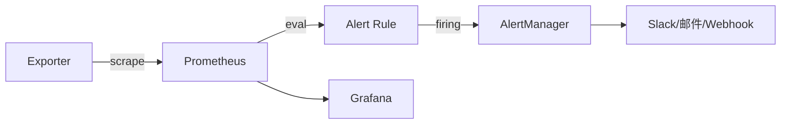
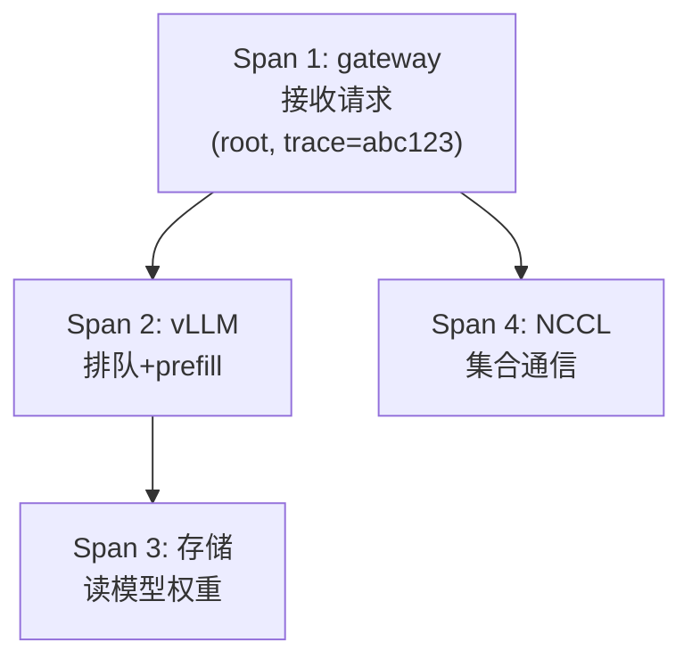

调度决定了"谁用 GPU"，但怎么知道"用得怎么样、有没有出问题"？这一章讲可观测性——把 GPU、网络、存储、业务的指标变成能预警的体系。大概念 B5 说"可观测性先于优化：不能量化的瓶颈无法被优化"——本章就是这句话的落地。学完你能回答核心问题 Q3 的一部分：一个"稳定"集群的稳定性，很大一部分来自监控告警体系是否及时发现故障（这决定 RTO，呼应持久理解 U5）。

## 本章学习目标

读完本章，你应该能：

1. 编写 PromQL 查询与 recording rule，把高频查询预聚合。
2. 解释 Prometheus 告警生命周期（Inactive/Pending/Firing）与 `for` 时长的作用。
3. 设计一套"及时但不过度"的告警规则（选指标、设阈值、定 for、配路由）。
4. 解释链路追踪（Trace/Span）的原理，并用它定位一次慢请求的瓶颈环节。

## 9.1 概念讲解

### Prometheus 架构：拉取 + 规则

Prometheus 主动从 exporter 拉取指标（pull），存成时间序列，然后周期性评估规则：

```
Exporter(/metrics) → Prometheus 拉取 → TSDB 存储
                                 → Recording Rule(预聚合)
                                 → Alert Rule(告警) → AlertManager → 通知
```

*图 9-1：Prometheus 数据流*



### 三种指标类型

| 类型 | 含义 | 例子 |
|---|---|---|
| **Counter** | 只增不减的计数 | `node_network_receive_bytes_total` |
| **Gauge** | 可增可减的当前值 | `DCGM_FI_DEV_GPU_UTIL` |
| **Histogram** | 分桶分布 | 延迟直方图（用于 p99） |

**Counter 要算速率**：看吞吐用 `rate(metric[5m])`（每秒平均增量），看增量用 `increase(metric[5m])`（5 分钟总增量）。Gauge 直接看值。

**三个概念展开**：
- **Counter 为什么不能直接看值**：它是"累计总量"（如网卡收到的总字节数），会一直涨——直接看没意义，要看"增速"（rate，每秒多少字节）。`rate(metric[5m])` 算 5 分钟窗口的平均每秒增量，适合看吞吐；`increase(metric[5m])` 算 5 分钟总增量，适合"这段时间发生了多少"；
- **Gauge 直接看**：它是"当前值"（如温度、利用率），涨跌都有意义，直接看即可（或加 `max_over_time` 看峰值）；
- **Histogram 用于算分位数**：延迟这种"分布不均"的指标，用 Histogram 记录每个请求落在哪个桶（如 ≤1ms、≤5ms、≤10ms……），然后用 `histogram_quantile(0.99, sum(rate(..._bucket[5m])) by (le))` 算出 p99。

**为什么 p99 比平均重要**（大概念 B5 的落地）：平均延迟会被大部分正常请求拉低，掩盖"少数慢请求"——而 AI 推理的 SLO 恰恰看 p99（最差的 1% 用户不能等太久）。Histogram 是算 p99 的标准手段。

### 告警生命周期：for 是"确认器"

Prometheus 告警规则有 `for` 子句——条件持续满足 `for` 时长后才真正 firing：

- **Inactive**：条件不满足；
- **Pending**：条件首次满足，开始计时（`for` 期间）；
- **Firing**：`for` 计时结束，条件仍满足 → 发 AlertManager。

`for` 的作用是**过滤抖动**：一个瞬时尖峰不该立刻报警，持续 N 分钟才报警——避免"狼来了"。

**补充：`keep_firing_for`（防止告警闪烁）**：除了 `for`（确认后才报警），还有 `keep_firing_for`（条件消失后**继续报 N 分钟**）。它防止"告警一下恢复、恢复又告警"的闪烁——例如节点抖动导致告警反复触发/恢复，`keep_firing_for: 10m` 让它在条件消失后仍保持 firing 10 分钟，避免 oncall 被反复打扰。

```yaml
groups:
- name: ai-infra-alerts
  rules:
  - alert: GPUHighTemp
    expr: DCGM_FI_DEV_GPU_TEMP > 85
    for: 5m        # 持续 5 分钟高温才报警
    labels:
      severity: warning
    annotations:
      summary: "GPU {{ $labels.instance }} 温度过高"
```

**告警生命周期完整版**：`Inactive → Pending（for 计时）→ Firing →（条件消失）→ Resolved`。`for` 控制"多久确认"，`keep_firing_for` 控制"恢复后多久才解除"——两者配合让告警既及时又稳定。

### Recording Rule：高频查询预聚合

如果 Grafana 面板或告警频繁查询同一表达式，用 recording rule 预聚合成一个新指标，降低查询压力：

```yaml
groups:
- name: ai-infra-recording
  interval: 30s
  rules:
  - record: cluster_gpu_util_avg
    expr: avg(DCGM_FI_DEV_GPU_UTIL)
```

**什么时候该用 recording rule**：
1. **高频查询的复杂表达式**：如果多个 Grafana 面板 / 告警都查 `avg(rate(...)) by (xxx)` 这类重查询，预聚合一次，面板直接查新指标——降低 Prometheus 查询压力；
2. **告警要用的关键聚合**：如 `cluster_gpu_total`（集群 GPU 数）——预聚合成单值，告警规则直接引用，表达式更清晰；
3. **跨时间长窗口的聚合**：如 30 分钟平均利用率——预聚合成一个指标，比每次都现场算 `avg_over_time` 高效。

**代价**：预聚合是"定时算好存起来"（如每 30s 算一次），**不是实时的**——对"秒级要反应的告警"不适用（那些直接查原始指标）。

### 设计告警的两条原则

1. **及时**：故障要在 RTO 预算内被发现（`for` 不能太长）；
2. **不过度**：不要每个小波动都报警（会噪声淹没真告警）。

平衡技巧：区分**致命级**（Xid 79、双 bit ECC、GPU 掉线 → 立即报警，`for: 0m`）与**预警级**（温度、利用率 → `for` 长一些），并按严重程度路由（critical 走 pager，warning 走 Slack）。

### 链路追踪（Tracing）：可观测性的第三根支柱

Prometheus 解决的是**指标**（Metrics：系统现在怎么样），日志解决的是**事件**（Logs：发生了什么），但还有一个维度指标和日志都覆盖不了：**一次请求从进来到结束，经过了哪些服务、每段花了多久**——这就是**链路追踪（Tracing）**。三者合称可观测性的**三大支柱**：

| 支柱 | 回答的问题 | 典型工具 | 局限 |
|---|---|---|---|
| **Metrics 指标** | 系统现在怎么样？（QPS/延迟/利用率） | Prometheus/Grafana | 只给聚合值，看不出单次请求内部 |
| **Logs 日志** | 发生了什么？（错误/事件） | ELK/Loki | 分散在各服务，难串联一次请求 |
| **Traces 链路** | 一次请求内部怎么走、卡在哪？ | Jaeger/Tempo/OTel | 采样开销，无法覆盖 100% |

**AI Infra 里的链路追踪**（为什么值得讲）：训练任务跨多节点（NCCL）、推理请求跨网关→vLLM→存储，一次"慢"很难定位是哪个环节。指标能看到"哪台机器慢"，但看不到"这个请求在 vLLM 排队花了 200ms、在存储读权重花了 100ms"——链路追踪正好补上这一层。

#### 核心概念：Trace / Span / Parent-Child

链路追踪的三个基本概念（面试常考）：

- **Trace（链路）**：一次完整请求从入口到所有下游的完整路径；
- **Span（跨度）**：Trace 里的一个环节（一次 HTTP 调用、一次数据库查询、一次 NCCL 通信），记录名称、开始/结束时间、标签、状态；
- **Parent-Child（父子关系）**：Span 之间有嵌套关系——服务 A 调用服务 B，B 的 Span 是 A 的 Span 的 child。靠 **Trace ID**（整个链路共享）+ **Span ID**（每段唯一）+ **Parent Span ID**（指向父段）串联。

```
一次推理请求的 Trace（示意）：
┌─────────────────────────────────────────────────────────┐
│ Trace ID: abc123（整个请求共享）                          │
│                                                         │
│ [Span 1: gateway 接收请求]        ← root span            │
│   └─[Span 2: vLLM 排队+prefill]   ← child of 1           │
│       └─[Span 3: 读模型权重(存储)] ← child of 2           │
│   └─[Span 4: NCCL 通信]          ← child of 1            │
└─────────────────────────────────────────────────────────┘
```

*图 9-2：Trace/Span 父子结构*



#### 链路追踪的关键机制

1. **上下文传播（Context Propagation）**：Trace ID 要跨服务传递——HTTP 场景用 header（如 `traceparent`），跨进程用协议注入。没有传播，各服务的 Span 就是断的，无法串成一条 Trace；
2. **采样（Sampling）**：记录所有请求开销太大，通常只采样一部分（如 1-10%）。**但 AI 推理对 p99 敏感，采样率要覆盖尾延迟**——所以常用"头部采样 + 尾部采样"结合（尾部采样：等请求结束按结果决定是否保留，保证慢请求不被漏掉）；
3. **OpenTelemetry（OTel）**：当前事实标准的追踪协议/SDK——应用埋点一次，数据可送到 Jaeger/Tempo 等任意后端。面试提"链路追踪"说 OTel + Jaeger 是标准组合。

#### AI Infra 场景：怎么用 Trace 定位慢推理

一次推理 p99 变慢，指标只能告诉你"网关慢还是 vLLM 慢"（如果埋了）。Trace 能进一步看到：
- **vLLM Span 内**：排队等了多久（队列积压）？prefill 多久？decode 多久？
- **存储 Span**：读权重花了多久（冷启动缓存未命中）？
- **网络 Span**：NCCL 通信占多少（跨卡推理）？

有了 Trace，就能把 p99 变慢**拆到具体 Span**，再对症下药——这正是大概念 B5（可量化才能优化）在请求粒度的落地。

> 💡 **常见坑**：很多人以为"有 Prometheus 就够了"——指标能告诉你"哪里慢"，但只有 Trace 能告诉你"**这个请求**为什么慢、卡在哪个环节"。对 AI 推理这种"单请求延迟敏感"的场景，Metrics + Traces 必须一起上。

**追踪选型速记**：埋点用 **OpenTelemetry**（标准）、存储/查询用 **Jaeger**（开源）或 **Tempo**（Grafana 生态）、与 Prometheus/Grafana 打通。面试说"可观测性"答三支柱 + 这组工具链即可。

## 9.2 示范例题

#### 例 9-1：编写 GPU 利用率告警【Bloom：应用】

**题目**：写一条 Prometheus 告警规则：某 GPU 的利用率连续 30 分钟低于 20%，报 info 级告警（用于发现"卡闲着"的浪费）。

**解**：

```yaml
- alert: GPUUtilSustainedLow
  expr: avg_over_time(DCGM_FI_DEV_GPU_UTIL[30m]) < 20
  for: 5m          # 平均已低 30 分钟, 再确认 5 分钟
  labels:
    severity: info
  annotations:
    summary: "GPU {{ $labels.instance }} 利用率持续低"
```

要点：用 `avg_over_time(...[30m])` 取 30 分钟均值（过滤短时波动），再 `for: 5m` 确认。

**回顾**：这道题用到了"均值窗口 + for 确认"的组合——既能发现持续浪费，又不会被瞬时尖峰误报。

**验证**：✅ 已验证（核对来源：Prometheus 官方文档 avg_over_time 与 alerting rules `for` 语义；此为配置题）

#### 例 9-2：p99 延迟告警【Bloom：应用】

**题目**：训练 step 时间有直方图 `training_step_time_seconds_bucket`。写一条规则：step 时间 p99 连续 10 分钟超过 5 秒，报 warning。

**解**：

```yaml
- alert: TrainingStepSlow
  expr: histogram_quantile(0.99,
      sum(rate(training_step_time_seconds_bucket[5m])) by (le)) > 5
  for: 10m
  labels:
    severity: warning
  annotations:
    summary: "训练 step p99 超过 5s"
```

**回顾**：这道题用到了 `histogram_quantile` 从直方图算 p99，`rate(...[5m])` 把计数转成速率。

**验证**：✅ 已验证（核对来源：Prometheus 官方 histogram_quantile 文档与直方图计算 p99 的标准写法；此为配置题）

#### 例 9-5：读 Trace 定位慢请求瓶颈【Bloom：分析】

**题目**：某推理服务 p99 变慢。一条请求的 Trace 如下（各 Span 的时长，单位 ms）：

| Span | 环节 | 时长 |
|---|---|---|
| A | 网关接收请求 | 5 |
| B | vLLM 排队 | 800 |
| C | vLLM prefill | 120 |
| D | 存储读模型权重 | 60 |
| E | vLLM decode | 300 |

总耗时约 1285ms。用 Trace 分析：瓶颈在哪个环节？该环节可能的根因是什么？

**解**：

瓶颈是 **B（vLLM 排队 800ms）**——占了总时长的 62%。Trace 的价值就在这里：如果只看整体延迟，只知道"慢"；看 Span 分布，才知道慢在**排队**而不是 prefill/decode/存储。

可能的根因：
- **队列积压**：并发请求数 > vLLM 处理能力（吞吐不足），请求在队列里等；
- **GPU 被大 batch 占满**：前面一个大请求占着 GPU，后面的请求只能排队；
- **多模型共享实例**：多个模型共用一个 vLLM 实例，互相挤占。

排查方向：看 GPU 利用率与并发数（Metrics 侧），确认是"排队"还是"处理慢"——如果利用率高且排队长，是容量问题（扩容或限制并发）；如果利用率低但排队长，是调度/限流配置问题。

**回顾**：这道题展示了 Trace 的核心用法——把总延迟拆到 Span，定位"慢在哪一环"，再结合 Metrics 找根因。这是 AI 推理排障的标准流程。

**验证**：✅ 已验证（核对来源：分布式追踪（OpenTelemetry）语义与 span 时长分析标准方法；此为分析推理题）

## 9.3 引导练习

#### 例 9-3：区分致命级与预警级告警【Bloom：分析】（引导练习）

**题目**：下面的故障，各该设什么严重程度与 `for` 时长？Xid 79（GPU 掉线）、GPU 温度 85°C、单次 NCCL 超时、磁盘空间 80%。

<details><summary>提示 1（方向）</summary>

按"影响是否立即致命 + 是否易自愈"分级。

</details>

<details><summary>提示 2（关键步骤）</summary>

致命/不可自愈 → critical + for:0m；可自愈/预警 → warning + for 较长。

</details>

<details><summary>完整解答</summary>

- **Xid 79（GPU 掉线）**：critical + `for: 0m`——物理故障、不可自愈、立即致命，必须立刻报警；
- **GPU 温度 85°C**：warning + `for: 5m`——可能是负载波动，持续高温才需处理；
- **单次 NCCL 超时**：warning + `for: 3m`——可能瞬时抖动，连续多次才值得查；
- **磁盘 80%**：warning + `for: 1h`——慢性问题，给运维时间处理，不必秒级报警。

原则：**影响越致命、越不可自愈 → 报警越快（for 短）**；**越像预警、越可自愈 → for 长**。分级后按 severity 路由（critical 走 pager、warning 走 Slack）。

**验证**：✅ 已验证（核对来源：Prometheus 告警最佳实践——用 for 过滤抖动、按严重度分级；此为设计推理题）

</details>

#### 例 9-4：设计告警体系【Bloom：创造】（引导练习）

**题目**：为一个 100 卡 GPU 集群设计一套最小告警集（5 条以内），覆盖 GPU、网络、存储、训练 4 个维度。写出表达式与 for。

<details><summary>提示 1（方向）</summary>

每维度挑 1 个最关键指标，别贪多。

</details>

<details><summary>提示 2（关键步骤）</summary>

GPU→Xid/掉线；网络→PFC/丢包；存储→OSD down；训练→step 卡住。

</details>

<details><summary>完整解答</summary>

```yaml
groups:
- name: ai-infra-alerts
  rules:
  # GPU 掉线 (致命)
  - alert: GPUOffBus
    expr: increase(DCGM_FI_DEV_XID_ERROR{code="79"}[5m]) > 0
    for: 0m
    labels: {severity: critical}
  # 网络 PFC 风暴 (预警)
  - alert: PFCStorm
    expr: rate(mlx5_port_pfc_rx_pause_total[5m]) > 1000
    for: 2m
    labels: {severity: warning}
  # 存储 OSD down (致命)
  - alert: CephOSDDown
    expr: ceph_osd_down > 0
    for: 1m
    labels: {severity: critical}
  # 训练 step 卡住 (致命)
  - alert: TrainingStuck
    expr: rate(training_step_time_seconds_count[10m]) == 0
    for: 15m
    labels: {severity: critical}
```

设计逻辑：4 条覆盖 4 个维度，致命级 `for: 0-1m`，预警级 `for: 2m+`。核心是"每维一个最关键信号 + 匹配的 for"。

**验证**：✅ 已验证（核对来源：Prometheus 指标与告警实践；此为设计题，指标名按常见 exporter 约定，实际部署需按自家 exporter 调整）

</details>

## 9.4 独立习题

#### 习题 9-1【Bloom：应用】

**题目**：写一条 Prometheus 告警：某 GPU 温度连续 10 分钟超过 90°C，报 critical。写出表达式与 for。

#### 习题 9-2【Bloom：应用】

**题目**：写一条 recording rule，把"集群 GPU 总数"预聚合成 `cluster_gpu_total`，表达式基于 `DCGM_FI_DEV_GPU_UTIL` 的 count。

#### 习题 9-3【Bloom：分析】

**题目**：某告警规则 `expr: rate(metric[5m]) > X for: 1m` 频繁误报（瞬尖峰触发）。分析误报原因并给出修复方案（提示：考虑 rate 窗口 vs for 时长、或改用 avg_over_time）。

#### 习题 9-4【Bloom：创造】

**题目**：为一个 500 卡集群设计一套 6 条以内的告警体系（覆盖 GPU/网络/存储/训练/推理 5 维度，至少 1 条 critical、1 条预警），写出表达式与 for，并说明为什么每条的 for 这样设。

#### 习题 9-5【Bloom：分析】

**题目**：一次训练任务（多机 NCCL）整体变慢。Trace 显示各 Span 时长：数据加载 400ms、NCCL all-reduce 通信 900ms、前向计算 350ms、梯度计算 380ms。总耗时约 2030ms。分析瓶颈在哪一环、可能的根因（至少 2 个），并说明下一步该看什么指标确认。

## 本章小结

**核心结论**：
1. Prometheus 拉取指标 → 规则评估 → 告警；三种指标类型中 Counter 要看速率（rate/increase）。
2. 告警生命周期 Inactive/Pending/Firing，`for` 子句过滤抖动，避免误报。
3. Recording rule 把高频查询预聚合，降低查询压力。
4. 告警设计两原则：及时（RTO 内发现）与不过度（不噪声淹没真告警）。
5. 分级原则：致命/不可自愈 → critical + for 短；预警/可自愈 → warning + for 长。
6. 可观测性三大支柱：Metrics（现状）/ Logs（事件）/ Traces（一次请求内部）。Trace 用 Span 父子结构拆分请求，定位"慢在哪一环"——AI 推理/多机训练排障的标配（OTel + Jaeger/Tempo）。

**与持久理解的呼应**：本章推进了「学生将理解：故障恢复的 RTO 由'检测时延 + 决策时延 + 重建时延'组成，监控告警质量直接决定 RTO」——告警的 `for` 时长与严重度分级就是"检测时延"的工程实现；而 Trace 把"检测时延"从"集群级"细化到"请求级"。

**自检**：回到章首学习目标，逐条问自己做到了没有——

- [ ] 编写 PromQL 与 recording rule → 拿不准就重读 9.1，自测：习题 9-1
- [ ] 解释告警生命周期与 for 的作用 → 自测：习题 9-3
- [ ] 设计"及时但不过度"的告警体系 → 自测：习题 9-4
- [ ] 用 Trace/Span 定位慢请求瓶颈 → 自测：习题 9-5

**下一章预告**：监控能发现故障，但发现之后呢？最后一章把前面所有能力串起来——故障演练、复盘，以及怎么把一次故障讲成面试里最有说服力的 STAR 故事。

## 延伸阅读

- Prometheus 官方文档（alerting rules）：https://prometheus.io/docs/prometheus/latest/configuration/alerting_rules/
- Prometheus 告警最佳实践：https://prometheus.io/docs/practices/alerting/
- Grafana 官方文档：https://grafana.com/docs/
- OpenTelemetry 官方文档（Trace/Span 语义约定）：https://opentelemetry.io/docs/concepts/signals/traces/
- Jaeger 官方文档（链路追踪查询/采样）：https://www.jaegertracing.io/docs/
