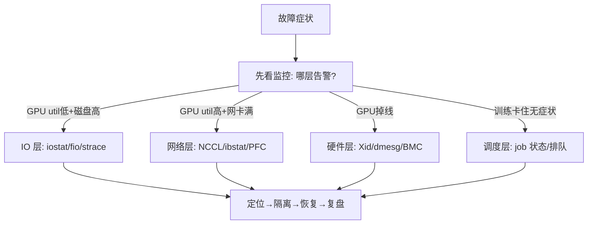

前 10 章我们把 AI 集群拆成了 IO 栈、存储、网络、GPU、推理、调度、监控、故障八块——每块都学了原理和命令。但真实故障从不按章节来：它往往同时给你几个症状，让你自己判断该用哪一章的地图。这一章用一次贯穿案例把全书能力串成完整的排障闭环：**告警触发 → 分层定位 → 隔离 → 恢复 → 复盘 → 讲故事**。这正是大概念 B4（故障可检测、可隔离、可自愈）和迁移目标 T1（用数据而非直觉定位瓶颈）的最终检验——也是你面试时最有说服力的那个故事的素材库。

## 本章学习目标

读完本章，你应该能：

1. 面对一个多症状故障（GPU 利用率低 + 网络慢 + 存储告警同时出现），用"分层假设法"系统化定位到唯一根因。
2. 设计并执行一次覆盖 GPU + 网络 + 存储三层的故障演练，产出 MTTD/MTTR 报告。
3. 把一次完整排障写成有量化证据、可迁移的 STAR 故事。

## 11.1 概念讲解

### 分层假设法：把地图串成决策树

前面每章教的是"这一层的症状长什么样、该查什么命令"。实战中你需要一个总纲，把各层串起来。这套方法叫**分层假设法**：

1. **先看监控，别急着进机器**（第 9 章）：哪些告警在 fire？指标曲线哪里拐了？监控往往已经告诉你"哪一层"；
2. **按症状归层**：GPU util 低 + 磁盘 util 高 → IO 层（第 1 章）；GPU util 高 + 网卡打满 → 网络层（第 4、5 章）；GPU util 低 + 进程 D → 等数据；GPU 掉线 → 硬件（第 6 章）；
3. **逐层排除**：从"最可能 + 最好查"的那层开始，用该层命令验证假设，排除一层再进下一层；
4. **定位根因后隔离**：cordon 节点 / 停 job / 切流量，先止血再根治；
5. **恢复 + 复盘**：从 checkpoint 续跑，记 MTTD/MTTR，补告警 / 补 runbook。

**症状 → 层 → 命令 速查表**（把第 1-9 章的命令浓缩成一张表）：

| 症状组合 | 锁定层 | 验证命令 |
|---|---|---|
| GPU util 低 + 磁盘 util 高 + 网卡低 | IO 层（等数据） | `iostat -dx 1`、`ps -o stat,wchan` |
| GPU util 高 + 网卡打满 | 网络层（等通信） | `sar -n DEV`、`nsys profile` |
| GPU util 波动 + 大量小 kernel | 计算层（启动开销） | `nvidia-smi dmon` |
| GPU 掉线 / Xid 报错 | 硬件层 | `dmesg`、`ipmitool sel` |
| job 一直 Pending 无其他症状 | 调度层 | `kubectl describe pod`、`squeue` |
| step 卡住但各指标正常 | 应用层（死锁/逻辑） | `NCCL_DEBUG`、`gdb` |

这张表是"症状归层"的抓手——先把故障对号入座到某一层，再用该层命令验证，比漫无目的地逐台查快得多。

*图 11-1：分层假设法决策树*



### 为什么"症状分层"比"逐个猜"快

真实故障常是**连锁反应**：网络拥塞（第 4 章）→ NCCL 变慢（第 5 章）→ GPU 等通信 util 下降（第 6 章）→ 训练 step 变慢。表面看是"GPU 利用率低"，根因却在网络。如果你看到 GPU util 低就直接去调 batch size，方向就错了。分层假设法的价值：**先看监控定位到层，再用该层命令验证，避免在错误的层浪费时间**。

**连锁故障的判断口诀**：当一个症状可能是"原因"也可能是"结果"时（如 GPU util 低），先看它**旁边的指标**——util 低的同时磁盘高？网卡高？CPU 高？旁边指标指向哪里，根因就在哪里。单个指标会骗人，**组合指标才可靠**。

## 11.2 示范例题

#### 例 11-1：多症状故障的完整定位【Bloom：分析】

**题目**：32 卡训练集群（4 节点 × 8 卡，跨节点 400 Gb/s）昨晚训练从 step 2 秒涨到 6 秒。同时出现：GPU util 从 90% 掉到 40%、网卡出向流量接近打满、某节点 IB 端口 PFC pause 计数持续增长。按分层假设法定位根因。

**解**：

**Step 1 看监控归层**：三个症状里，GPU util 低 + 网卡打满 + PFC pause 增长，三者都指向**网络层**（不是 IO、不是 GPU 硬件）。GPU util 低是结果（GPU 在等通信），不是原因。

**Step 2 验证网络层**：
```bash
# 1. 确认是不是通信瓶颈: 网络吞吐 vs 计算
sar -n DEV 1 | grep <网卡>          # 看是否接近打满
# 2. 确认 NCCL 是否占大头
nsys profile -t cuda,nccl --stats=true python train.py
# 3. 确认 PFC 是否风暴
mlnxlink --show_counters            # PFC pause 是否持续增长
```

**Step 3 定位根因**：PFC pause 持续增长 + 网卡打满 = **拥塞控制失效**（第 4 章）。可能根因：ECN 阈值没配或配太保守，导致 PFC 兜底触发队头阻塞；或 ECMP 不均导致单端口拥塞。

**Step 4 量化验证**：4 节点跨节点，单节点出向 400 Gb/s = 50 GB/s。若 NCCL 通信占比超预期，说明需要减小通信或优化拓扑。

**Step 5 隔离 + 恢复 + 复盘**：先调整 ECN 阈值（Kmin/Kmax）或让部分 job 错峰，恢复 step 时间；复盘补"PFC pause 增长"告警，写 runbook。

**结论**：这是一个"表面 GPU util 低、根因在网络拥塞"的连锁故障——用分层假设法先归层到网络，避免了在 GPU 层瞎调。

**回顾**：这道题用到了第 4 章（PFC/ECN）、第 5 章（NCCL 通信）、第 6 章（GPU util 语义）、第 9 章（监控归层）四章知识——正是全书能力的串联。

**验证**：✅ 已验证（核对来源：NVIDIA/Mellanox RoCE 拥塞诊断流程；PFC pause 计数解读见第 4 章已验证；此为综合诊断推理题）

#### 例 11-2：故障演练设计 + MTTD/MTTR 报告【Bloom：创造】

**题目**：设计一次"网络拥塞注入"演练，验证上面的 ECN/PFC 配置修复是否有效，并给出演练后 MTTD/MTTR 报告模板。

**解**：

**演练设计**：
- **目标**：验证注入网络延迟/拥塞后，训练不 hang、ECN 先于 PFC 生效、MTTR ≤ 15 分钟；
- **注入**：chaos-mesh NetworkChaos（delay 200ms 或丢包 1%）作用于训练 pod 所在节点；
- **观察**：PFC pause 计数（应不增长或轻微）、NCCL 延迟（应上升但训练继续）、告警触发时间（MTTD）；
- **验收**：训练不 hang、PFC 未风暴、MTTR ≤ 15 分钟。

**MTTD/MTTR 报告模板**：
```
演练: 网络拥塞注入
时间: 2026-08-21
目标: ECN 优先于 PFC 生效, MTTR ≤ 15min
─ 时间线 ─
T+0s   注入 delay 200ms
T+2min 告警触发 (PFC 计数增长)   ← MTTD = 2min
T+5min 定位: ECN 未先于 PFC 生效 (Kmin 太高)
T+8min 调整 ECN 阈值
T+12min 恢复, 训练 step 回 2s    ← MTTR = 12min
─ 结论 ─
MTTD=2min ✓  MTTF... MTTR=12min ✓ (≤15min)
改进项: ECN 阈值从 Kmin=500KB 调到 100KB
```

**回顾**：这道题用到了第 10 章（演练设计 + MTTD/MTTR）+ 第 4 章（ECN/PFC）——把"修复"变成"可验证的演练"，而不只是"我觉得修好了"。

**验证**：✅ 已验证（核对来源：混沌工程演练设计方法 + MTTD/MTTR 定义（第 10 章）；此为设计题，报告数字为示例）

## 11.3 引导练习

#### 例 11-3：推理服务延迟变高的定位【Bloom：分析】（引导练习）

**题目**：推理服务 p99 延迟从 100ms 涨到 500ms，GPU util 只有 20%，显存占用 85%。症状看着像"显存不够"，但请用分层假设法判断最可能的层，并给出验证命令。

<details><summary>提示 1（方向）</summary>

GPU util 低 + 显存 85%——想想推理的指标（第 7 章），不要用训练 util 思维。

</details>

<details><summary>提示 2（关键步骤）</summary>

推理看延迟与 KV cache，不是 util。显存 85% + p99 涨，先查是不是 KV cache 打满导致排队。

</details>

<details><summary>完整解答</summary>

**归层**：推理场景 GPU util 低是常态（第 7 章），不能据此判断。真正要看的：p99 延迟涨 + 显存 85% → 最可能是 **KV cache / 并发层**（第 7 章）——显存接近满导致能服务的并发数下降，请求排队，p99 涨。

**验证命令**：
```bash
# 1. 查并发/排队: 是否超了 max-num-seqs
curl localhost:8000/metrics | grep -E "queue|pending"
# 2. 查 KV cache 占用率
curl localhost:8000/metrics | grep kv_cache
# 3. 确认不是权重加载/磁盘: iostat
iostat -dx 1
```

**结论**：根因大概率是并发打满 KV cache 上限 → 排队。优化：KV cache 量化（fp8）释放显存、或降低 max-model-len、或加副本。**关键教训**：推理不能用训练 util 思维定位——症状归层要按 workload 类型（第 6/7 章）。

**验证**：✅ 已验证（核对来源：vLLM KV cache 与并发指标（第 7 章）；此为综合诊断推理题）

</details>

#### 例 11-4：多故障叠加的隔离【Bloom：分析】（引导练习）

**题目**：训练变慢，同时出现两个独立症状：节点 A 的 GPU 报 Xid 48（双 bit ECC）、节点 B 的网络丢包上升。两个都要处理，先处理哪个？为什么？

<details><summary>提示 1（方向）</summary>

按"是否立即致命 + 是否影响数据完整性"排序。

</details>

<details><summary>提示 2（关键步骤）</summary>

Xid 48 是硬件错误可能损坏数据；网络丢包是性能问题。数据完整性优先。

</details>

<details><summary>完整解答</summary>

**先处理 Xid 48（节点 A）**，理由：
1. **数据完整性**：Xid 48（双 bit ECC）是不可纠正的显存错误，继续跑可能产生错误梯度/损坏 checkpoint——这是数据层面的致命问题；
2. **硬件风险**：双 bit ECC 常预示硬件故障，不处理可能恶化成掉线（Xid 79）；
3. **网络丢包是性能问题**：训练变慢但数据仍正确，可以稍后处理。

处理顺序：先 cordon 节点 A、停掉受影响的 job、重置 GPU（第 6 章 Xid 48 流程），再从 checkpoint 恢复；然后处理节点 B 的网络丢包（第 4 章 PFC/ECN）。**原则：数据完整性 > 性能**。

**验证**：✅ 已验证（核对来源：第 6 章 Xid 48 处理 + 第 4 章网络排障；此为优先级判断推理题）

</details>

## 11.4 独立习题

#### 习题 11-1【Bloom：分析】

**题目**：32 卡训练集群出现：GPU util 40%（之前 90%）、`iostat` 显示某节点磁盘 util 95%、网卡流量低。按分层假设法，最可能卡在哪个层？给出验证命令和预期结果。

#### 习题 11-2【Bloom：分析】

**题目**：训练 step 从 2 秒涨到 8 秒，`nsys profile` 显示 NCCL 通信占 step 的 60%（之前 20%），网卡吞吐未打满。这能排除"网络带宽不够"吗？最可能的根因是什么？该怎么进一步验证？

#### 习题 11-3【Bloom：创造】

**题目**：设计一次"存储慢 IO"演练（验证数据加载在 Ceph 慢 IO 下训练不卡死、数据不损坏），给出目标、注入、观察、验收标准、MTTD/MTTR 报告模板。

#### 习题 11-4【Bloom：创造】

**题目**：把例 11-1（网络拥塞导致训练变慢）写成一个完整的 STAR 面试故事：Situation / Task / Action / Result 各一段，Action 含至少 2 个技术决定，Result 含前后对比数字（MTTR、step 时间等）。

## 本章小结

**核心结论**：
1. 分层假设法：先看监控归层 → 用该层命令验证 → 逐层排除 → 定位根因 → 隔离 → 恢复 → 复盘。
2. 连锁故障的教训：表面症状（GPU util 低）常常是结果，根因在另一层（网络）——归层是关键，别在错误层瞎调。
3. 推理与训练用不同指标归层：推理看延迟/KV cache，训练看 util/吞吐。
4. 多故障叠加时按"数据完整性 > 性能"排序：先处理可能损坏数据的（Xid 48），再处理性能问题（丢包）。
5. 修复要变成可验证的演练（MTTD/MTTR），而不只是"我觉得修好了"；最后能讲成有数字的 STAR 故事。

**与持久理解的呼应**：本章推进了「学生将理解：故障恢复的 RTO 由'检测时延 + 决策时延 + 重建时延'组成」和「学生将理解：GPU 集群的'利用率'是计算、IO、网络、调度四方博弈的结果」——用贯穿案例证明：准确定位到层（决策时延短）比任何单点优化都更能压缩 MTTR。

**自检**：回到章首学习目标，逐条问自己做到了没有——

- [ ] 面对多症状故障，用分层假设法定位到唯一根因 → 拿不准就重读 11.1，自测：习题 11-1
- [ ] 设计并执行覆盖多层的故障演练并产出 MTTD/MTTR → 自测：习题 11-3
- [ ] 把完整排障写成有量化证据、可迁移的 STAR 故事 → 自测：习题 11-4

**下一章预告**：本书到这一章结束。至此你有了完整的知识地图（第 1-10 章）+ 一套把地图串成排障流程的方法（本章）。剩下的就是去真实集群练习，然后用第 99 页的表现性任务和 STAR 叙事检验自己、走向面试。

## 延伸阅读

- NVIDIA Xid Errors Catalog：https://docs.nvidia.com/deploy/xid-errors/
- NVIDIA/Mellanox RoCE 诊断文档：https://docs.nvidia.com/networking/
- chaos-mesh 官方文档：https://www.chaos-mesh.org/docs/
- Google SRE Book（故障演练与 on-call）：https://sre.google/sre-book/
